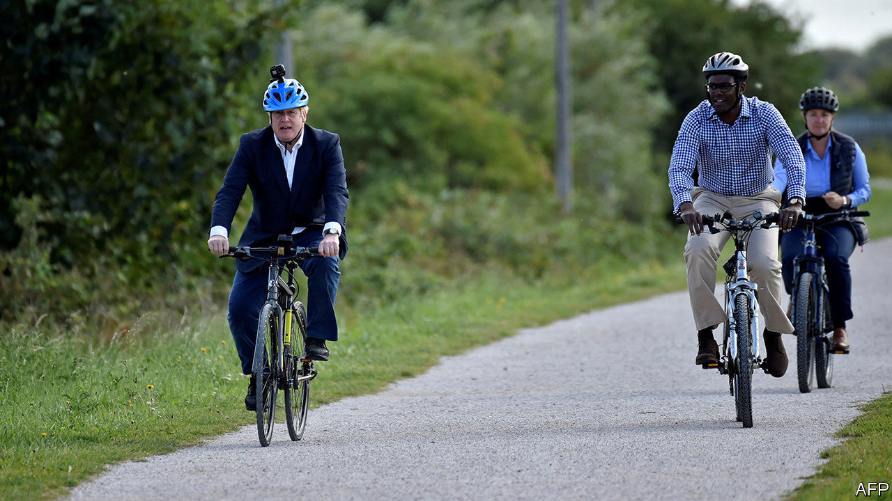

## Fat chance

# Boris Johnson’s plans for a fitter nation

> Why the prime minister is a healthy-eating convert

> Aug 1st 2020

WHEN THE British army was humiliated by a guerrilla force of southern African farmers at the turn of the 20th century, politicians turned to Britain’s diet. A third of men who had appeared at recruiting stations to fight the Boer settlers were rejected on the grounds of being too puny or sickly to fight. The decline of home cooking and a diet of white bread, cheap jam and tea was partly to blame, an official inquiry into the state of the “national physique” later concluded. It recommended regular medical check-ups and argued that schools should provide “adequate nourishment to children in attendance”.

The coronavirus pandemic has stirred similar concerns about the country’s dining habits. On July 27th Boris Johnson announced that Britain will ban the advertising of unhealthy food on television before 9pm and consider an outright ban online. Restaurant and takeaway chains will need to add calorie counts to their menus, and the government will consult on whether to require similar labels for alcoholic drinks. Mr Johnson wants Britons to cycle to work, and doctors to prescribe cycling to fat patients. Repeating a line that persuaded most people to obey the lockdown, the government argues that Britons should shed some weight to reduce the pressure on the National Health Service.

The prompt is the country’s covid-19 death rate—the second highest in the world—and the fear that wide waistlines contributed to it. Nearly two-thirds of Britons have a body-mass index above 25, meaning they are overweight; a figure higher than in France, Germany or Italy. A recent paper by Public Health England, a government agency, concludes that overweight covid-19 patients were more likely to experience serious complications and death. It noted that poor and non-white people are more likely to be obese, and that they have suffered higher death rates.

Politicians have toyed with anti-junk food policies for decades. David Cameron, while leader of the opposition, questioned why WH Smith, a shop found on railway-station concourses, promoted cut-price chocolate oranges near the tills but not fresh fruit. He did little in office to remedy the matter. His successor as prime minister, Theresa May, ditched plans to ban promotional cartoon characters such as the Milky Bar Kid and the Honey Monster, although she did introduce new taxes on sugary drinks.

As a newspaper columnist, Boris Johnson ridiculed public-health campaigns, arguing that the “true conservative knows that do-goodery is often far more dangerous than masterly inactivity.” His brush with death has changed his mind. He was, he said, “way overweight” when he was admitted to an intensive-care unit with the virus in April, and has since shed more than a stone thanks to a regime of early-morning dog walking.

The proposed advertising ban is supported by more than two-thirds of people, according to YouGov, a pollster. And, as in the Edwardian era, poor public health has become a political risk. The public may forgive the government if they think Britain’s high coronavirus death toll is a result of reasonable short-term errors, suggests one Tory MP. But if they conclude that a decade of Conservative government has “made Britain sick” then the political price could be much higher.

The plans were welcomed by public-health experts, with the proviso that they are unlikely to make a huge difference to British waistlines. Although a Cochrane review of nutritional labelling found that it may have a small impact on food consumption, it noted the evidence was weak; two more recent studies by researchers at the University of Cambridge found that posting calorie counts in workplace cafeterias made no difference to eating habits.

Children are watching half as much broadcast commercial television as they were a decade ago, notes Enders Analysis, a media-research firm. Online advertising is harder to regulate, because YouTube, unlike a broadcaster, is not legally responsible for the adverts it carries. As the committee of 1904 noted, they were fighting “popular taste, which it may take generations of educative influence to correct.” ■