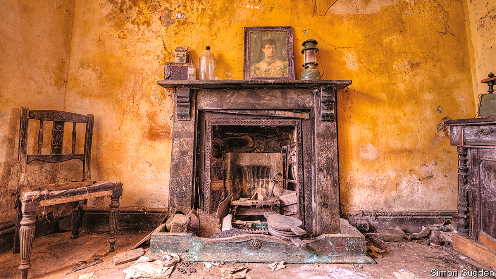

## Beauty in decay

# Britain’s urban explorers worry their playgrounds will be demolished

> A plan to knock down abandoned buildings is bad news for some

> Aug 1st 2020

“THIS MIGHT look like some spooky wreck,” says the urban explorer, as he studies the abandoned airfield from the unstable rooftop of its old officers’ mess. “But it’s where real life happened.” The dilapidated barracks, pillboxes and watchtowers are overgrown with plants. Some lack roofs. In one building, your correspondent reached the top of a flight of stairs and stepped into thin air where a floor should have been. He grabbed a door frame just in time.

Britain has lots of abandoned buildings, relics of the country’s fading industrial and military might. And the country is a hotspot for urban exploration, an odd hobby that combines a passion for history with an addiction to trespassing on private property. Its most serious practitioners are working-class and approaching middle-age, although they are sometimes joined by skateboarders and graffiti artists, who have their own uses for empty buildings. They congregate on online forums like Derelict Places and 28DaysLater. “A good urban explorer has a mental map of every abandoned building in a few hundred miles, sometimes more,” says the airfield trespasser.

Proposed changes to planning laws, which will make it easier to demolish vacant buildings to make way for housing, have shaken the explorers. They argue that the ruins are reminders of social history, and that they should be converted, not demolished. Some of the most sought-after ruins are old factories that evoke working-class life. “Walk into these old mills, and you can still smell the engine oil,” says Simon Sugden, an urban explorer and photographer who will soon publish a book on the subject. “You can picture all the people working away in the heat.”

The urban explorers are a passionate lot. “The building was beckoning me, like it wanted me to take pictures of it,” says Mr Sugden of Drummond Mill in Bradford, which was later destroyed by fire. To their occasional annoyance, others share their enthusiasm. YouTubers venture onto their sacred territory in search of quick celebrity. Some ruins have been leased to specialist live-action role-play companies, which use them as apocalyptic backdrops for airsoft battles or fake zombie attacks.

But the competition worries the urban explorers much less than the threat of demolition. “I just want people to see the beauty in it,” says Mr Sugden. “People should be more appreciative of these buildings.”

## URL

https://www.economist.com/britain/2020/08/01/britains-urban-explorers-worry-their-playgrounds-will-be-demolished
