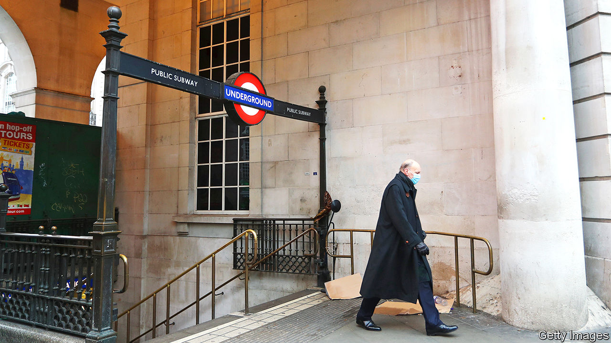
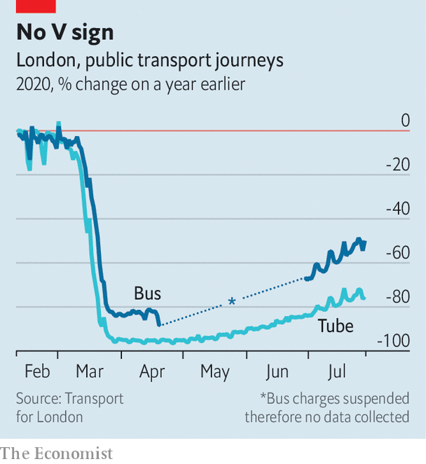

## TfL’s money woes

# London’s transport agency needs a new funding model

> For political reasons, it may not get one soon

> Aug 1st 2020

“IT WAS THE most unusual start to any job I’ve ever had,” says Andy Byford, London’s new Transport Commissioner, who took up his role on June 29th. “I walked into an almost empty office, running almost riderless Tubes with a severe financial challenge.” Transport for London (TfL), the capital’s public-transport authority, issued a revised budget for the second half of the current financial year on July 24th. It is asking central government for £4.9bn ($6.4bn) to cover a revenue shortfall over the next two years. That would come on top of an initial funding package of £1.6bn agreed in May.

TfL is unusual among large public-transport operators because it relies so heavily on passenger fares. Ticket sales generate over 70% of its income compared with under 40% in Paris or New York, where Mr Byford previously ran the transport authority. TfL used to receive around £700m a year from the Treasury, but that was phased out in 2018 as a result of a deal agreed with a former mayor, Boris Johnson. Since then it has come to rely on Tube revenues to subsidise buses. It was bound to suffer badly from a collapse in travel (see chart).

Mr Byford says that getting the finances on a sounder footing is one of his two priorities—the other one is opening the much-delayed Crossrail line. He argues that “going with the begging bowl out to the Treasury every six months” is not a long-term solution. Instead he wants a “sustainable, affordable and predictable” funding model, ideally one that will last for decades. That will not be easy.

Sadiq Khan, the Labour mayor of London, was due to face the voters in May this year. The pandemic has delayed elections until next spring. That context may explain why TfL has been treated more harshly than the railway companies, says Tony Travers, a long-time watcher of the capital’s institutions from the London School of Economics: “The rail industry got a quiet £3.5bn bail-out with little fanfare. Meanwhile TfL got less than half as much cash, had to drop concessionary fares, raise the congestion charge, take two new government-appointed directors and accept a financial review. There’s some politics here.”

The agency’s travails are a useful stick for Mr Khan’s Conservative challenger, Shaun Bailey, to use to beat the mayor. “It’s easy for the mayor to blame the virus,” he tweeted after the new budget was released, “but if he had managed TfL’s finances properly, he wouldn’t have needed one bail-out, let alone two.”

This is nonsense. Mr Khan’s freeze in fares cost TfL around £640m over four years, a sum dwarfed by the estimated £1.9bn drop in passenger income expected this year. Simon Kilonback, its finance director, argues that £1bn had already been taken out of operating costs in the four years before covid-19 hit. TfL’s funding is now the subject of two concurrent reviews, one overseen by the Department for Transport, the other by the Mayor of London. Mr Byford diplomatically notes that he looks forward to engaging with both.

Tube tickets are already among the most pricey in Europe, suggesting there is not much room to increase fares. Both Mr Byford and Mr Kilonback want to make more innovative use of TfL’s land and generate more income from commercial development. Mr Travers expects that some of the financial hole will have to be filled by some kind of a tax on Londoners. The congestion-charging zone, in which motorists pay to drive, could perhaps be expanded. Or existing services could be mothballed. Mr Byford says that he did not take the job to oversee a reduction in passenger services. He may not have a choice.■