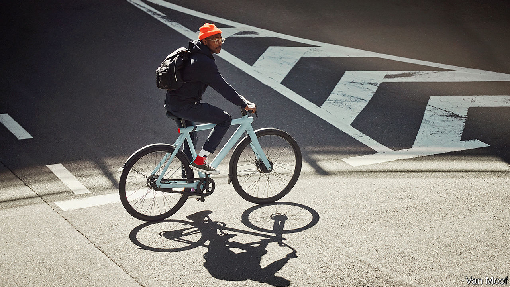

## Electric shock

# The pandemic is giving e-bikes a boost

> Two wheels good. Two wheels plus a motor better

> Aug 1st 2020

VANMOOF, A DUTCH bicycle-maker, is known for sleek designs and clever advertising. In a television spot for its newest model, images of the evils of car culture—accidents, gridlock and pollution—are projected onto the skin of a luxury car, which melts, turning into one of the company’s elegant e-bikes.

Electrically assisted bicycles are not about to replace cars. But they are booming, especially in Europe, where sales rose by 23% in 2019, to 3m units. E-bikes are unlocking even saturated bicycle markets like the Netherlands, where the average person already owns 1.3 pushbikes. Last year Deloitte, a consultancy, estimated the number of e-bikes worldwide at 200m, and expected it to hit 300m by 2023.

That may prove to be an underestimate now that coronavirus-wary commuters are shunning public transport and cities are expanding cycle lanes. Sales, which braked in March and April owing to supply-chain wobbles and shuttered stores, shifted into high gear when lockdowns lifted. In June revenue at Accell, Europe’s biggest bicycle manufacturer, was 53% higher than a year ago, largely thanks to e-bikes.

Big firms such as Accell and Giant of Taiwan compete with sporty brands such as America’s Cannondale and affordable city rides from QWIC. Brompton, a British maker of fancy folding bikes, has been making 10% of its £42.5m ($56m) in annual sales from the electric sort, and hopes eventually to raise that figure to 40%. VanMoof, which raised $13.5m from investors in May, bills itself as the Tesla of e-bikes. Like the electric-car maker it designs its own parts, motors and software rather than relying on off-the-shelf bits and bobs. The result is a more seamless product, boasts Taco Carlier, a Dutch engineer who co-founded VanMoof with his brother in 2009.

Demand is growing faster than manufacturers can keep up, leading to long backlogs and premium prices, which start at around $1,000. Giant says that its gross margin on e-bikes is around 25%, above its average of 21%. VanMoof’s machines go for $2,000 a pop. Mr Carlier may, however, have to rethink his firm’s marketing strategy. Though its polemic against traffic jams evokes French nouvelle vague cinema, the ad was banned in June by French authorities, for trying to “discredit the automobile sector”.

Editor’s note: Some of our covid-19 coverage is free for readers of The Economist Today, our daily [newsletter](https://www.economist.com/https://my.economist.com/user#newsletter). For more stories and our pandemic tracker, see our [hub](https://www.economist.com//news/2020/03/11/the-economists-coverage-of-the-coronavirus)