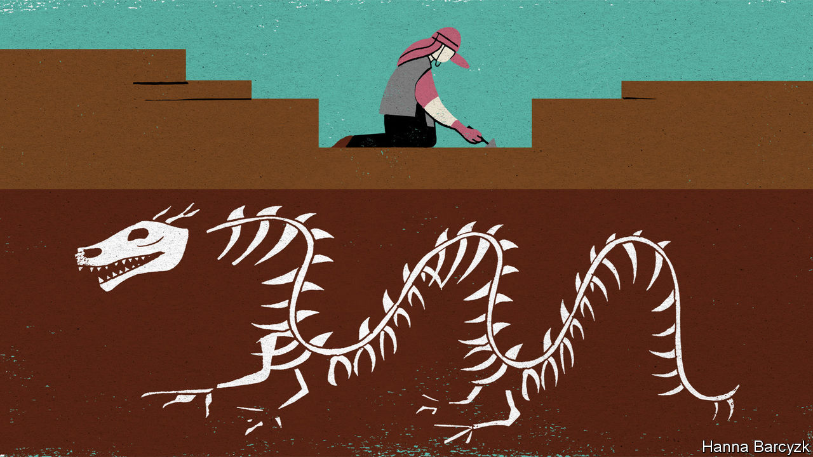

## Chaguan

# Digging up China’s past is always political

> Officials claim an archaeological site proves that China has 5,000 years of continuous history

> Aug 1st 2020

IN THE TIGHT-KNIT world of Chinese archaeology, a sign of a dig’s importance is the sight of Zhou Mingsheng at work. A sun-battered, tousle-haired field technician who has worked at excavations all around China, “Master Zhou” is credited with the gentlest touch in his profession. Born into a farming family, he is a “national-level craftsman” with a talent for using simple tools—a trowel and soft brush—to extract relics that would crumble in other hands, says his current boss, Wang Xu, director of an archaeological site at Shuanghuaishu, a Neolithic settlement near the Yellow River in the central province of Henan.

Master Zhou’s presence, quietly supervising local villagers as they scrape at the hard-packed soil, is not the only proof that this hilltop site has the attention of high-ranking officials. Since digging began in 2013, funding has increased greatly. Sturdy roofs cover much of the site. Vaulted living quarters have been built into a hillside, keeping them cool in summer heat and cosy in winter frosts. A spell at Shuanghuaishu is a prize for top students at Peking University, the country’s most prestigious college. Visits by Chinese dignitaries are a weekly routine.

It is not beauty that lures visitors to Shuanghuaishu. At 5,300 years old, the settlement is the work of a culture too simple to have left behind exquisite bronzes or written inscriptions. The single most precious find, to date, is a finger-length sculpture of a silkworm, carved out of the tusk of a boar. Nor is the setting lovely: a scrubby plateau patrolled by dragonflies and deafening crickets, between a highway and two power stations. Rather, the site’s importance is historical, and thus political. For since the birth of Chinese archaeology in the 1920s, it has been inseparable from claims that China boasts the oldest unbroken civilisation on Earth.

That question caused a genteel tussle between President Donald Trump and his Chinese counterpart, Xi Jinping, during a state visit in 2017. As the pair explored the Forbidden City in Beijing, Mr Trump ventured that he had heard that China has 5,000 years of history, but that Egypt has 8,000. “Egypt is a bit more ancient,” Mr Xi replied. “But the only continuous civilisation to carry onwards is China.” Shuanghuaishu is now part of that debate. Leading archaeologists say that the site boasts the right combination of location, age, grandeur and distinctive cultural elements to be the capital of an early Chinese kingdom. That would make it a bridge between China’s written history, which stretches back 3,000 years, and the era of the Yellow Emperor, who by tradition ruled over these fertile central plains almost five millennia ago, though many foreign scholars have the impudence to dismiss him as a myth. State media call the site proof of China’s 5,000 years of history.

Master Zhou began his career in 1979. He is too diplomatic to say so, but that was a period of cautious rebuilding for Chinese archaeology, after the relic-smashing frenzies of the Maoist era. Back then ancient treasures, if displayed at all, were labelled as evidence of feudal oppression. By the late 1990s patriotic education had replaced class warfare as a favoured tool for mobilising the masses. In 1995 a deputy prime minister, Song Jian, was mortified during a visit to Egypt, where officials showed him a detailed timeline of the pharaohs extending back 4,700 years. He returned arguing that China needed similarly precise dates for its dynasties, writing that history without chronology “can only be called rumour or myth”. The central government tasked a team of 200 archaeologists, historians and other scholars with assigning firm dates to the earliest dynasties listed in classical histories, the Xia, Shang and Zhou. That multi-year project ended with official Chinese declarations of success, and a start date for the Xia dynasty four millennia ago. In contrast, many foreign scholars question to this day whether proof of the Xia has been found.

A second national project to research the origins of Chinese civilisation followed from 2002 to 2015. It was given a further boost by President Xi’s launch in 2013 of a globe-spanning infrastructure scheme, the Belt and Road Initiative, with its talk of reviving ancient trade routes along the Silk Road. Mr Wang recalls how those twin quests to find silk-producing kingdoms led archaeologists to Shuanghuaishu, and then in 2016, to two nearby sites where small urns turned out to hold children buried in silken funeral wrappings. He lists signs of Shuanghuaishu’s sophistication, from its large houses to neatly dug tombs, some containing residents who lived to the then-astonishing age of 40 and have the slender torsos of those spared hard labour. A series of pots was found buried in the precise shape of the plough, a constellation. Foreigners carp about a lack of written records, Mr Wang notes. Perhaps they are missing symbols that will one day be deciphered, for instance in patterned pottery. Maybe the Yellow Emperor was not a literal person, but a tribe. Outsiders “can’t keep using Western standards to apply to Chinese ruins,” he argues.

To foreigners, a final puzzle remains. Shuanghuaishu is an interesting place. But so are lots of other Chinese sites of the same period. Wang Wei, director of the Institute of Archaeology at the Chinese Academy of Social Sciences (CASS), agrees that similar artefacts—from jade carvings to images of dragons—have been found in several sites dating back five or six millennia. That would seem to bolster those scholars who compare early China to a “starry sky” filled with competing cultures. But unity is what interests Mr Wang. In time, he says: “the stars gathered in central China, and a nation was built on top.” Shuanghuaishu matters because it lies in that central cradle of national greatness. Chinese archaeology has three main missions, says the CASS archaeology boss. The first two are studying human development and agriculture. But the most important is studying the origins of Chinese civilisation. If that sounds like a political answer, in China history and politics are inseparable. And that has been true for thousands of years.■