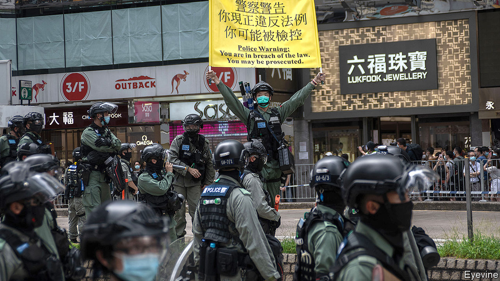

## One country, two passports

# Many Hong Kongers are considering emigration

> Political and economic uncertainties may drive a new exodus

> Jul 30th 2020

IN SEPTEMBER 2018 Matthew Torne, a British filmmaker, released the third in his trilogy of documentaries about Hong Kong. “Last Exit To Kai Tak” is a bittersweet chronicle of five Hong Kongers who, after the disappointment of the pro-democracy “umbrella” protests of 2014, grapple with what is left for them in the city, as its liberties are chipped away by an increasingly bellicose Chinese government. The burning question, as one character puts it, is this: “revolution or emigration?”

For many people, that question has now been answered. At 11pm on June 30th, one hour before the 23rd anniversary of Hong Kong’s return to Chinese rule, the Communist Party imposed a national-security law designed to squash Hong Kong into submission. The city’s reputation as a haven of free speech within China disappeared overnight, along with the “one country, two systems” framework set up in 1997. In 2014 Communist Party leaders waited for the protesters to lose steam. But by 2020 they had run out of patience.

Several people were arrested for violating the new law on July 1st, but most have been dissuaded from taking to the streets. Then, on July 29th, four students aged 16 to 21 were detained for “inciting secession” on social media. They included Tony Chung, former leader of Studentlocalism, a protest group that had called for Hong Kong’s independence from China. On July 30th Hong Kong’s government said it had disqualified 12 pro-democracy figures from standing in elections in September for the Legislative Council (Legco), Hong Kong’s (until now) semi-democratic parliament. As the euphoria of the protests has dissipated and the new reality has sunk in, the focus for many Hong Kongers has shifted—just as it did a generation before, as the handover loomed—to emigration.

It is not just the crackdown that is pushing people to leave. Hong Kong was already one of the world’s most expensive places to live. It ranked above New York, Tokyo and London in the latest cost of living survey carried out by the Economist Intelligence Unit, a sister company of The Economist. Then came the covid-19 pandemic. The economy shrank by 9% year-on-year in the second quarter of 2020. On July 29th Carrie Lam, the territory’s chief executive, warned the city was “on the verge of a large-scale community outbreak”. (Rumours spread that Legco elections might be postponed as a result.) A poll by the Chinese University of Hong Kong conducted in May, after China announced its intention to impose the law, found that half of 15- to 24-year-olds were considering leaving. “In Hong Kong people learn to survive, not live,” says Thea, a 23-year-old who plans to emigrate. “Even for a middle-class person like me, having my own flat is like an impossible mission.”

Would-be émigrés have many destinations to choose from. Canada is home to more Hong Kong-born people than any other OECD country. More than 275,000 of them emigrated there between 1989 and 1997. A residence permit can be secured by an investment of just C$150,000 ($112,000), a sum easily covered by the sale of a pad in Hong Kong, where the average house price is $1.2m, according to CBRE, a property firm. Australia is offering five-year visa extensions to Hong Kongers already in the country, “with a pathway to permanent residency”. An investment visa is pricier, at around A$1.5m ($1.1m).

Other avenues are also now available. Taiwan has opened an office to help Hong Kongers resettle. Between January and May, there were 3,352 Hong Kong applicants for permanent residence in Taiwan, double the figure in the same period for 2019. Cultural similarity and affordability make Taiwan a popular choice, says Roy Lam, an immigration consultant. A recent poll found that Taiwan was the most popular destination for 50% of Hong Kongers considering emigration.

The biggest difference is that Britain is now offering sanctuary. In 1990 the colonial master offered just 50,000 families British citizenship, and was accused of betrayal for fobbing off the rest (or at least those born before the handover) with a British National (Overseas) passport. This gave Hong Kongers a symbolic connection to Britain, visa-free visits for six months, and some consular protection outside Chinese territory, but not much else. Now, it is offering all 2.9m people who have BNO status the opportunity, with their dependents, to live and work in Britain, with “a path to full British citizenship”. Foreign Secretary Dominic Raab said Britain refuses to “duck our historic responsibilities”. China threatened to take “corresponding measures” (which presumably does not mean letting in 2.9m Brits).

Meanwhile, business is booming for emigration consultancies. Mr Lam relocated 250 families in the first half of 2020, nearly as many as in the whole of 2019. Harvey Law Group, a law firm, had to double the size of its team to meet demand. Andrew Lo’s firm, Anlex, normally receives ten inquiries a day. Since May, it has had 200 a day. He has had to deter bankers from reinventing themselves as butchers for Canada’s rural-immigration programme.

Hong Kong does not track emigration statistics. But there are proxy measures. Applications for certificates of no criminal conviction, a document required for visa applications (as well as adoptions and overseas study), leapt 40% between 2018 and 2019, to more than 33,000. The figure had hovered around 21,600 since 2012.

In 1989 Mr Lo helped people secure escape routes after the June 4th massacre in Beijing sent shudders through Hong Kong. “Today, people are more panicked,” he says. Then, people wanted an insurance plan; now they want to “move immediately”. More than a quarter of the Hong Kongers who moved to Canada between 1991 and 1995 later returned to Hong Kong, heartened by China’s initial light touch. Indeed, most of the 300,000 Canadians in the former colony are Hong Kong-born. “I treasure my Canadian citizenship, and not just as a potential way out of Hong Kong,” says Joyce Lau, who was raised in Canada. Like most foreign-passport holders, she has no plans to leave just yet. Today’s would-be émigrés may be different. “I feel like I need to mentally prepare myself that I might not be able to return to Hong Kong,” says 23-year-old Nicole, who was deeply involved with the protests, and wants to leave.

Some high-profile student leaders have already gone. On July 2nd Nathan Law flew to London, fearing for his safety. For others it is much less clear-cut, not least because those who most want to leave—the young protesters—are the most idealistic about the fight and the least able, financially, to up sticks. “Leaving Hong Kong at this time of desperation just feels wrong,” says Nicole. “I feel like a deserter.”

So, just as in the 1990s, by necessity or choice, there is a third category for Hong Kongers: staying put and making the best of it. The city has always risen from the ashes, say optimists, and perhaps it can again. Many are waiting to see just how bad it gets. Curtis Law, a 28-year-old journalist, is renewing his BNO passport, just in case. “Perhaps it will be useful in the future,” he says. But “without a lot of savings”, moving to Britain is still “a last resort”. ■