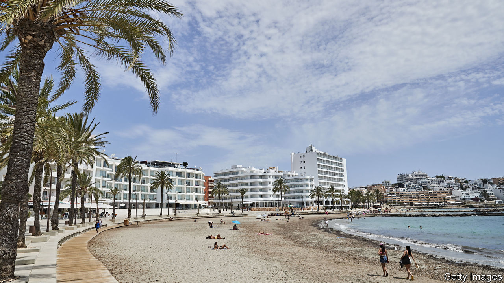
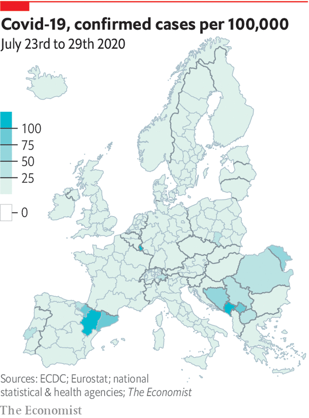

## The new hotspots

# Curbing the covid-19 comeback in Europe

> Young people are flouting the rules

> Aug 1st 2020

THE WAVES of an epidemic tend to rise like a tsunami—slowly, almost surreptitiously, before a precipitous surge. In parts of Europe there are now fears that covid-19 cases may again be nearing a menacing inflection point. In Spain, daily new cases in the week to July 28th have risen sharply to nearly ten times the low they had descended to in June, when the lockdown was lifted. Less dramatic but worrying increases in cases are starting to bubble up in other European countries.

For the moment, the spikes in Europe are largely confined to a few hotspot countries, regions within them or even towns. Infection rates are particularly high in the Balkans and in Spain, which has notched up about 27 cases per 100,000 people in the past week. The corresponding case rate in Germany, France and Italy is in the single digits. In both low- and high-rate countries, the bulk of new cases is often concentrated in particular locations. Roughly two-thirds of Spain’s cases in the past week are from just two regions, Catalonia and Aragon, which are home to a fifth of Spaniards. About 20% of Italy’s cases in the same period are in the Emilia-Romagna region, which has just 7% of the population.

The rise in cases across Europe is not surprising, says Hans Kluge of the World Health Organisation. As lockdowns were lifted and people resumed travel and mingling, both imported cases and the local spread of the virus have pushed tallies up. What is different now is that testing and tracing systems are catching local spikes early, and authorities are battling them with localised measures. On July 27th Antwerp, Belgium’s most populous province, announced a night curfew for non-essential movement and made masks mandatory in public spaces; people were told to stay at home as much as possible. Covid clusters have emerged across Germany, in care homes, workplaces and private parties, forcing officials to impose localised lockdowns. In mid-July the Catalan authorities reimposed a strict lockdown in Lleida, a city of 140,000. Nightclubs in Barcelona and other hotspots in Spain were recently shut or ordered to close early.

Varying covid-19 rates across Europe have prompted countries to make some tough choices. In a normal year, some 18m Britons seek fun in the sun in Spain, along with lots of other northern Europeans. But as cases in Spain notched up, Britain and Norway swiftly brought back quarantine for people coming from Spain. Vacationers to Greece from some Balkan countries must now show proof of a negative covid-19 test to enter the country. That has dealt a blow to whatever remained of the foreign tourist season in much of southern Europe. But there has been a collective sigh of relief among health officials watching with trepidation clubs and beaches crowded with drunk foreigners.

That, however, still leaves the matter of intensifying local transmission. A pattern that cuts across Europe is that new cases have been mostly among people in their 20s and 30s; clusters linked to large parties have become a recurring theme across the continent. German politicians have warned that citizens are growing complacent about the dangers; surveys confirm suspicions that fewer people are avoiding crowded public spaces or private gatherings. Dr Kluge says that the priority in Europe now is to ensure that young people comply more with such precautions. If that fails, he says, it won’t be long before infections spread to older, vulnerable people.

As the summer starts to wind down, the need to contain outbreaks across Europe will become increasingly acute. A huge worry in all countries is the autumn, when people start to spend more time indoors and flu and other respiratory infections rise as they do every year, filling hospital beds. Countries that reach that point with a high plateau of covid-19 cases could see a return to exponential growth that overwhelms hospitals again. Across Europe, they are better prepared for a second wave than they were for the first, with new measures to curb the spread of covid-19 in hospitals and extra beds and field hospitals that are mothballed now. But how hard they are hit will depend largely on how much their citizens choose to play by the rules of the new normal.■

Editor’s note: Some of our covid-19 coverage is free for readers of The Economist Today, our daily [newsletter](https://www.economist.com/https://my.economist.com/user#newsletter). For more stories and our pandemic tracker, see our [hub](https://www.economist.com//news/2020/03/11/the-economists-coverage-of-the-coronavirus)

## URL

https://www.economist.com/europe/2020/08/01/curbing-the-covid-19-comeback-in-europe
