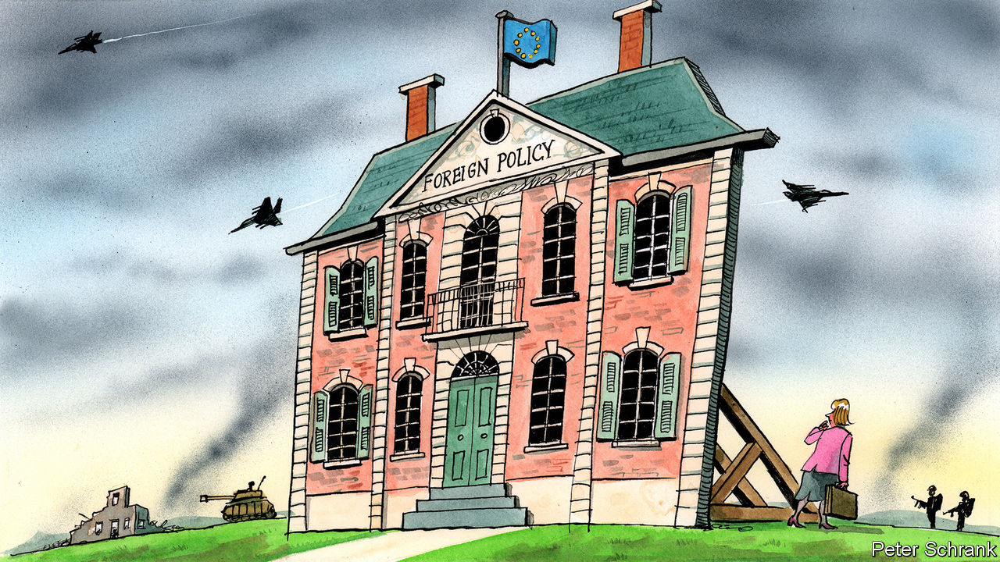

## Charlemagne

# Europe still lacks a foreign policy

> Yet in matters of currency it has hung together better than predicted

> Aug 1st 2020

TO DEPRESS AN EU diplomat, lay out a map of Europe. On one border is Russia, posing a physical threat to the bloc’s eastern members and a digital one to the rest. To the south-east the western Balkans remain a mess. Turkey has evolved from partner to awkward neighbour to menace. In Ukraine a war still rumbles on, while Belarus, previously a place of autocratic stability, looks wobbly. Around the Mediterranean a line of unstable or failed states stretches from the Middle East to north Africa.

A coherent foreign policy in such circumstances would make sense. Instead the EU has a contradictory one. Russia is regarded as an existential threat by the likes of Poland, but a potential ally by France. Turkey is viewed in a similarly erratic way. Countries in the western Balkans should be hugged close or shoved away, depending on whom you ask. In Libya, perhaps the apogee of EU foreign-policy bungling, member states managed to find themselves on different sides of a civil war, while both Russia and Turkey carved out a foothold on the EU’s southern underbelly.

The EU is a victim of geography when it comes to foreign policy. But it is also a casualty of its own policy failures. To understand these problems it is worth remembering how it handled another predicament: the euro-zone crisis. The two have more in common than first appears. In both cases an indispensable national government lurks as the cause of, and solution to, the bloc’s problems. During the euro-zone crisis this role was played by Germany, argues Alexander Clarkson of King’s College London. A near-hegemonic economic power, Germany was often the biggest obstacle to reforms that would have shored up the euro, such as mutual debt issuance. At the same time its stern preference for balanced budgets and low debt limited the bloc’s economic policy options.

When it comes to Europe’s collective geopolitical clout, France plays a similar role, says Mr Clarkson. France is the closest thing the EU has to a global power. After Brexit, it is the bloc’s sole nuclear power and only member with a permanent seat on the UN security council. The French government has been a noisy advocate for European sovereignty—essentially demanding that the EU get its act together to a point where it can happily ignore the demands or threats of China and America. In practice, however, this has tended to manifest itself in an expectation that the EU should simply follow French policy. A paradox has emerged: while France calls most loudly for a canny European strategy, it is often the first to undermine it. In the western Balkans, it fought a rearguard protest against North Macedonia and Albania taking a step towards joining the bloc, despite the region’s importance. In the case of Libya, France was the EU’s main sympathiser for Khalifa Haftar, a rogue general who launched an assault on the UN-recognised government in Tripoli, which ostensibly had EU support.

The EU is trying to fix the problems at its borders with the trappings of a foreign policy but not its actual tools, just as politicians tried to save the euro without always having the right institutions in place. The euro’s designers built the currency on the expectation that further integration would inevitably follow, which it did, albeit in a sometimes chaotic manner. This strategy was known as the Monnet method, after Jean Monnet, one of the EU’s founding fathers. But when it comes to foreign policy the tactic has so far failed. The EU is left with a botched Kevin Costner project: they built it, but nobody came. An EU foreign policy exists only so far as member states allow it, with any decision requiring unanimity. Instead the union offers Potemkin diplomacy, with missions across the globe flying EU flags and staffed with well-paid diplomats but with little in the way of strategy to promote. As a result the bloc is burdened by responsibility without power: expectations that it should do something rise, while the capacity for the bloc actually to do anything remains static.

A final similarity with the euro-zone crisis is an unwillingness of governments to admit that their fates are bound together. It took a pandemic-induced recession for Germany to learn this lesson, but learn it did. After opposing common debt issuance to solve the euro-zone’s ills, the German government at last gave the nod earlier this year, paving the way for the biggest federalising step the EU has taken since the euro’s creation. Even those countries which protested compromised, leading to a €750bn recovery fund, with €390bn handed to governments as grants. (While all EU countries were involved, the main targets were euro-zone economies in the bloc’s south.) It was a step towards the EU becoming a little more recognisably state-like. But in foreign policy no such breakthrough is visible. Member states do not yet believe that the pain of a shared foreign policy—with contentious issues settled by qualified majorities, backed by a proper military capability—is worth the benefits of one.

There are differences between the foreign-policy crisis and its euro cousin. Unlike euro policy, the EU’s foreign policy is not entirely in its gift to solve. There is no obvious buzzer marked “Fix Libya” that EU leaders are refusing to press. Markets cheer when the EU shows a modicum of political unity over the future of the euro. Given a similar breakthrough in foreign policy, leaders in Turkey and Russia would probably simply shrug. Likewise, while economic concerns are always at the top of voters’ minds, foreign policy appears only when something goes badly wrong. There is less political impetus to boost the EU’s geopolitical standing.

A totemic belief for EU officials is that crisis breeds integration. It is a view first put out by Mr Monnet that Europe is “forged in crisis”. Such an attitude can lead to complacency but in the case of the euro it stood the test. The currency bloc stumbled but never fell, with politicians taking necessary steps, albeit belatedly. A similar path is available when it comes to the EU’s foreign policy. After all, there are plenty of crises to test the theory on. Just look at a map. ■

## URL

https://www.economist.com/europe/2020/08/01/europe-still-lacks-a-foreign-policy
