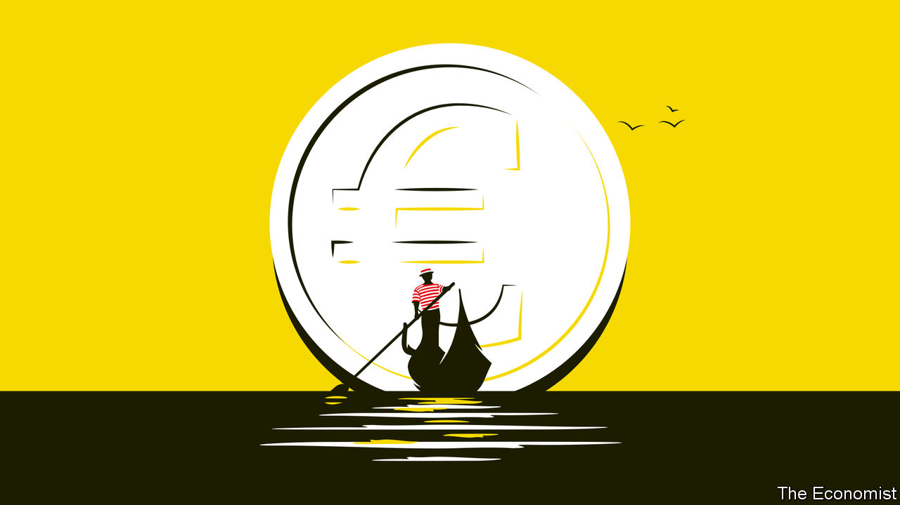
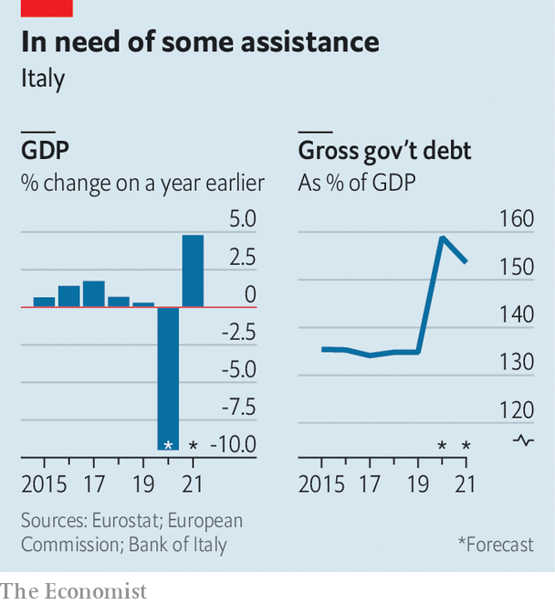

## How to spend it

# Italy has to work out what to do with all its new EU money

> In the past it has wasted a lot

> Aug 1st 2020ROME

TO OPEN A motor-repair business in Italy, you need 86 permits. Opt for something simpler, like selling pizza by the slice, and things may not stay simple for long: your firm will be subject to checks by 21 different government agencies. Get into a commercial dispute and you can expect it to drag on for three years on average, twice as long as in Spain.

These facts and figures, assembled for the website of Corriere della Sera, a daily, help explain why Italy was ranked fifth-worst among EU states in the World Bank’s latest survey of obstacles to doing business. They also help explain why this month’s European summit lasted five days as a quartet of flinty countries resisted approving a landmark deal to fund the EU’s recovery from the covid-19 pandemic.

The new facility involves the European Commission borrowing €750bn ($880bn) to give or lend to member states according to how badly their economies have been hit by the virus, but also according to how much their economies need to modernise.

There are two ways of considering the so-called New Generation EU (NGEU) project: pessimistically, as it could presage endless redistribution from the efficient north to the inefficient south, or as a historic opportunity to bring the south up to the level of the north so that such transfers will no longer be needed. As the main beneficiary, Italy bears a huge responsibility.

Precisely how much Italy will get is unclear. Giuseppe Conte, the prime minister, claims it will be €209bn: €81bn in grants and €127bn in loans. But though Italy’s loan entitlement can be calculated, what it actually borrows will depend on factors including the commission’s assessment of Italy’s spending proposals and its government’s willingness to take on yet more debt: extra borrowing to cope with covid-19 has nudged the total to at least 155% of GDP. As for the grants, 30% of the money will not be doled out until mid-2022.

As a net contributor to the EU’s finances, Italy may eventually have to pay for much of its supposedly free lunch, when the bonds issued by the commission mature, though the rules have yet to be settled. A more immediate objection is that the “frugal four” (Austria, Denmark, the Netherlands and Sweden) were bought off with budget rebates that could cost Italy’s taxpayers some €11bn.

That still leaves a handout of €70bn—five times what Italy got in today’s money from the post-war Marshall Plan, though a better yardstick is its relation to the size of the economy at the outset: 4.3% of Italy’s estimated GDP this year, against 8.3% of its GDP in 1948.

Small wonder that Mr Conte’s handling of the negotiations won him some plaudits even from the opposition—but not from the hard-right Northern League, whose concerns focus on the loan: “damned dangerous” in the view of Claudio Borghi, the chairman of the lower house budget commission. He argues that, as preferred debt, Italy’s loans from Brussels will subordinate its existing bonds, making them vulnerable to market panic if circumstances alter.

So far, investors are unfazed. Since the recovery funds were approved, the yield gap between Italian and German government bonds, which reflects market worries about Italy, has narrowed by 14 basis points, to just 1.49%. Giovanni Zanni, chief euro-area economist for NatWest Markets, says investors focus on two things. One is a government’s ability to repay its debts: with interest rates falling, he predicts that Italy’s annual borrowing costs could soon be down to 2% of GDP. The other factor is a government’s willingness to repay: with the Eurosceptic League out of government, there is no threat of Italy leaving the euro and re-denominating, or renouncing, its debts. Mr Conte has a fragile grip on office, with a wafer-thin majority in the Senate, but one of his first moves on returning from Brussels was to reach out to Silvio Berlusconi’s increasingly moderate Forza Italia party for extra support.

To some extent, Italy’s spending priorities will be dictated from Brussels; and the frugals have won an emergency brake on disbursements if things go wrong. That could cause problems. The country has for years fought against demands for unpopular structural reforms in return for EU concessions. But the aims of the recovery fund include making Europe greener and more digital. That chimes with the priorities of Mr Conte’s government, especially its largest component, the Five Star Movement.

A serious drag on economic growth is the time Italians waste interacting with the state. And it has increased. The proportion of people who report spending more than 20 minutes when queuing at registry offices has risen by more than two-thirds in the past 10 years. Parliament is debating legislation sponsored by the minister for innovation and digitalisation, Paola Pisano, to make the entire range of government services accessible via an app. She says she will be pushing for NGEU money to be spent on improving connectivity and digital education, particularly in the south of the country, where it is most lacking.

That raises perhaps the most important question of all. Italy exemplifies the EU’s division, with a north almost as rich as Germany and a south nearly as poor as Greece. If the NGEU can be used to pull the south closer to northern levels of prosperity, it would solve many problems, not just for Italy. But it has been tried many times before and has always run into the same obstacles: a mentality of dependence on the state, poor infrastructure and organised crime. The shortcomings of the south are also the main reason for Italy’s dire record of using past EU funds. Italy cannot afford to miss out in the same way on its biggest opportunity in 70 years. As Ms Pisano says: “This is a train that will only pass once.” ■

Editor’s note: Some of our covid-19 coverage is free for readers of The Economist Today, our daily [newsletter](https://www.economist.com/https://my.economist.com/user#newsletter). For more stories and our pandemic tracker, see our [hub](https://www.economist.com//news/2020/03/11/the-economists-coverage-of-the-coronavirus)

## URL

https://www.economist.com/europe/2020/08/01/italy-has-to-work-out-what-to-do-with-all-its-new-eu-money
