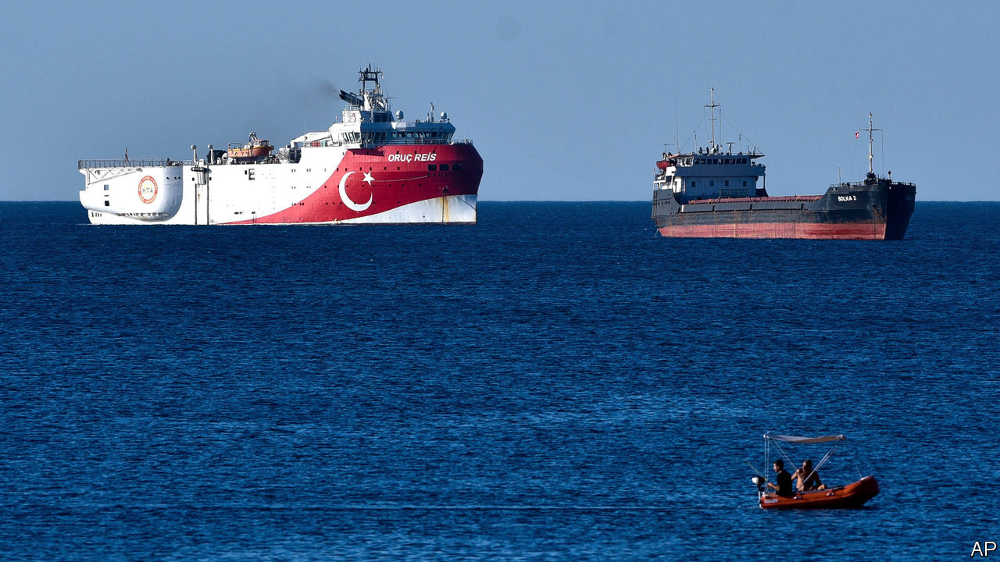
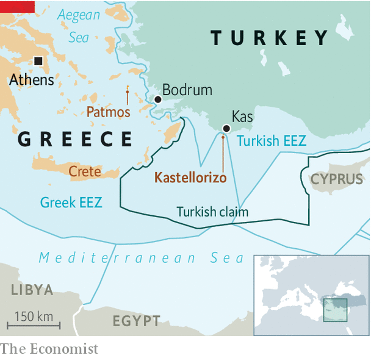

## Muddying the waters

# Turkey and Greece avoid coming to blows, for now

> But a dispute over drilling rights is far from settled

> Aug 1st 2020ATHENS, BODRUM AND PATMOS

ON PATMOS, A small Greek island popular with jet-setters, flags flew at half-mast on July 24th. Church bells tolled every hour in protest against Turkey’s transformation of the Hagia Sophia, in Byzantine times the grandest cathedral in Christendom, from museum to mosque. That was not the islanders’ only concern. Coastguards, together with almost all the Greek navy and air force, were placed on high alert after Turkey announced on July 21st that the Oruc Reis, a drilling ship, would carry out ten days of exploration for oil and gas in a disputed area of the south Aegean.

The dispute has simmered for years. Turkish drilling ships periodically sail into exploration blocks off Cyprus to underline Turkish demands for a stake in potentially lucrative gasfields. This time the target was Kastellorizo, a far-flung Greek island opposite Kas, a pleasant resort town on the Turkish mainland. Tourist ferries between the two have been suspended this year because of covid-19. A couple of warships now cruise the area instead. Fighter jets occasionally split the sky above.

The two NATO countries have had their share of dust-ups of late. Earlier this year Turkey’s President Recep Tayyip Erdogan encouraged tens of thousands of migrants to breach the border with Greece. More recently the conversion of the Hagia Sophia saw the country’s top mufti delivering a sermon while clutching an Ottoman sword. The border crisis helped Mr Erdogan distract public opinion at home from an air strike that killed dozens of Turkish troops inside Syria (see [article](https://www.economist.com//node/21790210)). The reconquest of the Hagia Sophia came amid the economic fallout from the coronavirus crisis. Both were also intended to put pressure on Greece.

Turkey and Greece are staking competing claims to the waters between them, and the energy riches that may lie beneath the waves. Greece holds that its islands, even the smallest, have continental shelves where it has the sole right to drill. The EU and America agree. The Eisenhower, an American aircraft-carrier, accompanied by 12 smaller vessels, recently held a joint exercise with a Greek frigate and several Greek F-16 fighter jets off the island of Crete. Meanwhile, France threatened to slap Turkey with sanctions.

Turkey has long refused to recognise the economic zones around the Greek islands hugging its shores. An island like Kastellorizo, only a couple of kilometres offshore from Turkey, should not be able to generate 40,000 square km of maritime jurisdiction, says an official in Ankara. To make its point, Mr Erdogan’s government last year signed an agreement with Libya’s UN-backed government which it says gives Turkey the right to waters off Crete and other Greek islands. Greek officials say the deal is not worth the paper it is written on, and suggest they are close to signing a competing agreement with Egypt.

Maritime law does not offer clear solutions in the Mediterranean. “Good claims could be made either way,” says Brenda Shaffer, an energy expert at the Atlantic Council, adding that such disputes usually end up having to be settled by force or by agreement.

Agreement does seem possible. After a phone call between Angela Merkel, the German chancellor, and Mr Erdogan, Turkey said on July 28th that it would suspend plans to drill off Kastellorizo and give talks a chance. The Oruc Reis stayed tied up in port. In return, Kyriakos Mitsotakis, the Greek prime minister, offered to meet the Turks in Berlin, if calm prevails in the Aegean for the rest of the summer. That is hardly guaranteed. But Mrs Merkel’s willingness to get involved in one of southern Europe’s knottiest issues is a good sign. ■

## URL

https://www.economist.com/europe/2020/08/01/turkey-and-greece-avoid-coming-to-blows-for-now
