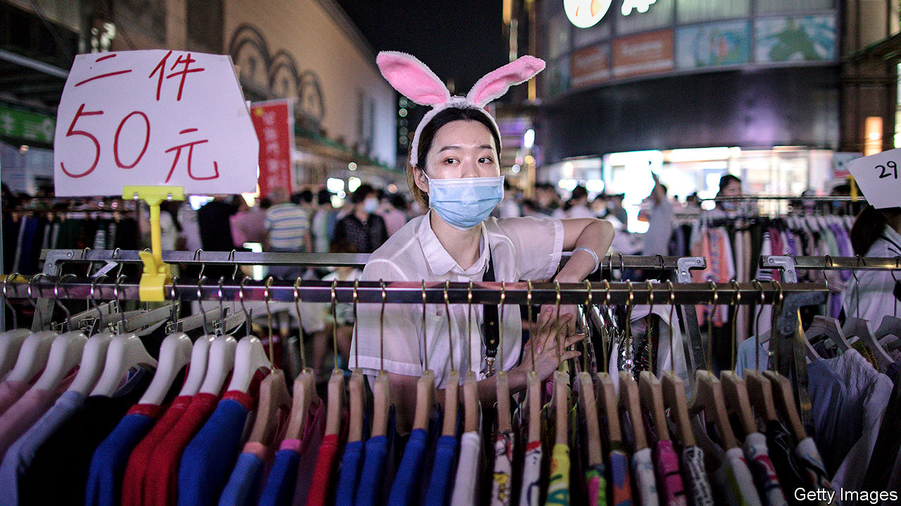
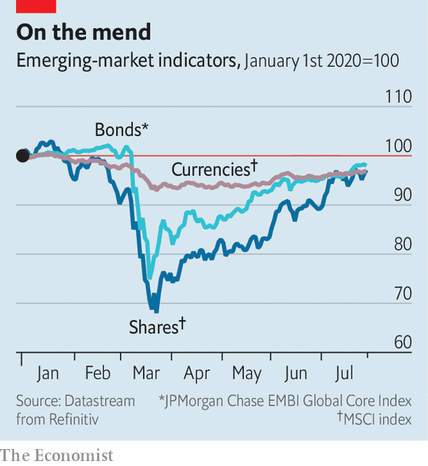
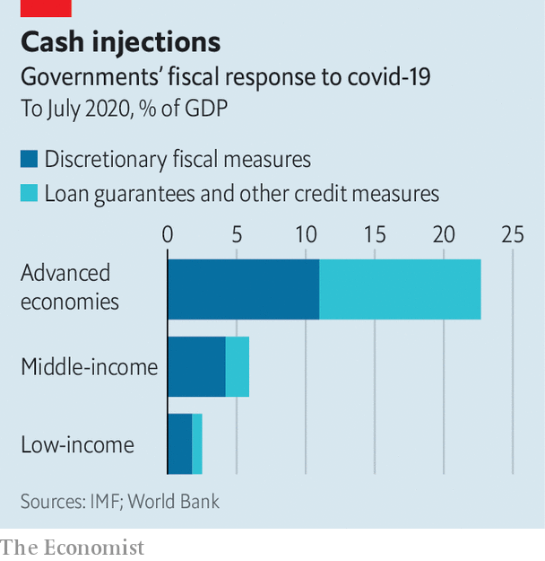

## A sigh of relief, a gasp of breath

# In emerging markets, short-term panic gives way to long-term worry

> Emergency measures have helped keep economies alive, but could have nasty side-effects in the long term

> Aug 1st 2020

FATIGUE. SHORTNESS of breath. Frayed nerves. Lungs mottled by scars. Months have passed since early survivors of covid-19 recovered from the disease. But some still report lingering after-effects. The disease, it seems, can inflict lasting damage, even in cases that did not prove critical. The same may be true of the pandemic’s impact on economies, especially in the developing world. Some acute dangers seem to be receding. But chronic problems loom. What does not kill these economies may still leave them weaker.

A few months ago the coronavirus shock looked financially lethal. But emerging-market bonds, currencies, and shares have rallied strongly since plumbing dramatic depths in March (see chart), thanks to a determined effort by the Federal Reserve, America’s central bank, to allay financial stress at home by relieving a shortage of dollars worldwide.

In China, the biggest emerging economy of all, the revival of activity has been remarkable. Its GDP somehow grew by 11.5% in the second quarter, compared with the first, an annual pace of 59%, according to UBS, a bank. That left it 3.2% higher than in the prelapsarian era of April-June 2019. Capital Economics, a consultancy, now expects that by the end of this year China’s output will have caught up to where it would have been without the pandemic.

China’s growth has helped lift commodity prices, benefiting the roughly two-thirds of developing countries that export oil, metals and other primary products. The dollar value of Indonesia’s goods exports in June was 2.3% above that of a year earlier, defying expectations of a 12.3% fall. Other big emerging economies have also reported pockets of resilience or piecemeal recovery. In Mexico remittances were over 3% higher in May than a year earlier, perhaps because its emigrants took the opportunity to send money home while the peso was cheap. India in May and June regained over 90m of the 114m jobs lost in April, according to the Centre for Monitoring Indian Economy, a research firm.

Two big concerns remain, however. The long-term worry is that the virus leaves behind economic scars even after it departs. The more immediate concern is that it has yet to depart. Indeed, the surprisingly strong response to the easing of lockdowns (dubbed “revenge consumption”) in some countries may have contributed to an uptick in infections in parts of China and Vietnam (as well as richer economies like Australia and Japan) that had successfully contained the virus. And the resumption of ordinary life has no doubt contributed to the continued strong growth in infections in India and much of Latin America. The “recovery is unlikely to be a smooth process”, note analysts at Capital Economics.

Nor is it likely to be complete. Past epidemics have left a permanent mark. Three years after SARS, MERS, Ebola and Zika, investment was 9% lower in stricken economies, on average, compared with the unstricken, according to the World Bank. Output per worker was almost 4% lower. The lasting damage from covid-19 is likely to be far worse.

The pandemic has, for example, interrupted the education of many of the developing world’s youngsters. Those aged between five and 19 constitute a bigger share of the population in poor countries than in rich ones (26% versus 17%) and therefore a more significant share of the future workforce. The hiatus in their schooling is also more likely to become permanent. People cannot afford to remain on the “sidelines” in poor countries, points out Ayhan Kose of the World Bank. Youngsters feel a “bigger push” to get a part-time job, which can easily end up severing their ties to school.

Human capital is not the only kind that will suffer. When growth prospects are weak and uncertain, entrepreneurs are unlikely to invest in new premises, ideas or machinery, even if they can raise the finance to do so. According to the bank, governments in 58 developing countries have offered credit guarantees of various kinds to encourage lending. But banks remain risk-averse, says Bhanu Baweja of UBS.

The pandemic has also disrupted trade, which was already unsettled by tensions between America and China. For emerging economies, trade and foreign investment are sources of both hard currency and know-how. Firms learn about the world by selling to it; countries learn by hosting firms from elsewhere. By damaging global supply chains and denting international collaboration, “the pandemic could alter the very structures upon which the growth of recent decades was built”, warn Mr Kose and his co-authors in the bank’s latest “Global Economic Prospects” report.

If that is true, some industries in emerging economies will need reinvention. But contrary to folk wisdom, a crisis is not a good time for such a makeover. Research by Lucia Foster and Cheryl Grim of America’s Census Bureau and John Haltiwanger of the University of Maryland found that the reallocation of workers across firms slowed in America during its last recession. The crisis winnowed out productive firms as well as weaker rivals. Job destruction increased. But job creation fell just as much. In better times, workers can leave sunset industries for promising, sunrise sectors. But in a crisis, ousted workers simply get lost in the gloaming.

To their credit, policymakers in emerging economies have tried to keep banks and firms intact. In March central banks in 42 developing countries cut interest rates, according to the World Bank, far more than in any month in 2008. Many have also become more ecumenical lenders of last resort. India’s central bank, for example, is helping to shore up shadow banks.

A number of central banks have also bought sovereign bonds, helping governments provide as much stimulus as they dare (see chart). During the global financial crisis, recalls Mr Kose, some policymakers would say: “Maybe we shouldn’t do this, or we shouldn’t do that.” Those conversations have not happened this time.

On top of fiscal stimulus, financial regulators have become more forgiving. They have eased prudential limits on banks and allowed lenders to indulge in creative accounting, turning a blind eye to souring loans. In Russia, financial institutions can value the securities they hold at prices on March 1st. India introduced a moratorium on loan payments (see next story).

In some cases these macro-imprudential measures have interrupted reforms going in the other direction. China’s credit push reverses several years of attempted deleveraging. In the Philippines, an amendment to the central bank’s charter had strengthened its financial independence from the finance ministry. Now the central bank is busy buying its bonds.

Measures of this kind were necessary. But they may prove tricky to undo. Governments will have to arrest the increase in their debt without jeopardising the recovery. And regulators will eventually have to allow some loans to be written off and some firms to go bust, if new industries are to enjoy room to grow.

One reason why covid-19 inflicts lasting harm on those infected is the aggressive immune reaction it can trigger. This “cytokine storm” may help kill the disease. But it can also endanger the patient. Policymakers in developing countries must take care to prevent something similar happening to their economies. They have responded with justifiable aggression to the pandemic. If left unchecked, however, this storm of defensive measures could have some nasty side-effects of its own. ■

Editor’s note: Some of our covid-19 coverage is free for readers of The Economist Today, our daily [newsletter](https://www.economist.com/https://my.economist.com/user#newsletter). For more stories and our pandemic tracker, see our [hub](https://www.economist.com//news/2020/03/11/the-economists-coverage-of-the-coronavirus)

## URL

https://www.economist.com/finance-and-economics/2020/08/01/in-emerging-markets-short-term-panic-gives-way-to-long-term-worry
