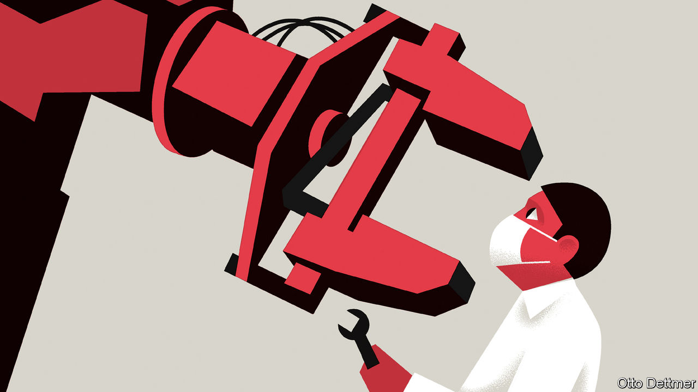

## Free exchange

# The fear of robots displacing workers has returned

> But do not expect tech-induced lay-offs just yet

> Jul 30th 2020

COVID-19 PRESENTED employers with a simple choice: find ways for workers to do their jobs safely, or shut down. At least some have chosen a third option, of dispensing with humans altogether. Among the many breathless headlines prompted by the pandemic are those warning of a new wave of job-destroying automation. The pace of automation in some parts of the economy, like factory floors and warehouses, is almost certain to accelerate. Yet on the whole, robot-induced mass unemployment should remain near the bottom of workers’ lists of worries.

The world has only recently recovered from a bout of robophobia. In the early 2010s advances in robotics and artificial intelligence (AI), described ominously in countless papers and books, seemed to portend a wave of job destruction. High unemployment after the global financial crisis of 2007-09 added to fears of a job scarcity. Fretting about robots in a downturn is not entirely irrational: firms appear to do most of their job-slashing during slumps. Nir Jaimovich of the University of Zurich and Henry Siu of the University of British Columbia argue that labour-market recoveries have grown weaker in recent decades as a result. Worries can be overdone, though. By the end of the decade unemployment had dropped like a stone and driverless vehicles were struggling to turn left. The earlier panic seemed a touch hysterical.

High rates of joblessness and eye-catching technological advances are again contributing to a new round of fears. In recent weeks, for instance, mind-boggling examples of the capabilities of GPT-3—an AI-based language-processing model developed by OpenAI, a research organisation—have zoomed around the internet. Another cause for anxiety has been businesses’ strategies for coping with the pandemic. Anecdotes of covid-motivated automation are easy to find. Many organisations have turned to software to automate paper-processing tasks that cannot be done by homebound workers. Those facing a deluge of customer enquiries, such as hospitals, are supplementing human assistants with chatbots. Employers’ interest in automating tasks in high-risk environments, such as slaughterhouses, is reportedly on the rise.

Any effect of these on unemployment has almost certainly been swamped by stronger economic forces, such as social-distancing measures and collapsing aggregate demand. And the pace of automation is likely to be gradual rather than disruptively speedy. Many jobs, even those commonly classified as “low-skilled”, require manual and social dexterity that machines cannot yet match. Workers in face-to-face industries—in bars or restaurants, say, or hair and nail salons—are especially vulnerable to covid-19. But there is little scope for, or interest in, replacing them with robots. In New York thousands of public-transport workers caught the virus, and dozens died. Despite billions of dollars of investment in driverless vehicles, though, computers cannot yet pilot buses through chaotic city streets.

Furthermore, automation is only one of the technological solutions available to firms as they weather the crisis. The pandemic’s most profound labour-market legacy will probably be a rise in remote work. About half of all Americans who were working before the arrival of covid-19 were doing their jobs remotely by May, according to one estimate. Surveys of firms indicate that some of the shift will not be reversed. If remote work slashes overheads and enables people to move to cheaper cities, it could preserve jobs, by alleviating cost pressures on struggling firms.

Telework may have some job-destroying effects, though. The pandemic has sped the adoption of technology in labour-intensive sectors like education and health care. Telemedicine and distance learning might mean that fewer doctors and teachers can serve more patients and students. Their largest impact is likely to be on blue-collar workers, such as clerical and janitorial staff, whose services become less necessary as the physical footprint of education and health institutions gets lighter. In a recent essay David Autor and Elisabeth Reynolds of Massachusetts Institute of Technology warn that such a dynamic could play out more widely. Over the past half-century employment growth in cities polarised: middle-skill work declined, and employment grew in white-collar professions and the services that support them. If remote working proves a lasting shift, then the café staff, taxi drivers and cleaners who depend on their custom could find themselves out of work.

Such severe, lasting labour-market pain in the aftermath of the pandemic may actually delay automation, by depressing wages. Developing and deploying new technologies costs money. Would-be automators deciding whether or not to make the needed investment could be swayed by the large reservoir of underemployed labour, willing to work for low pay. In America slaughterhouses—which often hire from a big pool of low-wage workers, many of them undocumented immigrants—are far less automated today than in parts of northern Europe, for example.

Tech-induced mass unemployment, then, seems unlikely. But there is one scenario where covid-19 could unleash the robots—if labour costs start to drift upwards, perhaps as global supply chains break down, or minimum wages rise. The reshoring of manufacturing jobs could lead to pressure to replace cheap foreign labour with robots at home. Production could no longer take advantage of low-cost labour, as America’s meat-processing industry does.

Years of economic dysfunction have energised campaigns for higher minimum wages and a more generous welfare state. The economic devastation wrought by the pandemic lends them momentum; like past crises, it could lay the groundwork for a new social contract. If post-pandemic policy were to enable workers to enjoy more security on fewer hours worked, firms might then face some genuine labour scarcity. And that would really work up an appetite for disruption. ■

## URL

https://www.economist.com/finance-and-economics/2020/07/30/the-fear-of-robots-displacing-workers-has-returned
