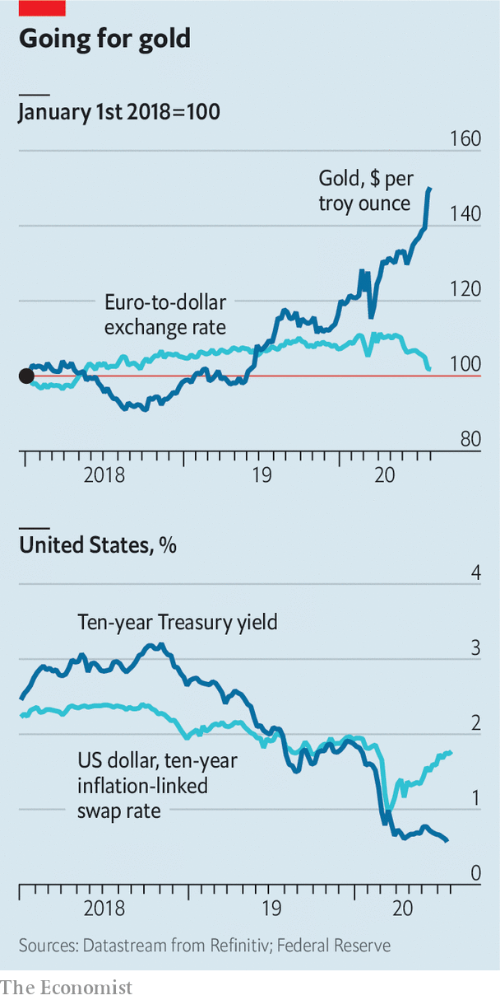

## Going for gold

# The price of gold surges to an all-time high

> And the dollar weakens against the euro

> Jul 30th 2020

ON JULY 29TH the price of gold surged to an all-time high, as the dollar fell to its lowest level against the euro in nearly two years. Yields on ten-year Treasuries have stayed low, on fears of a rocky economic recovery, even as expectations of inflation have risen. That has depressed real yields, making dollar assets less attractive and adding to gold’s lustre.

## URL

https://www.economist.com/finance-and-economics/2020/07/30/the-price-of-gold-surges-to-an-all-time-high
