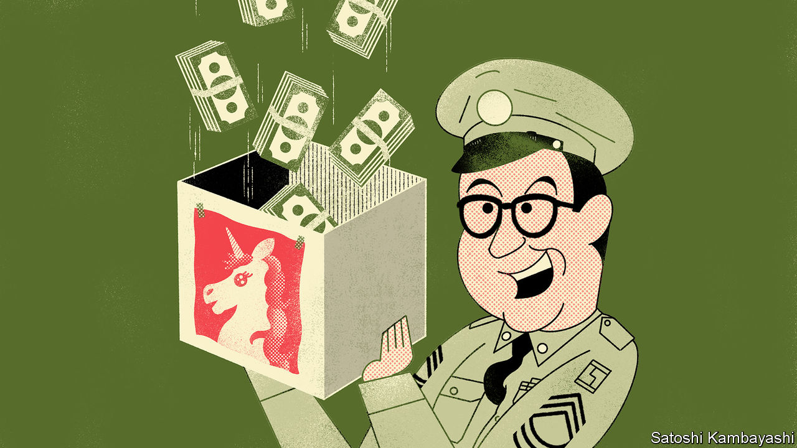

## Buttonwood

# The SPAC hack

> The latest twist in the power struggle between Silicon Valley and Wall Street

> Aug 1st 2020

IN AN EPISODE of “The Phil Silvers Show”, a 1950s TV comedy, Ernie Bilko (played by Silvers) discovers that his fellow army sergeants have fleeced a new recruit in a poker game. His plan to get the money back involves leasing a shop. “It’s just an empty store,” he insists. The others fear they are missing out. “When the smartest operator in the whole United States army suddenly decides to rent a store, we don’t ask no questions,” says one. “We just want to be cut in.”

An empty vessel can accommodate all manner of dreams. This trait helps explain the growing allure of the “special purpose acquisition company” (SPAC), a shell company listed on the stock exchange with a view to merging it with a real business. Ventures such as Virgin Galactic, in space tourism, and Nikola, in electric vehicles, have become listed companies by this route. Silicon Valley’s dream factory spies a way to sidestep the trials of an initial public offering (IPO). Bill Ackman, a shrewd hedge-fund manager, has just raised a $4bn mega-SPAC. He is looking for a unicorn to make a home in his empty store.

The view in Silicon Valley is that an IPO is a rotten process. There is typically a fixed fee, of up to 7% of the sum raised. And the value of the company is lowballed, say tech types, to allow for a satisfying first-day “pop” in the share price. Yet cost is not the only bugbear—and, perhaps, not even the main one. What entrepreneurs and their venture-capital backers hate about the IPO is the loss of control. They are used to being big shots in Silicon Valley. They do not like deferring to Wall Street types at all.

An IPO is meant to be a young company’s coming of age. It can be more like a funeral: a distressing ordeal that leaves you at the mercy of those you put in charge of it. The problem lies with an asymmetry. For the firm going public, the IPO is a one-off. But not for the underwriting banks. They have a relationship with the people buying shares. It is natural for them to favour repeat customers. The bankers run the roadshow to build a book for the IPO. They control the allocation of shares. And crucially, they set the price. If the IPO goes well, the banks retain the right to issue more stock to “stabilise” the market—a valuable option, known as a greenshoe. This, complains a Silicon Valley bigwig, is a “rapacious practice”.

Enter the SPAC, which is a sort of pre-cooked IPO. A shell company is set up by a sponsor. The SPAC is listed on the stock exchange via an IPO. The sponsor then finds a private business for the SPAC to acquire with the proceeds. Typically this will be a late-stage (ie, fairly mature) private company, whose owners and venture-capital backers are looking to cash out. The private company merges with the SPAC, following a shareholder vote. It is then a public company.

You can see the appeal for Silicon Valley. There is no roadshow, no ploughing through the same slide-deck ten times a day for a fortnight. It all takes much less time. That is handy in the present circumstances, when venture-capital firms need to get cash-burning unicorns off the books. Because this is a merger, and not an IPO, the selling firm can disclose more information to the buyer, including financial projections. The price is negotiated directly with the buyer—and after the money has been raised, not before. And it is all but certain, rather than at the mercy of the changing moods in the stockmarket, or a last-minute discount imposed by the bankers to sweeten the deal for favoured clients.

There is a downside, of course. Fees are unavoidable. Sponsors are typically paid with a 20% stake in the SPAC. This is in essence an indirect charge on the acquired firm. It is not obviously cheaper than an IPO. In principle the sponsor can dilute his effective “fee” by, for instance, co-ordinating another round of capital-raising from private-equity or hedge funds at the time of the merger. A few sponsors might inspire a halo effect, increasing the share price just by association. Investors will not question a really big name; they just want to be cut in. And the 20% fee is not set in stone. Mr Ackman, for instance, is taking a much smaller cut and making it conditional on reaching performance targets.

Trustworthy sponsors will keep their own capital tied to the venture. But Bilko is not to be trusted, of course—where would the comedy be in that? His three rival sergeants realise too late that he has sold each of them a one-third stake in a worthless venture. “Don’t you own a piece of it?” asks one in a panic. “Me? I’m in the army,” replies Bilko. “What would I want with an empty store?”