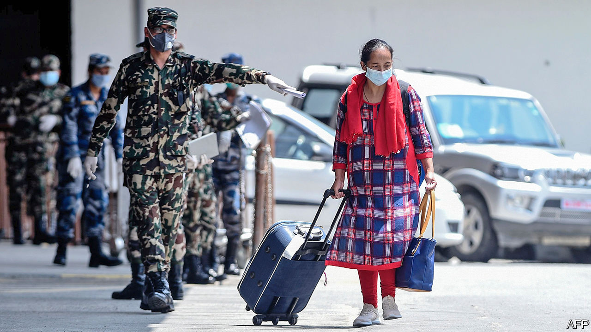
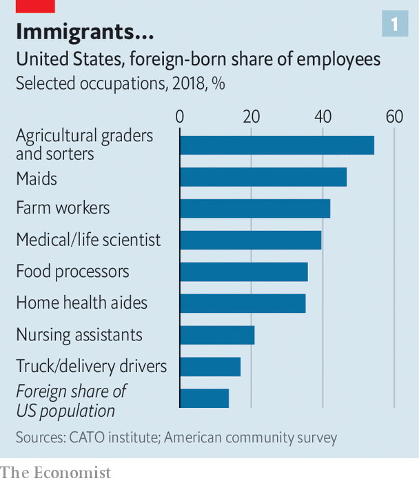
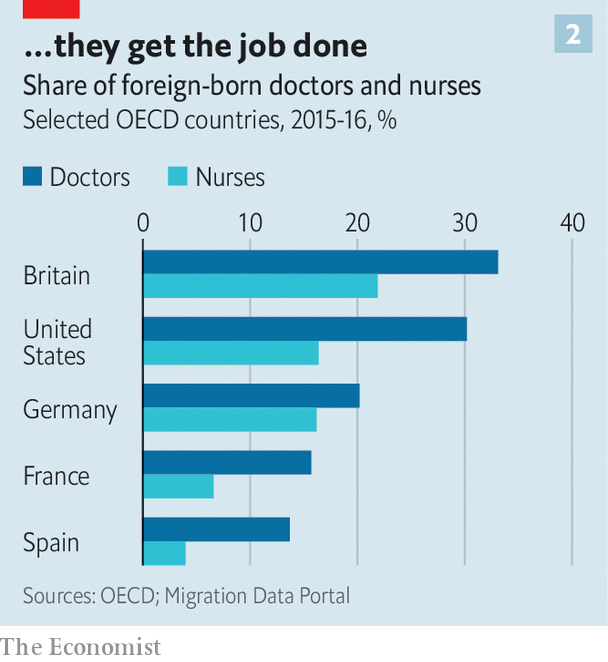
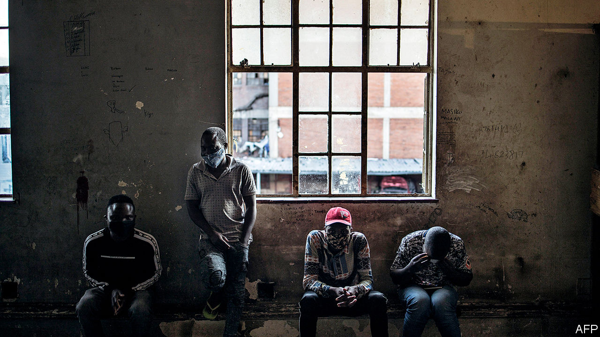

## Tearing up the welcome mat

# When covid-19 recedes, will global migration start again?

> Many curbs on immigrants could outlast the pandemic

> Aug 1st 2020DUBAI, JOHANNESBURG, SINGAPORE, SYDNEY, TOKYO AND WASHINGTON, DC

EVERY WEEKEND the removal vans come to a leafy suburb of Dubai. Expatriates are packing up. The United Arab Emirates (UAE), of which Dubai is part, will lose 10% of its population this year, reckons Nasser al-Shaikh, an ex-finance minister. Covid-19 has devastated the Gulf’s trade-and-transport hub. Emirates, Dubai’s airline, says it may cut 30% of its roughly 100,000 staff.

Nearly all of those losing their jobs in the UAE are migrants, who are almost 90% of the population. Without a job, they have to leave the country. This is irksome enough if they are bankers or architects. For those who used to wash dishes in hotels or lay bricks on building sites that are now shuttered, it can be a nightmare. Some 500,000 Indians in the UAE have registered to be evacuated; less than half have been.

Many blue-collar migrants have waited so long for flights that they have blown their savings. Asad (not his real name) got a $1,100 pay-off when he lost his construction job in April, but has had to spend nearly all of it on food and other necessities, which are far costlier in Dubai than back home in Pakistan. This week he was huddling outside the airport for a cigarette before a flight to Lahore. “Two years [and] I go home with almost nothing,” he says. Some of his friends are even worse off: they still owe money to the labour brokers who brought them to the Gulf in the first place.

Covid-19 has immobilised the world. Planes are grounded, borders are closed, people are hunkered down at home. Every country has restricted travel because of the coronavirus—issuing more than 65,000 rules in total. Some countries are starting to open up but it will be a long time before people can globetrot as freely as before.

For tourists who have to take a domestic holiday instead of a glamorous foreign one, global immobility is annoying. For would-be migrants, it can be life-shattering. Millions who would have set off to start a new life this year cannot. Workers who might have quadrupled their wages will remain poor. Students who might have stretched their minds on foreign campuses will stay at home.

Tens of millions of migrants who have already moved now face deportation, having lost their job, according to the International Labour Organisation. Millions have gone home to places like the Philippines, India and Ukraine. Millions more are stranded, sometimes in crowded conditions that foster the spread of the virus.

Locals are not always sympathetic. Malaysia, which used to welcome Muslim Rohingya refugees, has started pushing their vessels back into the sea. Italy has stepped up efforts to turn back boatloads of Africans. A Kuwaiti actress suggested that migrant workers, who are 70% of the labour force in Kuwait, be thrown into the desert to free up space in hospitals.

Global remittance flows, which are over three times bigger than foreign aid to poor countries, will fall by 20% this year, predicts the World Bank. Families that used to rely on cash from a migrant son or aunt to see them through hard times are finding that times are suddenly much harder and the flow of cash from abroad has dried up.

Businesses that depend on mobile labour have been hobbled. Pokka Singapore, a drinks-maker, employs about 120 Malaysians who used to commute across the border to Singapore. When the borders closed, more than half decided to remain in Malaysia, says Rieko Shofu, the firm’s boss. She has gone without half her Malaysian workforce for months, with no end in sight.

Travel curbs have made cross-border investment harder. Before committing money to a venture, you need to be “able to walk the factory floor” and “physically validate what you read in the PowerPoint presentation,” says Stephen Forshaw of Temasek, Singapore’s sovereign-wealth fund. Now, if you are not already there, you can’t.

Even if tourism and business travel return to something resembling normal as the pandemic fades, some restrictions on migration may remain. Where people had a settled right to move which was temporarily suspended for health reasons, within the European Union for example, that right will surely be restored. But where permission to move is granted by the host government, it may become permanently harder.

Much will depend on how covid-19 affects people’s view of immigrants. Fear could make them more hostile. Many will conclude that letting in foreigners is a health risk (though the vast majority of travellers are not migrants). Because the virus originated in China, bigots in many countries have mistreated people who look Chinese. Bigots in China, meanwhile, have evicted black immigrants from their homes and barred them from hotels, after hearing a rumour that Africans were likely to be infected. Future migrants will not quickly forget footage of a no-blacks sign on a McDonald’s in Guangzhou.

With economies reeling, many will also conclude that it is time to stop immigrants from competing with natives for scarce jobs. In countries where lots of migrants have been laid off and are allowed to live on the dole, locals may resent the expense.

The pandemic might also hurt illicit migrants. Some of the snooping tools that governments have introduced to trace the spread of covid-19 could outlast it, making it harder to work in the shadows. In China, to take the most extreme example, malls and subways often deny entry to those who lack an app on their phone to show they are healthy, which no one can get without a formal address. “It may become virtually impossible to live without papers,” writes Roberto Castillo of AfricansInChina.net.

In other ways, however, the pandemic could make people friendlier towards immigrants, many of whom have risked their lives to do essential work during the crisis (see chart 1). Health services in rich countries could not function without them (see chart 2). Roughly half the doctors in Australia and Israel are foreign-born. In America migrants were 14% of the population in 2018 but 29% of doctors. Medical research, of the sort that will one day yield a vaccine, depends on teams of the most talented minds from around the world getting together and collaborating. Some 40% of medical and life scientists in America are foreign-born. The Oxford Vaccine Group, which unveiled promising vaccine trial results in July, includes scientists from practically everywhere.

Immigrants also do a big share of the jobs that “make it possible for the rest of us to work safely from home,” observes Doris Meissner of the Migration Policy Institute, a think-tank. They grow food (42% of farm workers in America are foreign-born), deliver things (18% of industrial truckers) and disinfect floors (47% of hotel maids and 25% of janitors). More than half of American tech giants were founded by immigrants or their children. That includes Zoom, Amazon and Google, without whose products remote working would be tricky.

With covid-19 rife, immigration policy is not at the top of the agenda anywhere. But it is bubbling up. Europe seems more hostile to migrants crossing the Mediterranean. In Australia the opposition Labor Party’s immigration spokeswoman said the country should move away from its “lazy” reliance on “cheap” foreign workers who take “jobs Australians could do”.

Among rich countries the debate is playing out most dramatically in America. Long before covid-19 was discovered, Mr Trump associated immigrants with germs. He spoke of “tremendous infectious disease…pouring across the border” with Mexico. Stephen Miller, a hardline adviser, had long argued that public health could provide a legal justification for shutting them out. After the coronavirus struck, Mr Trump enacted a wishlist of restrictions.

He banned foreign travellers from China. This did not protect America since Americans were free to return home from covid-19 hotspots. Nonetheless, Mr Trump praised his own decisiveness. “I banned China,” he repeated, often.

Immigration to the United States was falling even before the pandemic, thanks to aggressive enforcement, reduced quotas and the eloquence with which Mr Trump tells migrants they are not wanted. The net increase in the foreign-born population was a mere 200,000 in 2017-18, down from over 1m in 2013-14. Mr Trump seems eager to lower that number to zero.

In June he issued a “Proclamation Suspending Entry of Aliens Who Present a Risk to the US Labour Market Following the Coronavirus Outbreak”. It froze four types of visa for the rest of the year: H-1Bs (for highly skilled workers); H-2Bs (for less-skilled workers); J visas, for au pairs, temporary summer workers and some academics; and L visas, for professionals who are moved within the same company.

These new rules, combined with a neartotal shutdown of visa offices, will destroy American jobs, not create them. Holders of H-1B visas mostly work in information technology, where there is a skills shortage. Adam Ozimek of Upwork, a freelancing platform, estimates that the use of IT to enable remote working has reduced the risk of job losses by between a third and a half. And a new paper by Britta Glennon of the Wharton School finds that when America restricts H-1B visas, multinationals do not hire more Americans. They shift operations to Canada, India and China.

Curbing the flow of talent will constrict economic growth. Consider the baffling decision to stop intra-company transfers. Multinationals routinely bring in key managers or technicians from abroad to solve bottlenecks. If they cannot do this, their businesses are less likely to succeed—so they will be less likely to invest in America at all. “About 80% of my portfolio consists of at least one founder who has immigrant roots,” says Joydeep Bhattacharyya, a venture capitalist in Silicon Valley. “Many have started outside the United States, and then the entrepreneur has moved over, employing a lot of American workers. This year it’s completely stopped. No matter how well they’re doing, they can’t come.”

Banning au pairs won’t create jobs for Americans, either. On the contrary: by providing cheap child care, au pairs make it easier for American parents to go out to work. Families that couldn’t afford a nanny can often afford an au pair because part of the au pair’s compensation is a place to stay and a chance to learn English.

Jason Patwell, a defence contractor, is a single father of three boys, one of whom has special needs. He was aghast when he realised that an au pair would not be coming. “I would love to say I have a back-up plan, but I don’t. I can throw money at the problem, and go into debt. I’ll survive until the end of the summer,” he says.

In worse-off countries, where the state lacks the cash to cushion the economic shock of covid-19, the debate about migration is even more fraught. Consider South Africa, where xenophobia was common, sometimes lethally so, even before the pandemic. Like America, South Africa shares a long, porous land border with a large continent where wages are much lower. Workers and traders flock there from all over Africa. The World Bank estimates that each one creates on average two jobs for natives, because migrants import skills, start businesses and spend money. But most South Africans think otherwise. They are nearly twice as likely to say that immigrants are a burden than to say they make the country stronger, says a Pew poll. (In America, those figures are reversed.)

One of the first things South Africa’s government did to fight covid-19 was to build a 40km fence on the border with Zimbabwe. It has more holes than a bagel warehouse. A local farmer calls it “a complete farce”. It would not be much of a public-health measure in any case. Covid-19 has largely entered South Africa by air, from Europe, and is circulating widely.

In March a minister announced that foreign-owned shops, which are the only outlets in many areas and are disproportionally owned by Ethiopians and Somalis, would have to close. Locals were forced to travel miles to buy groceries, which helped spread the virus. Enforcement was relaxed in April, but the hassles did not end.

When the offices that issue permits were closed, the government promised that all expiring permits would automatically be extended, first until July 31st, then until October 31st. However, police and soldiers have allegedly detained and demanded bribes from foreigners with out-of-date papers. A few Zimbabweans got on privately organised repatriation buses. Upon leaving South Africa, some were banned from returning for five years, despite promises to the contrary. An overhaul of immigration laws is due later this year—to be drafted by securocrats, not economists.

Some countries may emerge from the pandemic more open to migration. In Japan covid-19 may have spurred the government to make its pro-immigration policies more explicit. The country is ageing and needs young foreigners to clean hotels and staff shops. The polite fiction was that many of these foreign workers were “trainees”, learning skills to bring back home.

But from April the government ditched the requirement that these “trainees” stick with the firm that sponsored their visa. It did not want to deport migrants who had lost jobs in one sector (eg hotels) when others (eg hospitals) were crying out for them. So it announced that they could switch employers. By doing so, it has dropped the pretence that the trainee programme is about anything more than coping with Japan’s own labour shortage, argues Menju Toshihiro of the Japan Centre for International Exchange, a non-profit. Indeed, migrant workers are so valuable that calls to exclude them from the government’s covid-19 stimulus package fell on deaf ears.

In Britain anti-immigration sentiment peaked around the time of the Brexit referendum of 2016, but has since subsided. Many who voted to leave the EU because they thought there was too much migration now feel Britain has taken back control of its borders. In the wake of covid-19, views of immigration will continue to mollify, predicts Jonathan Portes of King’s College London. A recent decision to extend residence rights to up to 3m Hong Kongers passed without fuss. Under a proposed points-based system, EU nationals will find it harder to work in the UK, and few workers from anywhere will be admitted if they make less than £25,600 ($33,231) a year. But the rules will be looser for health workers. And voters have noticed that many migrants who make less than £25,600 have been indispensable of late. “Care workers, bus drivers and supermarket staff all fulfil essential functions, and it is far from obvious that there will be public support for an immigration system that excludes them all in favour of relatively junior bankers,” writes Mr Portes.

In America, for all Mr Trump’s fist-waving, the share of people who think that illegal immigration is a “very big problem” has fallen markedly since the pandemic began, from 43% last year to 28% in June. This could be because the influx has dried up, or because, compared with covid-19 itself, nothing seems like a “very big problem”. The country is divided. A new Economist/YouGov poll finds Americans roughly evenly split between wanting immigration to resume after the pandemic at the same pace as before or faster (40%) versus slower or remaining frozen (42%).

Still, the inability of populist leaders such as Mr Trump and Brazil’s Jair Bolsonaro to cope with covid-19 could cost them their jobs—and thereby usher in a less drawbridge-up type of government. The Economist’s prediction model gives Joe Biden about a nine-in-ten chance of winning the American presidency in November. He would clearly be different. He says “Trump has waged an unrelenting assault on our values and our history as a nation of immigrants.” He could immediately revoke Mr Trump’s executive orders and stop separating migrant children from their parents. He vows to promote laws to increase the number of skilled migrants, create an easier path to citizenship and let cities with labour shortages petition for more migrants.

Covid-19 has shown that the freedom to migrate, which was always constrained, can be cancelled at will when people are scared. Consider Subha Nawer Pushpita’s experiences. She is a Bangladeshi studying computer science at the Massachusetts Institute of Technology. America was built by people like her: immigrants at MIT have won more Nobel prizes than China. So she was gobsmacked to learn, on July 6th, that she might be deported. The government said that foreigners at American universities who take only remote classes would have to leave the country.

Eighteen states sued to have the rule scrapped. The week after, it was. “I felt incredibly relieved and excited. I called my mom and I was shouting,” recalls Ms Pushpita. She will be able to study. But many others won’t. On July 24th the Trump administration said that new foreign students who have not yet reached America will be barred if their classes are taught remotely. “As long as he’s in office, something else will pop up,” sighs Ms Pushpita.■

Editor’s note: Some of our covid-19 coverage is free for readers of The Economist Today, our daily [newsletter](https://www.economist.com/https://my.economist.com/user#newsletter). For more stories and our pandemic tracker, see our [hub](https://www.economist.com//news/2020/03/11/the-economists-coverage-of-the-coronavirus)