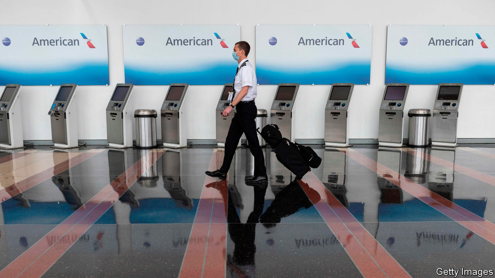
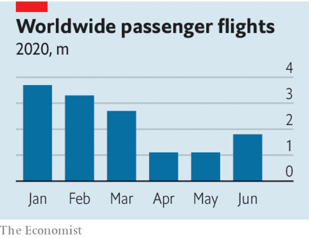

## Stop carrying flag-carriers

# Airlines have a chance to emerge from the crisis leaner and greener

> But that will require governments to reduce the power of incumbents

> Aug 1st 2020

TO SEE THE damage from covid-19 to aviation, look up. Where once a criss-cross of vapour trails told of holidaymakers heading for the sun or executives keeping businesses on track, the wide yonder is now a brilliant blue. This year nearly 5bn passengers might have been expected to take to the skies, but the actual number is likely to be only half as big. A fragile recovery is susceptible to new waves of infection. Britain’s imposition this week of a quarantine on passengers returning from Spain is the latest setback. Traffic may not return to 2019 levels until 2024.

When it does rebound, the twin priorities should be to put the industry on a sounder financial footing, and to make flying less polluting. For both objectives the way forward is the same: to loosen incumbents’ grip on the skies.

Start with carbon emissions. The dramatic declines this year are a distraction because as people resume flying, emissions will start to rise again. Neither should the industry’s sorry financial state today relieve it of recent pressure to decarbonise in the future. For many years aviation mostly had a free pass when it came to regulations of the type that forced carmakers to clean themselves up. Before the pandemic that had been changing. Some airlines had begun to worry about their reputations as “flight shame” raised awareness of how travelling by air accelerated global warming. Aircraft-makers were starting to plan the next generation of cleaner planes.

The question is how an industry whose finances are in tatters can make the vast investments and the huge technological leap required for net-zero-emissions flying. Bail-outs are the wrong answer. Only 30 airlines were profitable before the crisis and rescues will keep failing carriers alive. Some green strings are attached to rescue deals—a recognition of the changing mood—but they may not outweigh the zombifying effects of lavish rescue packages. Lufthansa’s €9bn ($9.8bn) bail-out allows it to buy 80 new fuel-efficient planes, but it took more money than it needed to preserve its position as a global airline. France’s aerospace bail-out includes €1.5bn to develop zero-emission planes and obliges airlines not to fly shorter routes between French cities that are served by trains. The exception? Feeder airports for Air France’s Paris hub. America’s airlines, showered with federal subsidies for decades, have trousered $25bn.

These efforts to keep incumbent airlines flying threaten to prevent bolder carriers from expanding. Waivers on airport-slot rules will further hamper new entrants. Regulators around the world suspended use-it-or-lose-it rules for the summer to help stricken carriers. Incumbents want an extension to cover the winter, too. But if slots cannot be reallocated, rivals will be constrained. In Europe agile, low-cost carriers like Wizz Air are rightly calling for slot-blocking to end.

If the industry is in the deep-freeze, it will slow the development of clean aeroplanes. Airbus has a goal of developing such an aircraft by 2035, whether using renewable fuels, electricity or hydrogen power, but the aerospace giants need to be sure that they will have a thriving market if they are to invest in them. Long industry lead times mean that Airbus will have to make firm plans in the next couple of years and Boeing will have to decide whether to respond soon after (see [article](https://www.economist.com//business/2020/08/01/air-travels-sudden-collapse-will-reshape-a-trillion-dollar-industry)).

Just as easyJet and Ryanair, now both huge airlines, took advantage of a glut of cheap aeroplanes after 9/11 and the deregulation of European airspace to expand rapidly, so a dynamic airline industry searching for new ways to grow would require new aircraft, encouraging Airbus and Boeing to make air travel greener. As well as setting back the industry, cosseting the old guard will do more damage to the planet. ■

Editor’s note: Some of our covid-19 coverage is free for readers of The Economist Today, our daily [newsletter](https://www.economist.com/https://my.economist.com/user#newsletter). For more stories and our pandemic tracker, see our [hub](https://www.economist.com//news/2020/03/11/the-economists-coverage-of-the-coronavirus)

## URL

https://www.economist.com/leaders/2020/08/01/airlines-have-a-chance-to-emerge-from-the-crisis-leaner-and-greener
