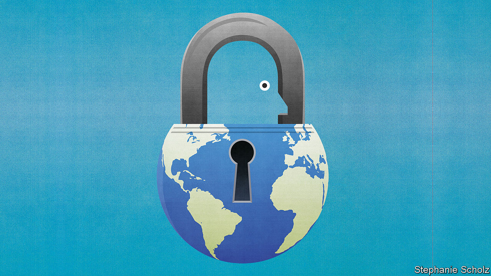

## Locked out

# As the pandemic recedes, let migrants move again

> Where it is safe enough to welcome tourists, it is safe enough for immigrants

> Aug 1st 2020

EVERY COUNTRY in the world has closed or partly closed its borders since the pandemic began. In total, they have issued more than 65,000 restrictions on mobility. For some places, especially islands, border controls have bought valuable time to prepare for covid-19. But the costs of global immobility are immense (see [article](https://www.economist.com//international/2020/08/01/when-covid-19-recedes-will-global-migration-start-again)). Billions of cancelled journeys means millions of jobs obliterated, lives blighted and dreams deferred. When bankers and tourists stopped flying to the United Arab Emirates (UAE), for example, the migrants who made beds and stirred soup were laid off. Foreigners without jobs are required to leave the Gulf, but lots of them cannot, because so many flights have been grounded. Globally, tens of millions of migrants have been stranded, burning through the savings they had hoped would lift their families out of poverty and put their children through school. Some have ended up begging; and since that is a crime in the UAE, several have been arrested.

Migration policy is far from the top of any country’s agenda just now. And with the coronavirus still raging, a return to normality will be impossible for some time. But governments will sooner or later have to grapple with an important question. As they gradually and fitfully open up again for tourists and business travellers, will they also welcome migrants?

There are emotive reasons why covid-19 might make countries less willing to accept foreigners even after a vaccine is discovered and the pandemic is suppressed. People are scared: not only of this pandemic but also of the next. Many associate foreigners with disease. (Dramatic news stories, such as a boat full of covid-infected migrants crossing the Mediterranean, can feed this impression.) Suspicion of foreigners is why people who look Chinese have been harassed in many countries, and people who look African have been harassed in China. It is why President Donald Trump has boasted about banning Chinese travellers (even as he downplayed masks), and why one of the South African government’s first actions to curb covid-19 was to build a fence on the border with Zimbabwe (though the virus was already spreading in South Africa).

In addition, covid-19 has caused mass unemployment. Many voters believe that migrants take jobs from the native-born, and so would keep curbs on immigration even after other travel restrictions are loosened. Mr Trump is one of many politicians who make this argument explicitly. His executive order in June suspending most kinds of work visa was aimed at “Aliens Who Present a Risk to the US Labour Market”.

Both these fears are electorally potent, but neither is well-founded. Tourists and business travellers vastly outnumber migrants. In Britain, for example, the total number of arrivals last year was 60 times more than the number of immigrants who showed up. When it is possible to open borders to short-term travellers, it should also be possible to open them for migrants. Unlike tourists, people who plan to stay for years will not object to a two-week quarantine on arrival. The precautions that work best—social distancing, contact-tracing, handwashing and testing—pay no heed to nationality. Nor does the virus.

The idea that more migrants means fewer jobs for locals in the long run is an example of the fallacy that the economy has a fixed “lump of labour”. As well as spending their wages, which supports new jobs, migrants bring a greater diversity of skills to the workforce, allowing the labour market as a whole to operate more efficiently. In the short term, rich countries may not need as many hotel or airline workers, but policymakers can tailor admission criteria to make sure that those who come meet local needs and can support themselves.

This is the opposite of Mr Trump’s nail-the-doors-shut approach. He has locked out skilled workers, internal company transfers and even foreign students, if they have not yet arrived and their courses are online. This is a recipe for a poorer, more insular America, where domestic firms cannot hire the best, foreign investors cannot send in technicians to unblock bottlenecks and brainy youngsters opt to study and settle in Canada.

Alas, America is not the only place where the pandemic has spurred nativists to clamp down. Italy is alarmed at Africans crossing the Mediterranean. Malaysia has pushed boatloads of Rohingya refugees back into international waters. The army chief in the Maldives has called migrant workers a security threat, not least because some date locals. South Africa temporarily closed migrant-owned shops in townships, forcing customers to walk miles to distant grocery stores, thereby spreading the virus.

However, even as covid-19 has immobilised the world, it is making some people appreciate the benefits of mobility. Many voters in rich countries have noticed that doctors are often migrants: 53% in Australia, 29% in America. The same is true of nurses, care-home workers and virus-busting mop-wielders. When people bang pots for health-care workers, they applaud a lot of foreigners.

Migrants are also over-represented among those who make it possible for others to work safely and productively at home, by harvesting and processing food, delivering parcels and fixing software bugs. They turbocharge innovation, too. Some 40% of medical and life scientists in America are foreign-born. Vaccine research depends on large teams of talents from all around the world. Half the big American tech firms were founded by a first- or second-generation immigrant. If the founder of Zoom had never left China, locked-down professionals might not even know what their colleagues’ bookshelves look like.

Some countries may end up more open after the pandemic than they were before. Japan is allowing foreign “trainees”, as it calls migrant workers, to switch jobs. Britain will be less open to migrants from the EU, because of Brexit, but just offered residency to up to 3m Hong Kongers without a perceptible backlash at home (see [article](https://www.economist.com//china/2020/07/30/many-hong-kongers-are-considering-emigration)).

When the coronavirus is vanquished, migration will still be what it was before: a powerful tool that can lift up the poor, rejuvenate rich countries and spread new ideas around the world. A pandemic is no reason to abandon it. ■

Editor’s note: Some of our covid-19 coverage is free for readers of The Economist Today, our daily [newsletter](https://www.economist.com/https://my.economist.com/user#newsletter). For more stories and our pandemic tracker, see our [hub](https://www.economist.com//news/2020/03/11/the-economists-coverage-of-the-coronavirus)