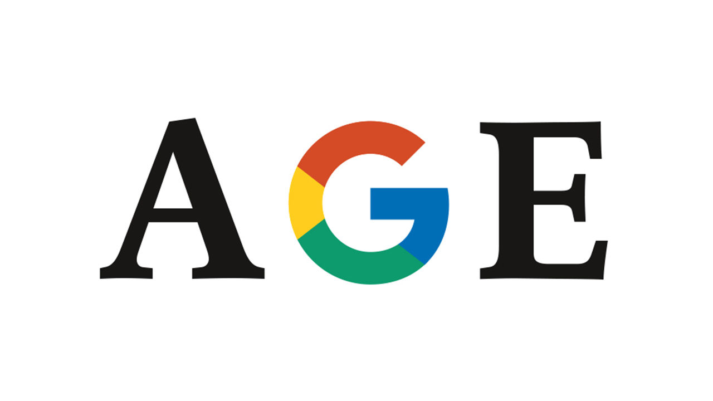

## How to cope with middle age

# Google has outgrown its corporate culture

> It is time to learn from its elders

> Jul 30th 2020

IT MAY BE just 21 years old, but Google is in the midst of a mid-life crisis. As so often in such cases, all seems well on the surface. Every day its search engine handles 6bn requests, YouTube receives 49 years’ worth of video uploads and Gmail processes about 100bn emails. Thanks to its dominance of online advertising, Google’s parent company, Alphabet, made a profit of $34bn last year. Beyond its core operations, it is a world leader in artificial intelligence (AI), quantum computing and self-driving cars. Along with the bosses of Amazon, Apple and Facebook, its chief executive, Sundar Pichai, was grilled this week by lawmakers in Washington, DC, who fret that America’s tech giants need to be restrained because they are so profitable. Crisis? What crisis?

Being hauled before Congress is, on the face of it, a sign of success. But it also marks a difficult moment for Google’s leaders: the onset of corporate middle age (see [article](https://www.economist.com//briefing/2020/07/30/googles-problems-are-bigger-than-just-the-antitrust-case)). This is a problem as old as business itself. How do companies sustain the creativity and agility that made them great, even as they forge a culture and corporate machine that is built to last? For Google the transition is especially dramatic because its founders, Larry Page and Sergey Brin, tried from the start to build a firm in which this moment would never arrive. As Google prepared to go public in 2004 they declared that it was not a conventional company, and “we do not intend to become one”. They hoped playground-like offices, generous perks and a campus atmosphere would allow it to retain the agility and innovation of a startup as it grew. The appearance of wrinkles on the corporate forehead is an admission of failure.

The signs of ageing are apparent in Google’s maturing business, its changing culture and its ever-more-entwined relationship with government. Take the business first. The firm is running up against growth constraints in its near-monopolies of search and online-advertising tools. Its market share in search ads is around 90%. Unearthing other gold mines has proved difficult. None of the ambitious “moonshot” projects into which Alphabet has poured billions, such as delivery drones and robots, has been a breakout success. To keep growing, Google is having to try to muscle in on the turf occupied by big tech rivals, such as cloud computing and enterprise software and services.

The cultural challenge is fuzzier but no less urgent for a firm that is proud of its unusual corporate character. The freewheeling ethos that was so successful in Google’s early days has become a liability. It works much less well at scale. Google now has nearly 120,000 employees, and even more temporary contractors. Doing things from the bottom up has become harder as the workforce has grown larger and less like-minded, with squabbles breaking out over everything from gender politics and the serving of meat in cafeterias to Google’s sale of technology to police forces.

The third sign of lost youth, the attention of trustbusters, has long looked inevitable. As big tech has grown, so have its interactions with government—as an institution to lobby, as a customer and as a regulator. America’s Justice Department is poring over Google’s online-ads businesses and may soon file an antitrust suit. Scrutiny is unlikely to wane as the tech titans break out of their silos and compete more. Indeed, regulators may take it as a sign of broadening power (see [article](https://www.economist.com//united-states/2020/07/30/big-techs-grilling-provides-more-show-than-substance)).

How should Google respond? To be both innovative and mature is a hard trick to pull off. History is littered with failed attempts. In giving it a go, the firm has to decide who it puts its faith in: managers, investors or geeks?

The first route would involve taking a strong dose of managerial medicine to become a more tightly run conglomerate. The archetype for this approach is GE in its heyday under Jack Welch, who persuaded shareholders that sprawling businesses could work well, provided they were run by expert managers (see [article](https://www.economist.com//node/21790213)). But it turned out that GE was disguising weaknesses in its industrial units by leaning on its financial arm, GE Capital. GE’s subsequent woes offer a warning of the peril of relying on one hugely successful division to subsidise less profitable units elsewhere—as Google does with its advertising business.

If doubling down on the conglomerate model is not the answer, what about the opposite approach: spinning off, selling or closing some units and returning money to shareholders? That would please many investors. By some calculations, Alphabet is worth $100bn less than the sum of its parts. Spinning off YouTube would increase competition in internet advertising—a handy sop to regulators—as well as unlocking value. It might be worth more than Netflix, because it need not pay for content, most of which is user-generated. But the experiences of firms like AT&T and IBM highlight the danger that downsizing hollows out innovation. And while Google might hope to retain its distinctive culture in whittled-down form, the truth is that no matter how much it wants to be as youthful and free-spirited as Peter Pan, it is no longer a startup.

That leaves trusting the geeks. Becoming a glorified venture-capital outfit has appeal, but the woes of SoftBank’s Vision Fund warn of hubris. Google would do better to examine how two older tech giants overcame their own mid-life crises (and near-death experiences): Microsoft, nearly broken up by antitrust regulators, and Apple, which spent years in the wilderness before Steve Jobs returned to reinvent it as a maker of portable devices. Both bounced back by rediscovering their core purpose and applying it in a new way. Under Satya Nadella, Microsoft has reinvented itself as a provider of cloud-based software tools and services, rather than its Windows operating system. And Apple, previously known for its elegant, easy-to-use computers, has minted money by applying its genius to smartphones.

Could Google similarly identify what it does best and apply it in new areas? It could decide its mission is helping consumers trade their personal data for goods and services; or using AI to solve more of the world’s problems; or being the data processor of net-enabled gadgets. At the moment it is betting on almost everything. Indiscipline can lead to unexpected innovations, but more often saps vitality. Google’s best way forward is to follow the advice often given to victims of a mid-life crisis: slim down, decide what matters and follow the dream. ■