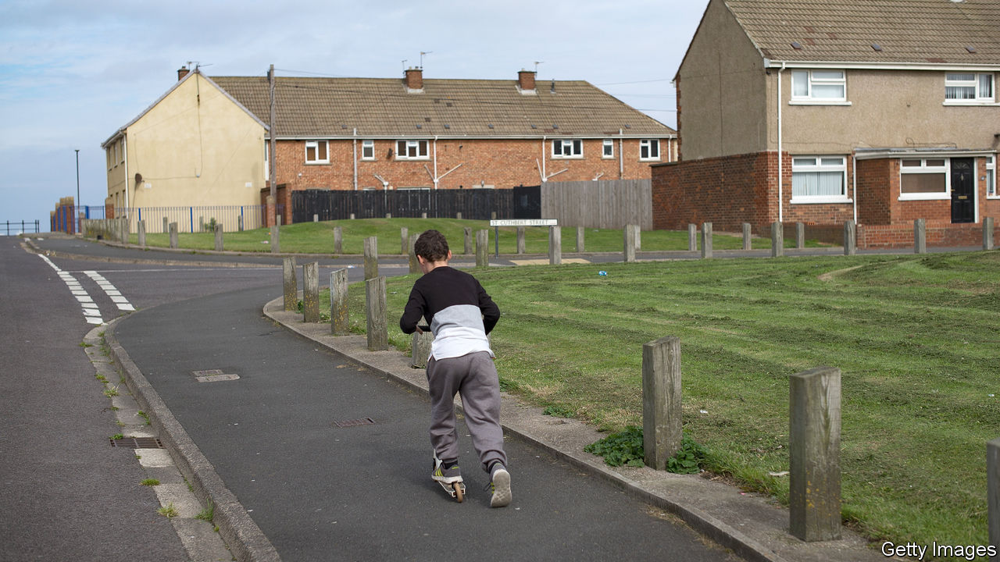

## Regional inequality

# Levelling up Britain: Boris Johnson has a big idea, but no plan

> The trick is to relinquish power

> Jul 30th 2020

LIKE ANY good journalist, Boris Johnson is a master of the snappy phrase. “Get Brexit done” won him the general election in December 2019. But the slogan that is supposed to define his premiership is “levelling up”. Those two words express a complex set of economic and political ideas and grievances. Much of Britain is lagging behind London and south-east England; often it feels looked down on by the smug metropolitan liberals who run the country from there. Levelling up means bringing everyone up to speed.

Even at the best of times, Mr Johnson struggles to give substance to a slogan, and these are not the best of times. The government’s poor response to the covid-19 pandemic has dented the prime minister’s popularity and crowded out other matters. But regional inequality is a burning issue, for two reasons.

The first is political. Having won lots of seats in the Midlands and north of England, including some in former coal-mining areas where Tories used to be as rare as snowflakes in summer, the Conservative Party needs to hold onto them. It now faces a Labour Party led not by the dismal Jeremy Corbyn but by Sir Keir Starmer, a disciplined politician from a working-class background. The Tories cannot run on a platform of bringing about Brexit, because it has happened. They need another story to tell.

The other reason is that regional inequality really is a blight (see [article](https://www.economist.com//node/21790230)). Take the 10% of small regions with the highest GDP per head and the 10% with the lowest. In Britain the ratio between the two is 4.3—higher than in any other OECD country. Male life expectancy in Glasgow is more than a decade lower than in Westminster. Although it is too early to be sure, covid-19 could widen the gap. If offices, factories, schools and transport are disrupted, the places that will cope best are the ones where most people can work remotely. That is London and the south-east.

It is neither possible nor desirable to distribute wealth perfectly across space. But Britain’s geographical inequalities seem to be reinforcing themselves. Some places, mostly in south-east England, have enjoyed a virtuous spiral of rising productivity, rising investment and rising aspiration. In others, the spiral is downward. The fact that 41% of disadvantaged London 18-year-olds go on to higher education, while only 15% do in Barnsley, hints at how much talent is being wasted.

Ideally, barriers that prevent migration to thriving places would fall—the main ones are the planning rules that make it so hard to build homes in and around cities like Brighton, Leeds and London. Still, people are seldom as footloose as economists think they should be, and they have become less so. Moreover, they dislike being told to move. The perception that their corner of the country is being left to die is dangerous, because it makes people more inclined to support political charlatans and destructive policies. The Brexit vote showed that.

Although Mr Johnson has an idea and a slogan, he has little clue about how to go about levelling up. Downing Street has flung some money at small cities and towns. It promises to spend more on public transport in the north of England. It has briefed about winkling civil servants out of London, and even about moving the House of Lords to York (though it may have been joking about that). A devolution plan is promised.

The government is muddled partly because its analysis is faulty. Ministers often suppose that the places being left behind are towns and villages, and that big cities are fine. Last month Michael Gove, the government’s in-house thinker, complained that previous governments had favoured cities like Sheffield; John Whittingdale, the junior minister for media and data, argues that the BBC panders to Manchester’s “metropolitan elite”. In fact, the problem lies precisely in cities like Sheffield and Manchester. Britain has 40 metropolitan regions, of which only nine are wealthier per person than the national average. Outside London, the metropolitan elite is too small.

A good way of making big cities and their hinterlands more productive is to upgrade their infrastructure. Even on the basis of the Treasury’s narrow cost-benefit calculations, which take too little account of projects’ potential for boosting growth, the south-east gets an unfair share. Transport projects have been approved in London while others in the Midlands and north with better benefit-cost ratios are nixed. That needs to change.

More important, though, is to relinquish control. Economists find that, in the developed world, more devolved systems tend to be more equal, probably because public services are more efficient when run by those who use them. Measured by the percentage of total tax revenue raised centrally, regionally and locally, Britain is by some distance the most centralised country in the G7. The failing is not so much that the Treasury favours the capital; it is that, if you want to widen a major road or electrify a railway line anywhere in England, you must first convince the Treasury to find the money.

David Cameron, who ran a more urbane government than Mr Johnson, began to build metropolitan institutions that can serve as a counterweight to Westminster. Some 37% of English people now live in places with combined authorities and “metro mayors”. These have little formal power but much clout; to judge from the experience of London (which got its first elected mayor in 2000) their powers will grow. Unfortunately, they still depend on the Treasury, so can be pushed around. In 2018 the government cut funding for Greater Manchester because it planned to build 11% fewer homes than it had promised.

To make metropolitan government more independent, it should be given greater power over taxation. Britain is overdue a reform of local property taxes, which are too low and not very progressive. Local and metropolitan authorities could also retain business rates, as some already do. There is even a good case for allowing them to levy income taxes, although within strict limits, to avoid tax competition. Scotland already has that power. There will need to be a balancing mechanism to prevent the poorest areas from losing out in the short term.

Britain has been so politically and fiscally centralised for so long that such changes would be a wrench. They should be tried all the same. Mr Johnson has taken risks before, and won.■