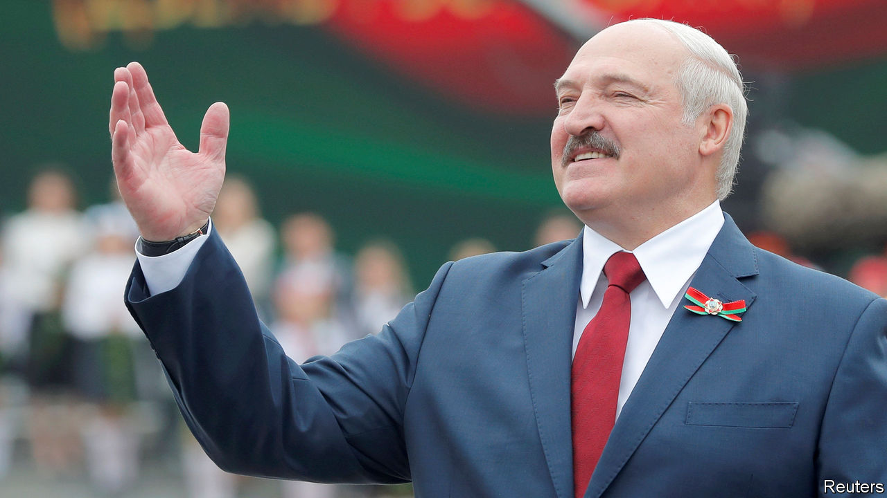

## Putin’s pal in peril

# The right way to get rid of President Alexander Lukashenko

> If change comes to Belarus, let it be peaceful

> Aug 1st 2020

AUTOCRATS AROUND the world have a lot to learn from Alexander Lukashenko, the president of Belarus, a former Soviet republic of 10m people between Poland and Russia. He was admired by the late Venezuelan president, Hugo Chávez, is championed by Hungary’s Viktor Orban and cordially received by China’s Xi Jinping. Vladimir Putin has copied some of his electoral dirty tricks. Mr Lukashenko has been in office longer than any of them, thanks to a mixture of populism, socialism, repression, Russian cash and European toleration.

But as Belarus heads into an election on August 9th, Mr Lukashenko faces one of the trickiest moments in his 26-year rule. The result is not in doubt—assuming the vote goes ahead. Belarus has not had a free or fair election since 1994, when the former collective-farm boss swept to power pledging to restore stability three years after the Soviet Union collapsed. With two of his challengers in jail and a third in exile, opinion polls banned, independent observers barred and riot police poised to crush protests, Mr Lukashenko is certain to declare himself the winner, with a fat majority. What is much less certain this time is whether Belarusians will accept the result. For the West, the election entails both risks and opportunities. Reducing the first and maximising the second will require principles and nerve.

The anti-Lukashenko surge has been triggered by his mishandling of covid-19, which he dismissed as a “psychosis” that could be treated with a few shots of vodka and a bit of tractor-driving. The underlying causes run far deeper. After nearly a decade of economic stagnation and no glimmer of change, Mr Lukashenko’s version of stability no longer sells. The regime’s opponents have rallied behind Svetlana Tikhanovskaya, a former teacher. She is not a career politician, but registered as a presidential candidate when her husband could not. He is a popular vlogger who was arrested by Mr Lukashenko’s goons to stop him running. She is joined by two other women, who represent the other disbarred candidates. Her only policy is to hold fresh and free elections within six months if she wins. Across Belarus, her rallies have gathered vast crowds and resembled rock concerts, people singing along to a song about tearing down prison walls.

It is hard to imagine Mr Lukashenko losing power. His riot police are conspicuously drilling on the streets of Minsk. His rigged election ten years ago resulted in cracked skulls, arrests, Western sanctions—and congratulations from Russia. This time, though, the discontent is much broader, and the room for manoeuvre narrower—so narrow that he could yet call the election off. Mr Lukashenko has long and skilfully played on the rivalry between Russia and the West. He extracted concessions from Russia for displaying nominal loyalty and touted Russia’s threat to keep the West off his back. But this balancing act has become more precarious. The Kremlin last year put great pressure on Mr Lukashenko to integrate the two countries politically so that Mr Putin could be president of both. Mr Lukashenko said no.

The Kremlin is now in an awkward spot. Mr Putin is facing his own protests in Russia’s far east. He hates the idea of a “colour revolution” in Belarus; but if he were to send troops to stop one, it would trigger more Western sanctions on top of those imposed on him for Russia’s bloody assault on Ukraine in 2014. Better for him, perhaps, to let the Belarusian leader launch his own crackdown, making him a pariah and thus ultimately a supplicant.

That would be a dreadful outcome. The West must use whatever carrots and sticks it can muster to restrain Mr Lukashenko from using force against his own people, while also warning Russia against any subversive action. If change is indeed coming to Belarus, let it be peaceful. ■

## URL

https://www.economist.com/leaders/2020/08/01/the-right-way-to-get-rid-of-president-alexander-lukashenko
