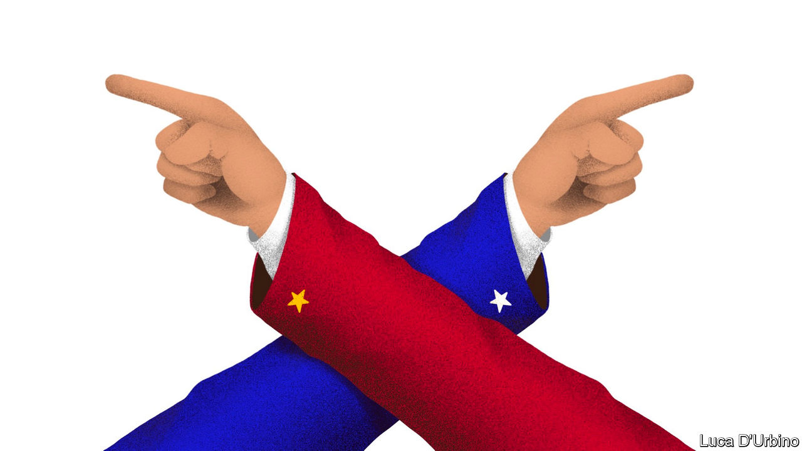

## America takes aim at China

# US-China relations are entering a dangerous period

> Why cool heads must prevail

> Aug 1st 2020

IN A BOOK of essays called “The Next Great War?”, which examines Sino-American relations through the lens of the first world war, Richard Rosecrance warns of “the tyranny of small things”, the points of friction and misunderstanding between rival powers that, without leadership to manage them, can lead to conflict. China and America today are not about to take up arms, but small things are rapidly accumulating. The two distrust each other more now than at any point since Richard Nixon went to China almost 50 years ago. As a presidential election draws near, the potential for dangerous miscalculation is growing.

On July 27th America’s consulate in Chengdu closed on orders from Beijing. It was in retaliation for the Trump administration’s order, a week earlier, to close China’s consulate in Houston, the first such moves since the normalisation of relations in 1979. This capped a month in which America sanctioned a sitting member of China’s Politburo, also a first, over the internment of Uighurs in Xinjiang; declared China’s expansive claims in the South China Sea illegal; ceased to recognise Hong Kong as distinct from mainland China; and claimed a victory in its campaign against Huawei, when Britain announced that it would bar the telecoms-equipment giant from its 5G networks.

For the hawks who surround President Donald Trump, this is overdue. In a series of four speeches that evoked the cold war, they laid out their case for abandoning “blind engagement” with China for a more confrontational relationship. On June 26th Robert O’Brien, the national security adviser, said that Xi Jinping, China’s president, “sees himself as Josef Stalin’s successor”. On July 7th Christopher Wray, the FBI director, claimed that China was seeking to become “the world’s only superpower by any means necessary”, and warned of its extensive efforts to spy on, influence and co-opt Americans. On July 17th William Barr, the attorney-general, charged that Hollywood studios and America’s tech giants had become “pawns of Chinese influence”. And on July 23rd Mike Pompeo, the secretary of state, declared that Mr Xi was engaged in a decades-long battle for global supremacy, and that America and other democracies must fight back.

A new, realistic strategy for standing up to China would be welcome. The atrocities in Xinjiang and the demolition of the rule of law in Hong Kong demand a tougher response than the world has mustered thus far. China’s territorial ambitions in its near seas are worrying. Its economic leverage over trade partners and companies sets it apart as an adversary from its communist predecessor, the Soviet Union. In calling attention to the comprehensive and complex threat Mr Xi’s China poses, Mr Trump’s hawks have achieved something.

But their speeches add up to an attitude, not a strategy. They articulate a compelling argument for imposing pain on China, but no framework for judging how and when to do so. They talk about working with allies in loose, aspirational terms. They have little to offer on larger geopolitical concerns like climate change, other than to say China cannot be trusted to keep its commitments.

Another president might formulate a grand vision for how to engage China under such conditions (see [article](https://www.economist.com//united-states/2020/07/30/would-a-biden-administration-be-softer-than-trump-on-china)). These hawks have Mr Trump. His disregard for democratic allies and the cause of human rights, and his personal affinity for Mr Xi, make him singularly ill-suited to lead a contest with China over global values. He has gripes with China, over trade and covid-19, but these are not rooted in principle. His eyes are on what can get him re-elected.

That sets up a combustible dynamic in the months ahead. As the election approaches, Mr Trump could be persuaded to take more dramatic action—say, financial sanctions on Chinese banks in Hong Kong, or a military display of support for Taiwan. A mishap or misunderstanding could prove perilous. It is right to want to chart a more robust course in Sino-American relations—but it would also be wise to beware the tyranny of small things. ■

## URL

https://www.economist.com/leaders/2020/08/01/us-china-relations-are-entering-a-dangerous-period
