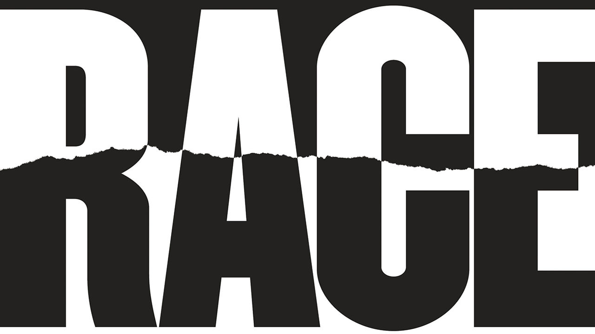
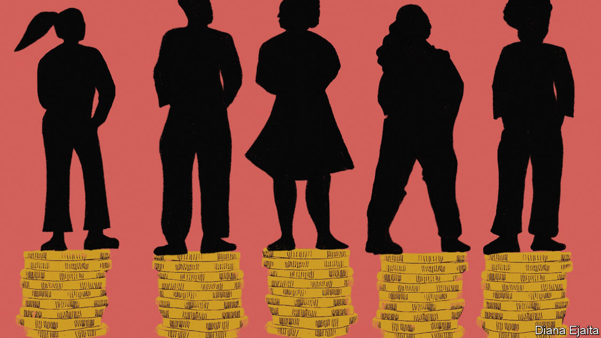

## On race and liberalism

# Letters to the editor

> A selection of correspondence

> Aug 1st 2020

Letters are welcome via e-mail to [letters@economist.com](https://www.economist.com/mailto:letters@economist.com%20)

The Economist missed the point about the Black Lives Matter movement (“[The new ideology of race](https://www.economist.com//leaders/2020/07/09/the-new-ideology-of-race),” July 11th). You praised Martin Luther King’s “vigorous protest and relentless argument”, but criticised the methods of today’s activists as “dangerous”, contending that they seek to impose their ideology “through intimidation and power”. King may have taken issue with your position. In his “Letter from Birmingham Jail”, written in 1963, King wrote:

I must confess that over the past few years I have been gravely disappointed with the white moderate…who is more devoted to “order” than to justice; who prefers a negative peace which is the absence of tension to a positive peace which is the presence of justice; who constantly says “I agree with you in the goal you seek, but I can’t agree with your methods of direct action”; who paternalistically feels he can set the timetable for another man’s freedom; who lives by the myth of time and who constantly advises the Negro to wait until a “more convenient season”.

While today’s activists should be open to constructive criticism, this is not the most important issue at hand. The Economist’s line makes clear that it is more interested in maintaining comfort and economic stability rather than achieving change. Its words perpetuate white complacency.

GRIFFIN CONGDONNew Haven, Connecticut

Your leader dripped with establishment anxiety over the growing influence of Black Lives Matter and the broader progressive movement. It reeked of the classic “you-can’t-say-anything-these-days” terror that radiates off those whose intellectual authority is being challenged. Rashad Robinson, president of Colour of Change, perfectly summarises this type of miscalculation: “Far too often we mistake presence, visibility and awareness for power.” Disappointingly, The Economist fell into this trap, equating the visibility of anti-racist voices in the virtual public sphere with the economic, political and judicial heft of the systems they seek to reform, dismantle and democratise. This false equivalence would be laughable if it wasn’t so insulting.

A. MENSAHLondon

* The new ideology of race? The old has never ended. It has been embedded in Anglo-Saxon thinking for centuries. It has justified the invasion and land theft of today’s America, Canada, Australia and New Zealand. That land was occupied and owned by Aborigine states, and to clear it, the Anglo-Saxon colonists simply invaded, stole and killed off the Aborigines. Then a “whites only” policy was instituted and turned into law, such as the “Chinese exclusion acts” of the early 1900s, and lasted, with Jim Crow laws, into the 1970s. Not to exclude the long-term use of slaves.

So what is new? The draconian suppression of black demonstrators, the exclusion of a growing China, making illegal Chinese advanced technologies that are superior to American ones. Same racial animus, same racial ideology. Only described differently.

HENDRIK WEILERPort Perry, Canada

Although liberalism has given the world theoretically unassailable values such as free speech, it has not been as successful dealing with pervasive social problems. The liberal “state of nature” and “veil of ignorance” imagine a society untarnished by politics. Thomas Hobbes, John Locke, and even John Rawls claimed to have established that the equality of mankind was determined by our fear of slaughtering each other, God, or rationality.

No one who studies political philosophy takes this exercise in apolitical history at face value. Their conclusions about government are based on a flawed assumption that humans once lived without politics. Social order has always existed, and therefore, so has politics. The assertion that “all men are created equal” is based on Enlightenment principles that were primarily created to check the power of government and protect property rights. The pursuit of these goals made it possible to ignore social inequality in general and allowed for the hypocrisy of most of the Founding Fathers owning slaves.

As you pointed out, liberal thinkers have always struggled with conceptualising unequal power relationships among groups. Critical theorists, their roots based in Marxism, inevitably face similar challenges when arguments are premised on simplified assumptions. If racism and discrimination are systemic, where do they originate from? Why do they persist, even if no one at an institution holds racist beliefs? And, hardest of all, what about individual rights?

However, it is liberalism that has had centuries to deal with prejudice and the social ills it produces. Thus far, the solutions it has offered are inadequate.

HEATHER KATZAssistant professor of political scienceSouthwestern Oklahoma State UniversityWeatherford, Oklahoma

* “What is the point” of a theory of justice that is silent on “how the actual world is ravaged by injustice?” My own view: properly applied, John Rawls clears away the whataboutery and wonkishness to expose our persistent racism as a stunning, continuing injustice. A nail may want a hammer, but we need a lamp to see our work.V.VM.SCARPATO IIIDenver

* You lamented the disempowerment of individualism. However, American slavery and subsequent institutional oppression did not operate on an individual basis, but by the desire to keep an entire group of people disenfranchised and powerless. Hence, it is impossible to uproot this mentality from the American way of life. Black people decry daily their inability to carry on simply as individuals, a privilege only afforded to white people. But they do recognise that the institutions that shape their lives are fundamentally biased against their group. Data show significant inequalities between the races, and much of black culture has developed as a direct consequence of these inequalities. How can one begin to remedy such differences without considering the historical and ongoing group dynamics?The truth is that a black person can have individual freedom and the pursuit of happiness only if African-Americans as a group have freedom and the pursuit of happiness. If liberalism cannot incorporate such a moderate idea, perhaps it is time to rethink how progress should be achieved, to dare suggest that another system can give America the “life expectancy, material wealth, poverty, literacy, civil rights and rule of law” for which you credit liberalism, in addition to the racial equality that has eluded it so far.PATRICK NTWARIBoston* The implicit bias trainings I have attended awakened a notion that we all have a demon inside us that distrusts the different borne of millennia of seeking survival and self-defence. This demon cannot be wished away. Instead, focus on what we control and judge accordingly.

Do we really want to be judged for differences we have no control over? It was Martin Luther King who dreamed of the day when his children will live in a country where they will not be judged by the colour of their skin, but by the content of their character. No human being has a choice about which body to be born into. Prejudice on this basis is patently illogical. Rainbow flags and gay-pride parades herald the type differences we do not control. Focus on the important quality we do control, which is our character. May our character exude kindness rather than malevolence.

PETER ROBERTSSeattle

* Imagine a United States where every head of a household with children had a decent full-time job with health insurance. Add this to The Economist’s good ideas about housing and early childhood (“[Staying apart](https://www.economist.com//briefing/2020/07/09/segregation-still-blights-the-lives-of-african-americans)”, July 11th) and few American children of any race would go hungry or suffer the other ills of desperate poverty. Single mothers would not be exploited in jobs with terrible schedules and working conditions. Today’s daunting choice between fighting the coronavirus and creating jobs would be lessened.

More than 40 years ago, President Jimmy Carter introduced the Better Jobs and Incomes Programme. It would have federally financed community jobs to bring about this vision. There are challenges. Meaningful jobs and apprenticeships would need to be created in sectors such as health, energy and the environment. Legislation would have to address geographic differences in the cost of living, unions would have to co-operate, and more. But the challenges are solvable and the benefits substantial.

ARNOLD PACKERFormer assistant secretary of labour in the Carter administration.La Jolla, California

In “Who We Are and How We Got Here”, David Reich, a population geneticist, related the story of how a piece of his research that identified genetic variants associated with an elevated risk of prostate cancer among men of west African descent led to accusations from some of his colleagues that he was “flirting with racism”. Critical race theory does not allow for the possibility that racial disparities in health could be caused by something other than systemic racism. If accepted, its assumptions make it nearly impossible to eliminate any racial disparities that have other causes, because the type of intervention required to address a disparity depends on what the disparity is caused by.

JONATHAN KANEFlat Rock, North Carolina

You made a good case for a genuinely liberal approach to race, at a time when the modern left has forgotten what a truly liberal society is. You see what we all see: intellectual rigidity and intolerance of dissent, the fomenting of division, racial obsession replacing colour-blind equality of opportunity, identity politics taking priority over the rights of the individual, all the marks of an authoritarian society, not a liberal one.

Donald Trump’s speech at Mount Rushmore was an attempt to address this issue. You say his speech strived “to inflame a culture war centred on race”, when in fact he was expressing the very concerns you share.

STEVEN VAN DYCKToronto

Congratulations on having the courage to challenge the intellectual hogwash that is the new race and identity politics. Prejudice based on skin colour is among the idiotic of all prejudices and it must be challenged. But to go from there to the construction of a Marxist-derived analysis, this time with “white people” as the new group to hate instead of the “bourgeoisie”, is nonsense on stilts. Its intellectual dishonesty is imbued with a Manichean worldview and totalitarian instincts. George Orwell would recognise all the newly woke, self-haters of the academic and cultural elite, who have meekly caved-in to show trial by Twitter.

SIMON DIGGINSRickmansworth, Hertfordshire

* Critical race theory brings to mind one fundamental Marxist concept: that there is no “objective truth” and each class generates its own “truth”. Race ideology, just like Marxism, did not take “a wrong turn”. As somebody who was forced to study Marxism in a communist country, I see a perfect similarity: an ideology pushed by intellectuals with little contact with the real world, no compassion for real people, and fancy concepts leading to the most unfair and sinister consequences. Critical race theory leads by design to intolerance, the silencing of dissenters and polarisation.

ANDREI TUDORANHouston

The hard part of resolving America’s racial economic gap starts with facing the actual history of our country. When I attended high school in California in the 1980s, I learned nothing of the lynchings in the post-Reconstruction era, nor of the Tulsa massacre or other white riots, nor the redlining that prevented black Americans from building home equity. White Americans need to fully reckon with this betrayal of their fellow citizens.

MARK SEAMANNew York

* I fear a bigger problem for the future. I moved to North Carolina during a year when Jesse Helms was running for Senate. His main campaign ad was a set of white hands crumpling a rejection letter, the implication being that a qualified white did not get a job because of affirmative action to help blacks. We must be careful that in trying to improve black lives we do not once again turn it into a fight between blacks and lower-class whites, with rich whites laughing all the way to the bank. Just as in the 1920s the Northern Ireland government broke an attempt to create a united Protestant-Catholic union in the shipyards by promising all Protestants a job, so the people on top in America succeeded once in turning the racial issue into a fight within the lower class.

ALAN LANEAssociate professor of historyBarton CollegeWilson, North Carolina* The greatest danger to liberalism is not the pantomime villains you boo each week, but rather the choking hypocrisy within its own ranks. Instead of basking in your enlightenment, as individuals you need to petition your local councils for more refugees and disadvantaged people to be housed and schooled in your own communities, whatever the effect on house prices. Stop tilting at Trumpian walls and Orbanite fences, and start addressing the far more formidable and discriminatory socioeconomic barriers that shield you from the adverse side effects of the globalisation and mass immigration that you piously prescribe for others.ISTVAN SZABOLondon* I object to your description of the street corner where George Floyd was murdered as “shabby”. In fact, it is home to several successful small businesses and is neither neglected nor unsafe. Our city has already been maligned enough because of recent events and this incorrect description was unnecessary.

THOM ROETHKEMinneapolis

One cannot easily shake off unwanted associations with partners picked up during a prolonged binge. As you made quite clear, liberalism awoke to find itself in bed with slave-traders and unbridled imperialists. Singing its prelapsarian virtues now, however sweet the tune, will not readily assuage the critics.

MATTHEW KAPSTEINDirector of studies, emeritusPractical School of Advanced StudiesParis

* Letters appear online and in app only