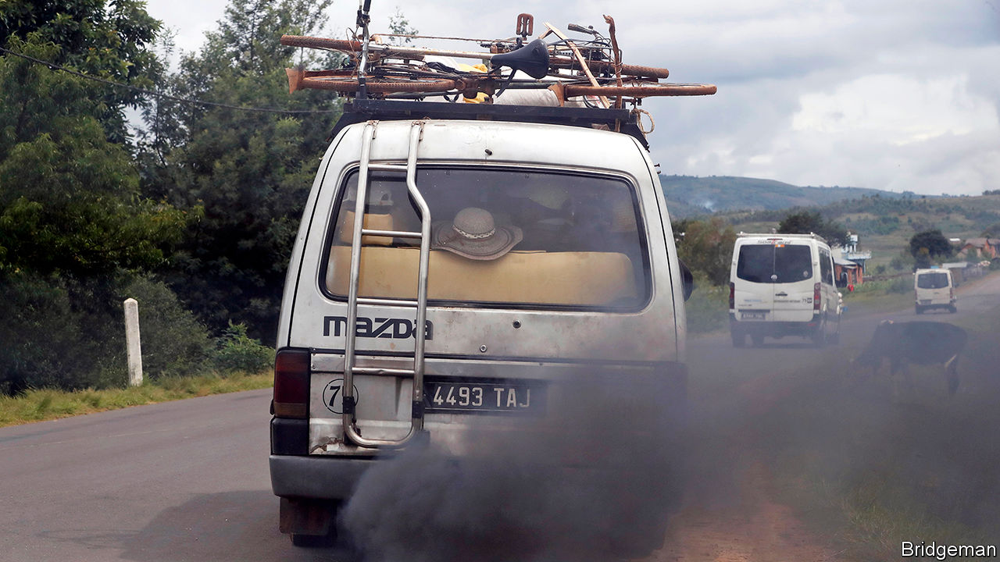
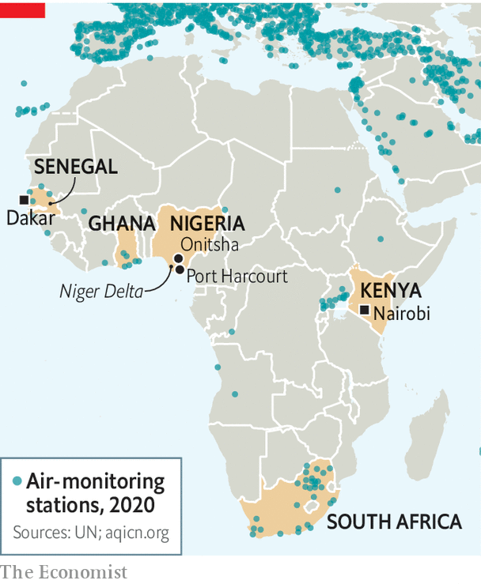

## Smoke gets in your eyes

# Africa’s skies are badly polluted

> But a lack of data makes it impossible to know how badly

> Aug 1st 2020

GORéE ISLAND, a former slave-trading hub, is so close to Dakar, Senegal’s capital, that hundreds of amateurs swim out to it every year. Yet some days it disappears from sight, lost in a haze of pollution and dust. In the Nigerian city of Port Harcourt, part of its oil-producing region, black soot settles on everything. Tiny particles clog lungs and invade the bloodstream.

Some 4.2m people die prematurely every year from dirty outdoor air, says the World Health Organisation (WHO). The World Bank reckons the worldwide costs of deaths from air pollution run to $5trn a year. Africa is plainly affected, but it is hard to know how badly. Outdoor pollution in the continent is rarely measured.

Fetid rubbish, old cars and filthy factories fill Africa’s air with smoke, rarely hindered by environmental standards or enforcement. Take Nigeria, where international commodity traders exploit weak regulations by importing fuel that is vastly more toxic than the stuff found in Europe, and even dirtier than fuel produced by bush refineries in the Niger Delta, says a study by the Stakeholder Democracy Network, a pressure group. Rana Roy of the OECD, a club of mainly rich countries, reckons air pollution of all types causes more premature deaths in Africa than dirty water, poor sanitation or the malnutrition of children. The WHO says the Nigerian city of Onitsha is the most polluted in the world.

Yet the WHO reckons that only 0.5% of African towns and cities have accessible air-quality data (Dakar is one of them). That would be unthinkable in the West (see map). Children are particularly at risk. In Europe and North America 72% of children live within 50km of an air-monitoring station versus only 6% of African children. Even in African cities that do track air quality, the data are patchy. “Most of the equipment in use is obsolete,” says Kofi Amegah of the University of Cape Coast in Ghana.

South Africa is an exception. There, as in much of the West, air-quality data are constantly and publicly available, so commuters and asthmatics can avoid the worst smog. Researchers can estimate the damage both to people’s health and the economy with reasonable accuracy.

Yet almost everywhere else in Africa, what little information is collected is rarely made public. Some governments think people should pay for it to help cover costs. That is ludicrous, thinks Mr Amegah, since data collection is anyway paid for by taxpayers and is meant to help improve public health. Many governments are simply worried that better data will lead to more criticism of them, says Dan Westervelt of Columbia University.

Information sometimes gets out anyway. American embassies in six African capitals have first-rate instruments and publish findings every day. In Beijing in 2008 the American embassy began releasing air-pollution data. A diplomatic spat ensued, but campaigners were able to challenge official claims, leading to new standards, more testing—and cleaner air.

African activists are following suit, buying cheap air sensors. The most basic cost $25 apiece, though they are less accurate than high-grade ones. Local data matter. A campaign to cut pollution from factories in Syokimau, a Nairobi suburb, succeeded thanks to four cheap sensors provided by Code for Africa, a network for open-data activists. It hopes to install 3,000 more sensors in African cities. ■