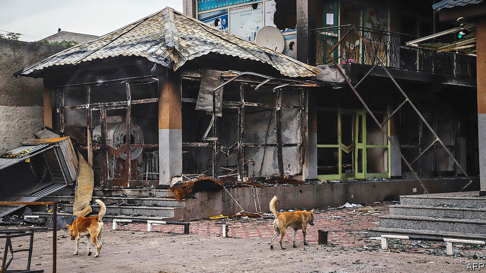

## Urban brawl

# How land disputes erupt in Ethiopia

> The edges of cities are often flashpoints of ethnic violence

> Aug 1st 2020ADDIS ABABA AND SHASHAMENE

“WE WERE BORN here, we grew up here, but now we live like beggars,” fumes Tsige Bule, gazing from a rain-splattered porch towards the grey and unfinished apartment block that looms over what remains of her family’s farmland. Several years ago the Ethiopian authorities confiscated almost all of it to build public housing for residents of Addis Ababa, the capital. In the past decade the expanding city has inched ever closer to Tsige’s village. She sold her cows and began buying jerry cans because water from the nearby river had become toxic. Her sons dropped out of school to work as labourers on nearby building sites. A life of modest comfort teetered toward destitution.

There is a deep well of anger in the suburbs and countryside around the Ethiopian capital. In July riots took place near Tsige’s home after the assassination of Hachalu Hundessa, a popular musician and activist from the Oromo ethnic group. New housing estates were pelted with stones, cars and petrol stations were set alight. Towns across the vast region of Oromia, which surrounds Addis Ababa, were similarly ravaged. Much of central Shashamene, a booming entrepot some 200km south, was burned to the ground. There were widespread attacks on minorities, notably Amharas, the largest ethnic group after the Oromo. Hotels, businesses and homes were destroyed or damaged. By one count 239 people were killed, some murdered by mobs, others by security forces.

The threads that connect the carnage in Oromia with the plight of Tsige’s family are real, even if hard to see. In recent years towns and cities in southern Ethiopia, especially in Oromia, have been flashpoints for political and ethnic turmoil. The latest bout was triggered by national politics: many Oromos saw Hachalu’s murder as an attack on the Oromo opposition movement. Much of their anger is also stoked by a fear that Abiy Ahmed, the prime minister, has reneged on promises he made in 2018 to end both authoritarian rule and the alleged marginalisation of Oromos. But a closer look at the pattern of violence in certain places suggests that local factors such as who owns land and businesses may also have played a big part.

Many southern towns began as imperial garrisons after the conquests of Emperor Menelik II, an Amhara, in the late 19th century. Establishing cities sometimes involved the eviction of those already on the land, including the Oromo clans who lived on ground that was taken for Addis Ababa. As towns expanded they attracted settlers from Ethiopia’s northern highlands, who spoke Amharic and dominated urban commerce and the state bureaucracy. Amharic-speakers are still perceived to control much of the urban economy. “If you take 50 hotels in the city, only three are owned by Oromos,” alleges the owner of a juice bar in Adama, the second-largest city in Oromia.

Old tensions are exacerbated by two factors in modern Ethiopian politics. The first is the 1995 constitution, which carved up territory along ethnic lines. In doing so it introduced the notion of ethnic ownership of cities and towns. This is particularly pronounced in the case of Addis Ababa, in which the constitution granted Oromia a “special interest”. Oromo nationalists claim the city is part of their historic “homeland” and demand a final say over its governance. But similar conflicts fester elsewhere, sometimes turning violent, as in the eastern city of Harar, where a minority of ethnic Harari enjoyed political privileges at the expense of much larger Oromo and Amhara populations.

The system also hardened perceptions of non-indigenous folk as alien settlers. In Shashamene mobs went from door to door checking identity cards, which record ethnicity, before burning property belonging to Christians and non-Oromos. “They have a plan to dominate the economy of this town,” frets a non-Oromo. “At the core this is about the concentration of economic power and opportunity in urban areas,” says Eshetayehu Kinfu of Hawassa University near Shashamene.

The second factor is land. In Ethiopia, all land is owned by the state. Although the constitution guarantees free land to farmers, in practice farmers and poor folk in cities have few legal protections from eviction, says Logan Cochrane, also of Hawassa University. For urban officials, leasing and administering high-value land is a source of revenue, rents and patronage. So many grab lots of it, adding to the ranks of the landless and jobless.

“Our fathers lost their land, so we have nothing to inherit,” says Tsige’s son Betemariam. An added sore is that public housing built on land that belonged to Oromo farmers was typically given to more prosperous city-dwellers. “It’s not fair,” says Beshadu Degife, who lives down the lane. “This land is ours but now it’s people from other places who are enjoying it.”

The growing perception is that towns with mixed populations are strongholds of Abiy’s Prosperity Party, which seeks to have no ethnic slant. This perception may further aggravate tensions. As Ethiopia prepares for delayed elections some time next year, towns will be places to watch—and worry about. ■

## URL

https://www.economist.com/middle-east-and-africa/2020/08/01/how-land-disputes-erupt-in-ethiopia
