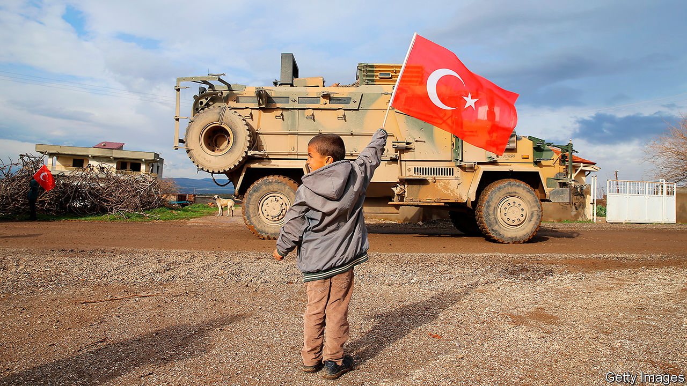

## Ottoman redux

# Turkey is wielding influence all over the Arab world

> Its muscle-flexing worries many

> Aug 1st 2020ISTANBUL

AZAZ HAS experienced quite the turnaround. The city in northern Syria was once controlled by Islamic State (IS), which continued to terrorise it even after leaving in 2014. That is when other jihadists and rebels swooped in. Today, though, Turkey is calling the shots. It keeps the lights on and supplies the local shops. The list of Turkish projects under construction ranges from schools and universities to hospitals and roads. “The infrastructure is better than before the revolution,” says an architect who is building new housing as part of another Turkish project.

Turkey is expanding its footprint across the Arab world, using force more than diplomacy. In the past year it has occupied north-eastern Syria, punched deep into Iraq and intervened in Libya’s civil war. Its military spending has increased by nearly half since 2016.

Yet Turkey’s strongman, Recep Tayyip Erdogan, does not appear to have an all-encompassing vision for the region. Rather he is pursuing Turkey’s economic interests and dealing with perceived threats—sometimes by violating the borders of other countries. Thus is he fulfilling a promise made four years ago to “go and confront [problems] wherever they nest”.

Turkey is no newcomer to the Middle East. Its predecessor, the Ottoman empire, ruled the region for 500 years, until European powers rolled it back. More recently it has exerted cultural and economic influence, especially through Turkish soap operas and construction projects. After the Arab spring of 2011 brought Islamist movements to the fore, Mr Erdogan promoted Turkey as a model of Islamist governance—and himself as leader of the Muslim world. As the Islamists were pushed back (or crushed) and Western powers lost interest in the region, Turkey grew more assertive.

Start in Syria, where Turkey has long backed the rebels trying to topple Bashar al-Assad’s regime. They have all but lost, but Turkey continues to protect the areas still under their control in the north-west. It does not want another flood of refugees to cross its border, so it has tried to stabilise the region—further digging in. It trains police, funds a civil service and has replaced the Syrian pound with the steadier Turkish lira. In cities such as Azaz it is building rapidly. Backers of Mr Erdogan suggest that this is an investment for the long run.

Turkey has been even bolder in the part of northern Syria once controlled by the main local Kurdish force, the People’s Protection Units (YPG). The YPG grabbed a large swathe of territory while helping America defeat IS. But the YPG has close ties with the Kurdistan Workers’ Party (PKK), a separatist Kurdish group in Turkey. So when America pulled out in October, Turkish troops moved in, backed by local Arab rebels. Together they pushed the Kurds out of much of their statelet. Turkey now occupies a 30km-deep strip in Syria extending for 145km along their border.

Mr Erdogan is also battling the PKK in the Kurds’ autonomous region in northern Iraq. Turkey says it has “neutralised” over 1,400 Kurdish fighters in Iraq and Syria this year. Sometimes the Turks have attacked 200km inside Iraq. They insist it is a short-term operation aimed only at the PKK, but they have set up a number of new outposts in the country. Many suspect their aim is to carve out a buffer zone along the border, as they did in Syria. Iraq’s Kurds fear a Turkish presence would endanger their aspirations for statehood and, if it extends far enough, cut them off from the Kurds in Syria.

Turkey’s intervention in Libya is different. The countries of the eastern Mediterranean have long argued over who controls which part of the sea—and the gasfields beneath it. Mr Erdogan feared that an alliance of Egypt, Israel, Greece and Cyprus might squeeze Turkey out of the area. So last year he signed a deal with Libya’s UN-backed government that demarcated their maritime boundaries and supposedly gave Turkey the right to drill in waters off Greek islands. (Greece is having none of it.) In return Turkey has provided troops, arms, drones and mercenaries (from Syria) to the Libyan government and its allied militias, tipping the war in their favour. Earlier this year the forces of Khalifa Haftar, a rebellious Libyan general, were pushed out of western Libya.

Turkey is now a force to be reckoned with along a 600-km stretch of the Mediterranean. It controls an airbase in al-Watiya, close to Libya’s border with Tunisia. Its frigates protect Libya’s coast in the west. Some say Mr Erdogan is trying to turn the eastern Mediterranean into a Turkish sea.

He is active elsewhere, too. He has installed a Turkish garrison in Qatar, an ally and fellow backer of Islamist movements that has been threatened by Saudi Arabia and the United Arab Emirates (UAE). He has also shown an interest in Yemen’s civil war, offering Turkey as a safe haven for the Islamists fighting on behalf of the exiled president, Abd Rabbo Mansour Hadi. (He may do the same for Mr Hadi if Saudi Arabia grows tired of hosting him.) Across the Red Sea, in Sudan, Turkey is hoping to develop Suakin, a ruined Ottoman port. And it has established its largest overseas base in Mogadishu, the Somali capital.

Does Turkey have staying power? Its armed forces may already be stretched thin, having lost thousands of officers to show trials and purges in the past decade. And its adventurism isn’t cheap. Its operations in Syria alone cost up to $3bn a year, says Nihat Ali Ozcan of TEPAV, a think-tank. But Mr Erdogan focuses on the benefits. Qatar, for example, has gone on an investment spree in Turkey. Earlier this year it helped shore up the weakening lira by tripling its currency-swap agreement with Turkey to $15bn. It may also be helping to pay for the operation in Libya, where Turkey expects to win new contracts when peacetime reconstruction resumes.

There is a domestic political benefit for Mr Erdogan, too. His attacks on the Kurds and posturing in the Mediterranean have delighted the nationalists who are his allies in parliament. They, in turn, have influence over the police and army.

But the going could get tougher. Egypt has mobilised its forces on Libya’s border and vows to cross it if Turkey advances further. Saudi Arabia and the UAE, staunch anti-Islamists, would probably back Egypt. Russia is also on the opposing side in Libya—and in Syria, where it is believed to have killed dozens of Turkish troops in February. Mr Erdogan may soon feel he has bitten off more than he can chew. ■