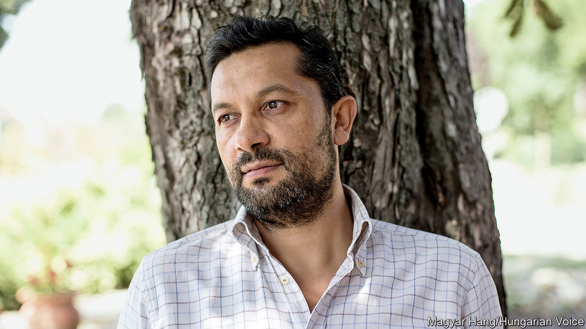

## The tale of a village

# László Bogdán died on July 14th

> The Gypsy mayor who made his Hungarian village famous was 46

> Aug 1st 2020

ALONG THE walls of his office in Cserdi, a village of around 350 souls in the gentle hills of southern Hungary, László Bogdán strung several clothes lines. Pegged to them were hundreds of messages written to “Laci”, as they called him: “People are good!” “Our parents have work”. “We have a good mayor”.

These were the voices of the villagers, who since his election as mayor in 2006 had seen their world transformed. Cserdi had once been strewn with rubble and dilapidated houses, with idle, jobless men brawling outside. Petty crime was rampant: up to 300 cases a year, with neighbouring villages terrorised. Now everything was orderly. The houses were neat, and many had gained bathrooms. Small parks had appeared. Out in the fields women worked with hoes, and men with spades, to plant potatoes or dig wells. Four giant plastic greenhouses sheltered crops of peppers and tomatoes. In a good year the village could produce 160,000kg of quality vegetables, with the surplus going to the poor of the county. Officials from far and wide came to inspect this “Cserdi miracle”. But Mayor Laci, pacing up and down with his purple scarf knotted fashionably round his neck, was still dissatisfied. Was it really so special, so exotic, to see Gypsies working?

He spoke as one, a proud Cigány (he hated “Roma”), who revelled in garish shirts that emphasised his Gypsyness, and delivered his vegetables in a red Zsiguli car with a swinging rosary of the sort only Gypsies drove. He showed off Cserdi, where the population was three-quarters Gypsy, to prove that it could be as ordinary as anywhere else. But he knew it was not. The stereotype that most non-Gypsy Hungarians carried in their heads was all too often true: his people (“us”, not “they”, for his people’s sins were his, he took them on himself) were work-shy, cheated, stole, and lived on handouts if they could. The jails were full of dark faces.

Of course, 600 years of history in Hungary had not been kind. Poverty and discrimination, fear of the Other, had stalked his people wherever they went. Under Communism everyone, including Gypsies, was meant to work. Yet it took his father some years to find a job as a miner. Until then, they lived in a shack; he had no shoes of his own until he was 13, and was sent down to scavenge for chewy, rotten meat in the pits where farmers threw the carcasses of their animals. His strongest childhood memory was hunger.

Yet that was no excuse to play the victim. He had never moaned, taking any job he could get after a few indifferent years of school: sweeping floors, packing monitors, eventually becoming production manager in a mobile-phone company. Here was the lesson for “all of us”: Gypsies had to work! If they took responsibility, gained self-respect, hauled themselves up by their bootlaces, prejudice might begin to fade away.

This was the task he set himself as mayor of Cserdi. It was heavy, but he set about it logically. Gypsies belonged nowhere, but if they got land, they could farm it. There was unused land in the village, a rubbish tip; once they had cleared away 15-20 lorryloads of rubble, they could plant potatoes. They then rented 1,200 hectares more. As the enterprise grew, he directed everything. A national public-work scheme provided small wages, but enough. Each day the villagers would gather round him to get their tools and his firm, straight instructions: where they should dig a well, exactly how big it should be, when they should move the paprika plants from the greenhouse. He reminded them what share of their harvest they had promised to give to others, to make them proud: they were givers now, not stealers, not spongers. Then he would wield his spade beside them, getting his hands dirty and urging them on.

The agriculture project was only part of what he was doing in Cserdi. He took village boys to the local jail in Pécs, to show them that if they broke the law they could expect to be buggered there; it shocked them so deeply that crime in the village fell to almost nothing. Teenage girls were taken to universities; would they rather be there at 18, he asked them, or lying on their backs in the wretched local labour ward? Every household’s budget came under his watchful eye, and he would pick through their rubbish too, finding the cigarette packets and beer bottles that proved they were wasting money. He barely had time for girlfriends, certainly not family. The villagers were all his children.

Outside the village, he had enemies. He wanted to see Gypsies integrated and living like other Hungarians, for he was proud of being Hungarian too; he dreamed of dark faces in advertisements, his food in national stores, colour-blind political parties and the money that was spent on self-serving, wasteful Roma minority councils spent, instead, on greenhouses. This didn’t suit those who still wanted to be victims. Others felt that his constant reminders of bad Gypsy ways simply fed the stereotype: he was a self-hater, racist to his own skin. One way and another, he had learned to watch his back when he crossed the road.

Some thought he might make a good Roma leader on the national stage. But he did not want that label. He cared about other minorities too, even inviting migrants—who were hated more than Gypsies now—to come to Cserdi in 2017. Besides, he had no interest in being a “celebrity bastard”. He disliked talking about himself. He was just a semi-literate “scattered soul” who was trying to make his mark on the world, and was doing it in Cserdi. There, his ambitions were still growing. The “Romburgers” the villagers were making for local restaurants were taking off nicely. He was going to produce a range of Gypsy stews in the new processing plant, built with state and EU funds and almost finished. But it was there, on July 14th, that he hanged himself.

He had given no hint of this before. Or perhaps only one: he had admitted that he cried every day, not because he was afraid, but because he felt powerless to do all that had to be done.

In a well-known Hungarian story, two Gypsies were haggling over the price of a horse. As they argued, the horse galloped fast towards a brick wall. “Your horse is blind!” complained the would-be buyer. “Not blind,” said the seller. “Brave.” ■

## URL

https://www.economist.com/obituary/2020/08/01/laszlo-bogdan-died-on-july-14th
