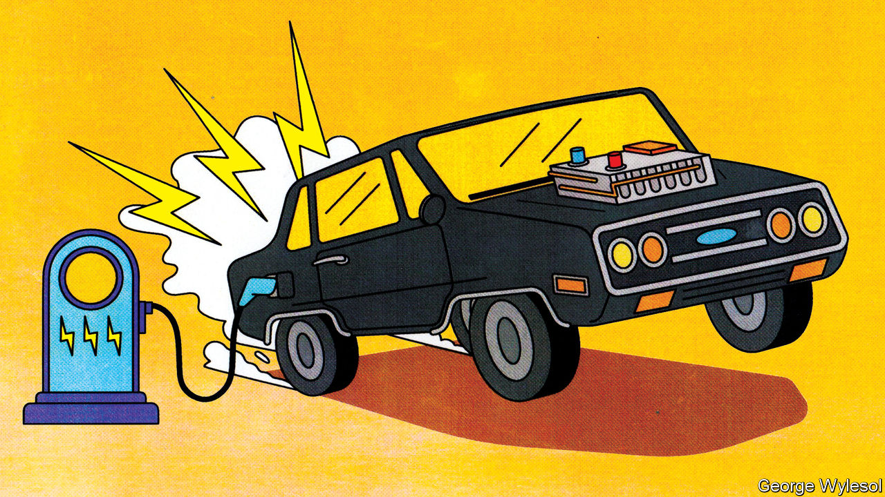

## Electric cars

# What the million-mile battery means for electric cars

> It is mainly about greater reliability

> Aug 1st 2020

AS EVERY MOBILE-PHONE owner knows, after a year or so the battery starts to fade and the beast needs recharging more frequently. That is a nuisance, but a phone’s batteries can be replaced fairly cheaply—or the whole handset traded in for the latest model. An electric car, however, is a much bigger investment. And batteries are its priciest component, representing around 30% of an average mid-size vehicle. Apart from increasing the risk of running out of juice and leaving a driver stranded, a deteriorating battery quickly destroys a car’s second-hand value.

To provide buyers with some peace of mind, carmakers guarantee their batteries, typically for eight years or around 200,000km. Producers are now, though, planning to go much further than that, with the launch of “million mile” (1.6m kilometre) batteries. Zeng Yuqun, the boss of Contemporary Amperex Technology, a giant Chinese firm which produces batteries for a number of carmakers, said in June that his company was ready to start manufacturing batteries which would last for 16 years or 2m kilometres. Elon Musk has hinted that Tesla, a Californian maker of electric vehicles of which he is boss, has a million-mile battery in the works. Rumours suggest this could be unveiled in September. And over in Detroit, General Motors (GM) is in the final stages of developing an advanced battery which it says has similar longevity.

“It’s a great catchphrase; the million-mile battery,” says George Crabtree, director of the Joint Centre for Energy Storage Research at Argonne National Laboratory, near Chicago. “But the fact you can drive a million miles may not be the most relevant parameter to look at.” Thrash a car and its battery will deteriorate faster. Regular fast-charging also reduces battery life, as do overcharging and deep discharging. Driving in extremely hot or cold weather does not help either. And battery life will diminish even if you just leave the car in the garage. The real point of a million-mile battery is that the technological advances required to make it possible will deal with these things as well.

The lithium-ion (Li-ion) batteries which power electric cars age in two ways: with time and with use. Battery-makers call time-dependent ageing “calendar ageing”. It is a consequence of the gradual degradation of some of the materials employed in battery construction. This degradation reduces a battery’s ability to hold a charge—though even here it is possible to ameliorate the problem to a certain extent. Leaving a car with a fully rather than partly charged battery, for example, can increase the rate of calendar ageing.

Use-dependent ageing is a consequence of the number of discharge-recharge cycles a battery goes through. It is caused by the complex chemical reactions that take place when a battery is operating. Some of these are essential to a battery’s job of storing and releasing energy. “But there are also side reactions that you can’t stop and some of those are harmful,” explains Dr Crabtree.

As a battery discharges, lithium ions (lithium atoms with an electron missing) are created at one electrode, the anode. These then shuttle through a liquid electrolyte to a second electrode, the cathode. The electrons stripped away at the anode, meanwhile, travel towards the cathode along an external electrical circuit, which powers the car. Ions and electrons are reunited at the cathode and remain there until the battery is plugged into a charger and the process is reversed.

Each cycle of discharge and recharge takes its toll. Lithium is so highly reactive that stopping it getting tied up in other chemical compounds while a battery is in use is hard. Even a small amount of diversion per cycle adds up, reducing the amount of the element available to store energy. On top of this, charging up faster than ions can be absorbed by the anode may result in a layer of lithium “plating” building up on the anode’s surface, reducing its storage capacity.

Plating becomes yet more of a problem if it leads to the development of structures called dendrites. These are small, finger-like fibres which project into the electrolyte from points on the anode where plating is especially elevated. If a dendrite reaches the cathode the battery will short-circuit, causing it to heat up rapidly and possibly catch fire. Other side reactions can have similarly adverse consequences.

It is difficult to generalise about the extent to which these processes reduce a battery’s lifetime. Not only does it depend on how that battery is used, but also how it is made. Li-ion cells come in different forms and a variety of chemistries, some of which have not been around long enough in cars for people to know for sure how long they will last. Nor is there any independent testing, says Dr Crabtree.

Nevertheless, the industry has a few rules of thumb. Once a battery’s capacity falls below 80% of its starting value, it is generally thought no longer suitable for use in vehicles. Some reckon that, on average, Li-ion batteries lose 2% of their capacity a year. This may not seem much, but by the time a vehicle is six years old it could mean it is halfway through its useful life.

Battery technology is improving all the time. As a consequence, so are calendar and use-dependent lifetimes. Getting direct experience of how electric cars are used is helping researchers come up with ways to mitigate some of the side reactions, says Tim Grewe, the head of GM’s electrification strategy. The company employs remote, “telematic” monitoring to keep track of how batteries are performing in its cars, and also takes back some batteries from high-mileage drivers and those living in extreme environments, such as deserts and mountainous regions, for analysis.

Dealing with impurities which get into batteries helps to extend their lives. Water, for example, reacts with salts in the electrolyte to form an acid, which attacks the electrodes. To prevent this, GM has developed an additive made from a type of material called a zeolite. Zeolites are molecular sponges. GM’s version serves to mop up any moisture which enters a battery cell.

Adding a little aluminium to a nickel-cobalt-manganese cathode, a type that is widely used in Li-ion batteries, saves on cobalt, the most expensive ingredient in a battery. But the aluminium delivers other benefits as well, adds Mr Grewe. It boosts the battery’s energy density, meaning a car can travel farther on a single charge. It also makes the battery last longer.

GM will be using these cathodes in a new battery, called Ultium, that it has developed in partnership with LG Chem, a South Korean firm. Ultium batteries, production of which is planned to start next year at a factory in Ohio, should provide electric cars with single-charge ranges of 650km or more. That compares with the 400km range which might these days reasonably be expected from a mid-size electric car. Asked if the Ultium is a million-mile battery, Mr Grewe replied, “Many customers could get that.”

As a marketing device, the million-mile battery will give electric-car buyers—even those never likely to put a million miles on the clock—more confidence that their batteries are robust. But some users might truly desire a lifetime range that great.

Jeff Dahn, who leads a group of battery researchers at Dalhousie University in Halifax, Canada, who are sponsored by Tesla, points out that autonomous electric vehicles like “robo taxis” could clock up vast mileages by operating around the clock. So, too, would long-haul lorries and electric buses. And some cars may end up being more than just means of transport. Plans are afoot to let electric-vehicle owners connect their jalopies to the grid in a way that will store surplus electricity generated in times of plenty by wind and sunshine and release it during hours of peak demand, with the owner collecting a fee for doing so. That means these grid-buffering vehicles will be racking up lots of charging cycles even when they are not moving.

Nor are million-mile batteries the limit of engineers’ aspirations. The next objective is to replace Li-ions’ liquid electrolytes with solid ones. That would keep the ions under stricter control and allow even longer driving ranges. This could make a two-million-mile battery a feasible objective. If that day comes, the tables would have been turned. From being the first part of a car to fail, its battery will have become the last.■