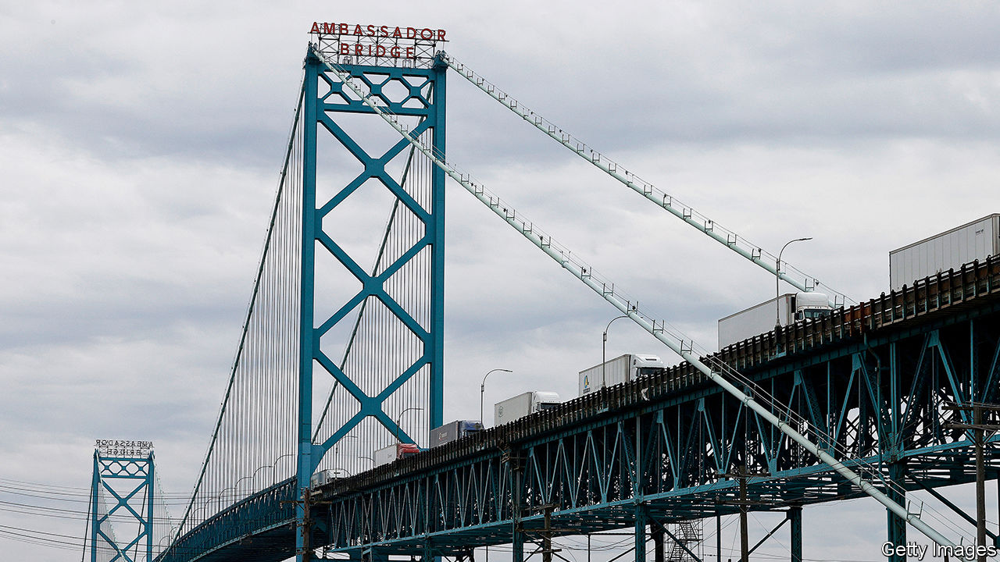

## No Canuck do

# Covid-19 has strained Canada’s relations with America

> Donald Trump wants Canada to open its border to Americans. Canadians say no

> Aug 1st 2020OTTAWA

HAVING BEEN stopped for most of the year, Major League Baseball finally started its diminished 2020 season on July 23rd. For the Toronto Blue Jays, however, the only Canadian team in the league, restarting play was not easy. The Canadian government refused to let American teams into the country to play in front of no fans in Toronto. The risk players will bring covid-19 with them is too high, public-health officials ruled. That led to a scramble to find a home in America. For the rest of the summer, all the Blue Jays’ “home” games will be just across the border in Buffalo.

Managing the border has dominated relations with the United States since March. America would like Canada to reopen, but with covid-19 spreading fast in most American states, Canadians are less keen. Justin Trudeau, their prime minister, has tried to avoid confronting Donald Trump. He is famous for avoiding awkward questions about the American president. But the pandemic is just one of several issues that may force his hand.

On July 22nd Canada’s federal court cited the Charter of Rights to throw out the “safe third-country” deal between Canada and America on refugees. Since 2004 Canada has been turning back arrivals at land-border crossings, saying they should have sought refugee status in the United States when they first landed there. But under Mr Trump, America has been jailing those returned by Canada, which the court said violates Canadian principles of justice. The court gave the government until January to make changes (or appeal against the decision). That means negotiations will persist throughout the American presidential election campaign.

It will not be the only problem. America has also threatened to impose new tariffs on Canadian aluminium. The next court date in the extradition of Meng Wanzhou, a Huawei executive who is wanted in America on fraud and sanctions-busting charges, is in August. Another argument bubbling away is over Canada’s defence spending: Mr Trump would like Canada, a fellow NATO member, to spend more.

Yet it is the pandemic that has most sharply pushed Mr Trudeau into confrontation. Canada has coped with covid-19 relatively well, with fewer than 9,000 deaths among its 38m people. New infections are up slightly as the country reopens but still under 400 a day. That contrasts dramatically with America, where new infection rates have been rising in 42 out of 50 states.

The border has been closed since March, and not just to baseball players. Canadians can return home, and lorry drivers and some commuters can cross, but most visitors cannot. Except for essential workers all entrants to Canada are expected to quarantine for two weeks on arrival.

In June only 64,000 American residents entered Canada by road, compared with 1.6m a year before, a drop of 96%. Air traffic fell by 98%. Those numbers have risen again in recent weeks, but only a bit. Parts are also moving again between car factories and the like. But the cost of immobility is still high. Destination Canada, a tourism-promotion agency, says 40% of all tourism businesses in Canada may fail; on the American side they are suffering too.

For that reason the American government would like Canada to reopen. The bipartisan Northern Border Caucus of 29 Congress members has called on Canada to allow Americans to visit holiday homes they own north of the border. They also want a “comprehensive framework” towards reopening.

Yet Canadians prefer to keep Americans out. John Williamson, an MP from a border region of New Brunswick, says he sees little appetite for relaxing restrictions, even though his constituents are deprived of the opportunity of buying cheaper petrol in America. A poll published on July 10th found 90% of Canadians want no change. As long as the pandemic rages, restrictions will stay, reckons Laurie Trautman, the director of the Border Policy Research Institute at Western Washington University.

Could the pandemic permanently alter Canada’s relationship with the United States? In early July Mr Trudeau turned down an invitation from Mr Trump to visit Washington, DC, on the basis that complying with quarantine rules on his return north would be too disruptive. Many saw it as a snub. Yet although the arguments are over real issues, Mr Trump’s personality does not help. If Joe Biden wins the election in November, Canadian officials will relax, reckons Colin Robertson of the Canadian Global Affairs Institute, a think-tank. But if Mr Trump finds a way to win, Canada’s problems are likely to intensify. And regardless of what happens, the Toronto Blue Jays may find themselves stuck south of the border for some time to come.■

Editor’s note: Some of our covid-19 coverage is free for readers of The Economist Today, our daily [newsletter](https://www.economist.com/https://my.economist.com/user#newsletter). For more stories and our pandemic tracker, see our [hub](https://www.economist.com//news/2020/03/11/the-economists-coverage-of-the-coronavirus)