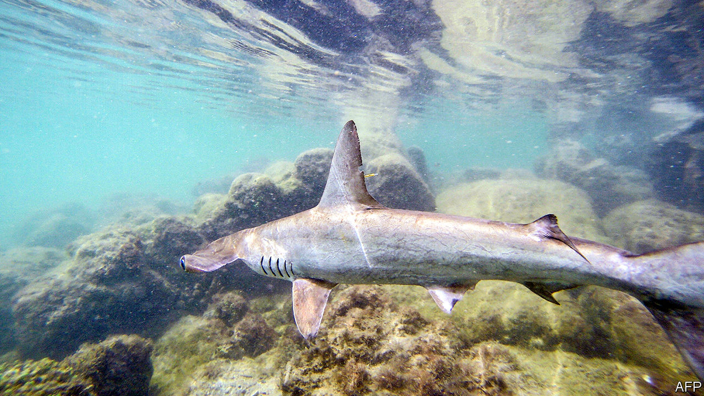

## Fishy business

# The Galapagos islands face an invasion of trawlers

> A new treaty is the best hope of stopping it

> Aug 1st 2020BOGOTÁ

ON JULY 16TH the Ecuadorian navy announced it had spotted a fleet of 260 fishing vessels, most of them Chinese, anchored in international waters near the Galapagos islands. Ecuador’s government reacted as if it were facing some sort of invasion. It increased patrols to ensure that the ships would not venture into the Galapagos Exclusive Economic Zone, where Ecuador claims a sole right to resources. President Lenín Moreno formally complained to China.

Overfishing in high seas near the Galapagos is endangering the unique species that thrive there. Yet there is little Ecuador can do to stop foreign fleets from ransacking its stock of marine wildlife. No laws regulate fishing in international waters. The ships use bait to lure sharks out of Ecuadorian waters and then catch as many as they can.

It is impossible to track how much the ships fish. The Chinese under-report the international catch coming in through their ports, says Alex Hearn, of MigraMar, a marine-wildlife research organisation. But Ecuadorians got a glimpse in 2017, when one Chinese vessel was intercepted in the Galapagos Marine Reserve. The authorities found 300 tonnes of fish, most of it scalloped hammerhead shark, a critically endangered species. Two-thirds of hammerhead fins found in Hong Kong markets belong to species that depend on Galapagos waters.

China claims the vessels belong to independent companies it does not control. But there is no way Chinese ships would go all the way to fish around Ecuadorian waters without government subsidies and technical support, says Max Bello of Mission Blue, an NGO based in California. China’s distant-water fishing fleet is the world’s largest but it is not the only country to have one. Taiwan, South Korea and America subsidise theirs, too. Global Fishing Watch, another American NGO, says much of the industry would collapse without subsidies.

Ecuador had played a big role in pushing countries to promise to negotiate a new UN treaty to regulate the fishing of endangered species. But its government took a back seat when the negotiations started, in deference to its own fishermen, who also trawl international waters. Thanks to the Chinese fleet, Ecuador is now “eager to reassess its position”, says Jeff LeBlanc, a government adviser. “We now see there are more pros than cons.” He hopes the new treaty will be signed next year, in time to save some threatened species. If not, fishing fleets will loot the waters near the Galapagos until there is little left.

## URL

https://www.economist.com/the-americas/2020/08/01/the-galapagos-islands-face-an-invasion-of-trawlers
