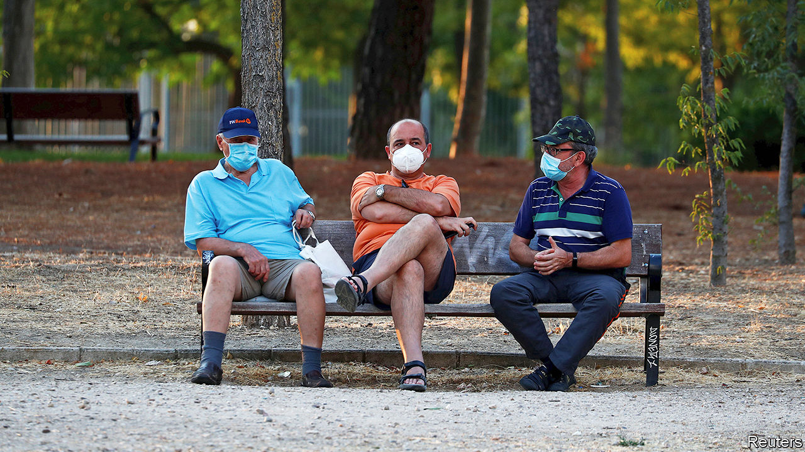
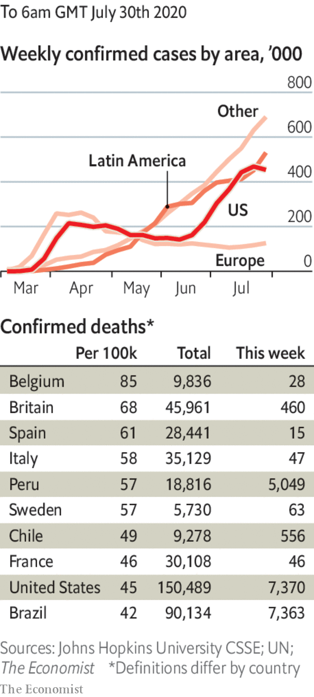

# Politics this week

> Jul 30th 2020

There were fears in Europe of a resurgence of covid-19. Catalonia returned to a form of lockdown. Britain announced that people arriving from Spain, including British tourists coming back from the beach, should quarantine for 14 days. The Spanish government was irked. Croatia, Germany, Luxembourg and Romania all saw localised spikes of coronavirus. Still, Europeans are much better prepared now than they were when the pandemic began. See [article](https://www.economist.com//europe/2020/08/01/curbing-the-covid-19-comeback-in-europe).

China recorded dozens of new infections in a day, the biggest tally since March. Most were reported in Urumqi, the capital of Xinjiang. Travel restrictions in the western region were already strict, as the central government seeks to crush dissent among mostly Muslim Uighurs.

China ordered the closure of the American consulate in Chengdu in retaliation for America shutting down the Chinese consulate in Houston. Chengdu is in western China; the American consulate there also covered Tibet, another restive region where foreign scrutiny is unwelcome. See [article](https://www.economist.com//node/21790200).

Hong Kong’s government said it had disqualified 12 pro-democracy figures from standing in elections in September for the Legislative Council, the territory’s (until now) semi-democratic parliament. It also arrested more students. See [article](https://www.economist.com//node/21790256).

Najib Razak, Malaysia’s prime minister from 2009 to 2018, was sentenced to 12 years in jail and fined $49m after being found guilty of seven charges related to the theft of billions of dollars from 1MDB, a development fund. He still faces verdicts in other trials. Mr Naijb, who said he thought the vast fortune in his personal bank account was a donation from a Saudi royal, remains free, pending an appeal. See [article](https://www.economist.com//asia/2020/07/30/najib-razak-is-found-guilty-on-seven-charges-in-the-1mdb-scandal).

The US defence secretary, Mark Esper, announced the withdrawal of nearly 12,000 American troops from Germany. President Donald Trump had criticised Germany’s reluctance to spend more on defence. Mr Esper said the decision would bolster NATO and deter Russia. He suggested that some of the troops could be redeployed on Russia’s doorstep around the Black Sea and in the Baltic countries.

The federal quasi-military agents sent to Portland to help quell violent protests are to leave the city’s centre, on the condition that Oregon provides security to protect the federal courthouse there.

South Africa took a $4.3bn emergency loan from the IMF to soften the economic shock of covid-19. The loan marks a big change for South Africa, which had previously shunned the IMF so as not to dilute its economic sovereignty. See [article](https://www.economist.com//middle-east-and-africa/2020/07/30/south-africa-borrows-from-the-imf-for-the-first-time-since-apartheid).

Perrance Shiri, Zimbabwe’s agriculture minister, died, reportedly of covid-19. He led the Fifth Brigade in Matabeleland in the 1980s, which tortured and massacred thousands of suspected opponents of the despot, Robert Mugabe, and their families. He once likened himself to Jesus, since he decided who lived and who died.

Parliamentarians in Somalia voted to remove Hassan Ali Khaire as prime minister. America, which supports the Somali army in its fight against the jihadists of al-Shabab, called the process flawed. Lawmakers say Mr Khaire failed to prepare the country for elections next year.

Tundu Lissu, an opposition politician in Tanzania who was shot 16 times in 2017 but survived, returned from exile in Belgium, hoping to run for president. Mr Lissu has also been arrested several times for such things as “insulting” John Magufuli, the incumbent. Elections are scheduled for October.

Israel fired on gunmen from Hizbullah, the Lebanese armed Islamist movement. Binyamin Netanyahu, the Israeli prime minister, said they were trying to “infiltrate our territory”.

Iran fired missiles at a replica aircraft-carrier in the Strait of Hormuz. The exercise was seen as a warning to America. Days earlier Iran accused an American fighter jet of coming too close to an Iranian passenger plane in Syrian airspace.

Five young women were sentenced to two years in prison by an Egyptian court for posting “indecent” videos on TikTok. They had let their fans see them dancing and telling jokes. The authorities are cracking down on popular social-media influencers who they say fail to uphold Egypt’s conservative values.

Ecuador’s defence minister said he was monitoring a fleet of around 260 mostly Chinese-flagged fishing boats that have gathered in international waters close to the Galapagos Islands. Chinese fishermen come each year to the spot, which is teeming with marine creatures. In 2017 a boat was caught with 300 tonnes of wildlife, mostly critically endangered sharks, which are a delicacy in China. See [article](https://www.economist.com//the-americas/2020/08/01/the-galapagos-islands-face-an-invasion-of-trawlers).

In Bolivia the electoral court postponed the country’s presidential election for a second time. It had been rescheduled to take place in early September, but because of covid-19 the date was pushed back to October 18th. The left-wing opposition rallied its supporters to protest against the delay. It has accused Jeanine Áñez, the centre-right interim president, of using the pandemic to cling to power. See [article](https://www.economist.com//the-americas/2020/07/30/the-return-of-rigged-elections-in-latin-america).

Vietnam recorded its first infections since April. It has still reported no deaths.

North Korea admitted that the virus was in the country. It locked down the border city of Kaesong, and accused a defector who swam back across the border from South Korea of bringing the disease.

Australia had its worst day for deaths and new cases since the start of the pandemic. See [article](https://www.economist.com//asia/2020/07/30/a-second-covid-19-wave-is-worrying-australia-japan-and-hong-kong).

Jair Bolsonaro, Brazil’s president, said he had recovered from covid-19, after a fourth test came up negative.

Robert O’Brien, Donald Trump’s national security adviser, tested positive for the virus, the most senior member of the administration to do so.

Mr Trump in effect cancelled the bit of the Republican convention that was to be held in Jacksonville because of Florida’s surging infections. See [article](https://www.economist.com//united-states/2020/07/26/donald-trump-cancels-his-florida-celebration).