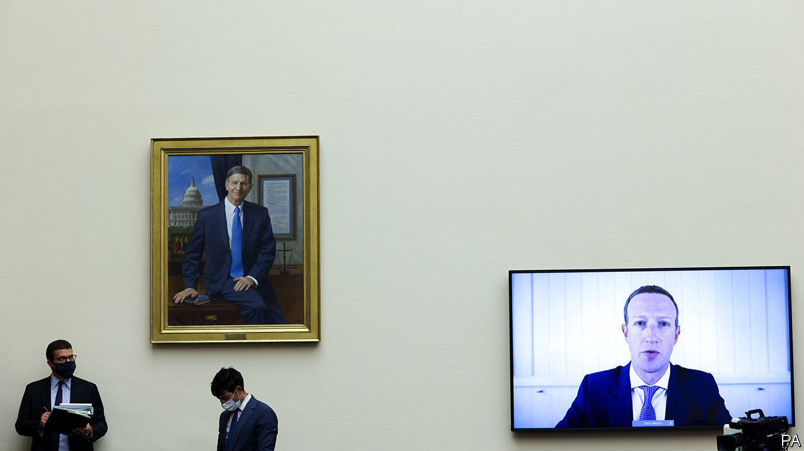

## Tech titans’ testimony

# Big Tech’s grilling provides more show than substance

> Hearing without listening

> Jul 30th 2020SAN FRANCISCO

“SO CAN WE all agree that this #antitrusthearing has...nothing to do with antitrust?” The tweet, sent midway through the five-hour congressional grilling on July 29th of the bosses of Alphabet (Google’s parent), Amazon, Apple and Facebook, was only a slight exaggeration. The much-hyped, mostly virtual event will not do a lot to move forward the debate about what, if anything, to do to rein in the titans of tech. Instead it was yet more proof that in the current hyper-partisan environment such hearings have become a bit of a farce.

In advance, aides to the antitrust subcommittee of the House Judiciary Committee, which held the hearing, suggested that the bosses would be confronted with plenty of smoking guns. In 13 months of investigation of big tech firms, intended to provide the basis for proposals on how to reform America’s antitrust law, it collected hundreds of hours of interviews and waded through 1.3m documents, mostly emails. Yet if there was smoke, it was thin.

The most damning emails came from Facebook, which many accuse of having systematically taken over other social-media firms, such as Instagram and WhatsApp, to prevent them from becoming serious competitors. “One thing about startups though is you can often acquire them. I think this is a good outcome for everyone,” the firm’s founder, Mark Zuckerberg, wrote in April 2012, shortly after Facebook bought Instagram. In another email one of his colleagues talks about acquisitions as a way to “neutralise a potential competitor”.

The four bosses generally managed to bat away such accusations. Mr Zuckerberg admitted that Instagram was a competitor, but said it would never have become as big as it is today without Facebook’s help. The legislators succeeded in showing that the firms were indeed “gatekeepers” to the digital economy, as David Cicilline, the chairman of the subcommittee, argued in his opening statement. What remains much less clear is what to do about this, and whether the companies abuse their power.

The problem is that the firms’ actions can often be seen as anticompetitive and as benefiting consumers simultaneously. Asked why Apple removed from its App Store some apps that help parents control their children’s devices, the firm’s boss, Tim Cook, could argue that this was not done to hurt apps competing with similar offerings from Apple, but to protect users’ data (although he struggled to explain why this took place right after Apple introduced its own offering and why six months later it let the other apps back in, without major changes to their data policies).

The long afternoon was mostly filled with lawmakers answering their own questions. They quizzed the bosses and let them say a few sentences, before talking over them and making their own statements. Democrats at least stayed on topic; Republicans seemed more interested in conspiracies. They argued that Google is somehow in bed with the Chinese government and that tech firms have an inbuilt bias against “conservative views” in the way they moderate content—even though their platforms are the most important distribution channels for right-wing opinions.

The most interesting insight came from how differently the four CEOs performed. Mr Zuckerberg did best; he has been grilled, in Congress and elsewhere, many times before. Mr Cook also put in a solid showing, although he faced the fewest questions. By contrast, Jeff Bezos of Amazon, appearing for the first time at a congressional hearing, could do with a tad more coaching: he appeared to admit some of the accusations levelled at Amazon, for instance that it uses data gathered from merchants on its e-commerce platform to develop rival offerings. But it was Sundar Pichai, Google’s boss, who performed the worst, too scripted and apparently overwhelmed by the conspiracy theories coming his way.

The subcommittee will now write a report, to be published later this year. It is unlikely to lead to any legislation, at least in the near future. Nobody expects much to happen before the presidential election in November. Even after that, would antitrust be a priority? What a re-elected Donald Trump would do is anybody’s guess (“If Congress doesn’t bring fairness to Big Tech...I will do it myself with Executive Orders,” he tweeted before the hearing). As president, Joe Biden, who has not shown much interest in tech matters, would have his plate full with other projects, such as fixing health care and the economy.

If there is big antitrust news before the election it is likely to come in the form of lawsuits. Insiders say the Department of Justice is intent on filing one by September—perhaps with some state attorneys-general—against Google for having extended its monopoly in online-search advertising into other areas of digital marketing. The Federal Trade Commission may follow suit by going after Facebook, though it is unclear what it would focus on. Such cases tend to take years. The four tech bosses may have had a few unpleasant hours, but their power is safe for now. ■

Dig deeper:Sign up and listen to Checks and Balance, our [weekly newsletter](https://www.economist.com//checksandbalance/) and [podcast](https://www.economist.com//podcasts/2020/07/24/checks-and-balance-our-weekly-podcast-on-american-politics) on American politics, and explore our [presidential election forecast](https://www.economist.com/https://projects.economist.com/us-2020-forecast/president)

## URL

https://www.economist.com/united-states/2020/07/30/big-techs-grilling-provides-more-show-than-substance
