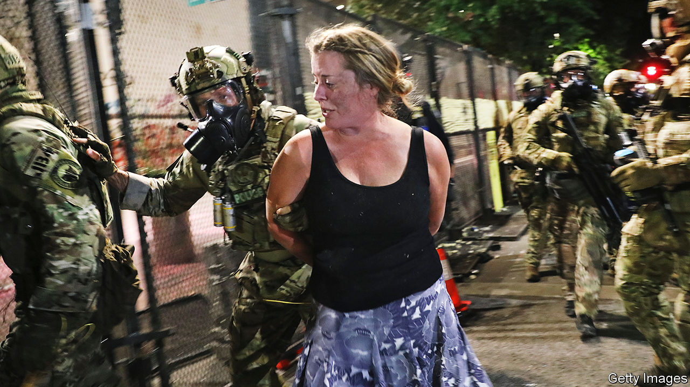
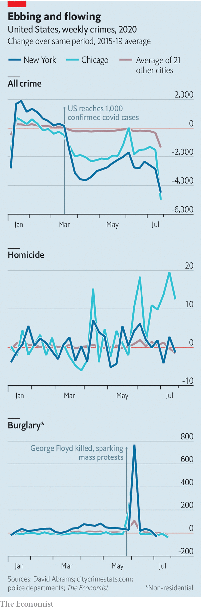

## Crime statistics

# Fears that America is experiencing a serious crime wave are overblown

> Few signs of a surge

> Aug 1st 2020

THE DEATH of George Floyd under the knee of a Minneapolis police officer on May 25th has sparked large anti-racist protests in cities across America. “Defund the police”, a call to reallocate some of the money spent on law enforcement to other services, is becoming a mainstream slogan on the left. President Donald Trump claims that the “anti-police crusade…has led to a “shocking explosion of shootings, killings, murders and heinous crimes of violence.” On July 22nd he announced he would send a surge of federal agents to police big cities, including Chicago and Albuquerque (although those that had been deployed in Portland, Oregon, are starting to leave.)

But the evidence that America is experiencing a major crime wave is mixed at best. Official national crime statistics, compiled by the FBI, are generally published with over a year’s delay, so researchers have to turn to other sources. David Abrams of the University of Pennsylvania, pulls together data from some two dozen major cities on citycrimestats.com. His figures show that so far this year crime is actually down by around 10% compared with the same period in 2015-19 (see chart).

It is possible that this drop is simply an artefact of reporting. Covid-19 has meant fewer people on the streets, hence fewer potential witnesses who might call the police. However, Mr Abrams notes that the share of police stops which have resulted in arrests has not changed, which suggests that the drop in crime is genuine. It seems even drug dealers have been adhering to social-distancing guidelines.

There are some exceptions to this decline. Non-residential burglaries spiked in early June, coinciding with the peak of the George Floyd protests, when looting of retail stores was common. Domestic violence has also probably increased. Data are sparse because only a small fraction of victims report being abused, and because police departments can be slow to share what numbers they do have. Research by Emily Leslie and Riley Wilson of Brigham Young University finds that calls related to domestic violence in March to May rose by an average of 7.5% in 14 cities compared with the same period in the previous year.

Alarmingly, murder also seems to be on the rise. So far this year, homicides in big cities appear to be up by around 20% against the average for the same period in 2015-19. Interpreting these numbers is tricky, since murder rates can vary a lot from year to year. An Economist analysis of FBI statistics finds that the total number of homicides in big cities fluctuated from year to year by an average of roughly 20% between 1990 and 2018. Murders in Chicago this year may be up by 51% through July 20th, compared with the same period in 2019, but by only 9% on 2017. Except in a handful of the cities in Mr Abrams’s data set, homicide rates did not change much relative to prior years after government shutdown orders were put in place.

One city which has seen a marked increase in violence in recent weeks is New York. Chris Herrmann of the John Jay College of Criminal Justice, a former analyst with the New York Police Department (NYPD), says this may be partly because many police officers who would normally patrol the outer boroughs have been redirected to Manhattan, where many of the protests are occurring. He also notes that covid-19 has forced jails and prisons to release inmates, including many convicted of, or awaiting trial for, violent offences.

The police usually benefit from a natural dividend in the autumn. Homicide rates tend to fall in September as the weather cools and teenagers head back to classrooms. But Mr Herrmann fears the country might not be as lucky this year. Many schools are unlikely to reopen. Courts have been shuttered, making it harder for prosecutors to stop gang violence. Michael LiPetri, chief of crime-control strategies at the NYPD, says the share of shootings involving gang members in his city has more than doubled since last year. And, as Jens Ludwig, director of the University of Chicago Crime Lab, points out, America’s covid-induced recession will take a serious toll on city finances, putting further pressure on the budgets of police departments.

Drastically cutting police funding without adequately investing in other areas, such as social work, would be risky. A recent working paper by Tanaya Devi and Roland Fryer, both economists at Harvard University, analysed the impact of state and federal investigations into police departments. It found that, though most probes had a small positive impact in reducing crime, “viral” ones prompted by national scrutiny appear to cause the police to retreat too far. When Freddie Gray was killed by the Baltimore police in 2015, the national media and federal investigators poured into the city. Police officers, fearful for their jobs, pulled back. They stopped fewer people in the streets and arrested fewer suspects. And homicides rose. ■

Dig deeper:Sign up and listen to Checks and Balance, our [weekly newsletter](https://www.economist.com//checksandbalance/) and [podcast](https://www.economist.com//podcasts/2020/07/24/checks-and-balance-our-weekly-podcast-on-american-politics) on American politics, and explore our [presidential election forecast](https://www.economist.com/https://projects.economist.com/us-2020-forecast/president)

## URL

https://www.economist.com/united-states/2020/08/01/fears-that-america-is-experiencing-a-serious-crime-wave-are-overblown
