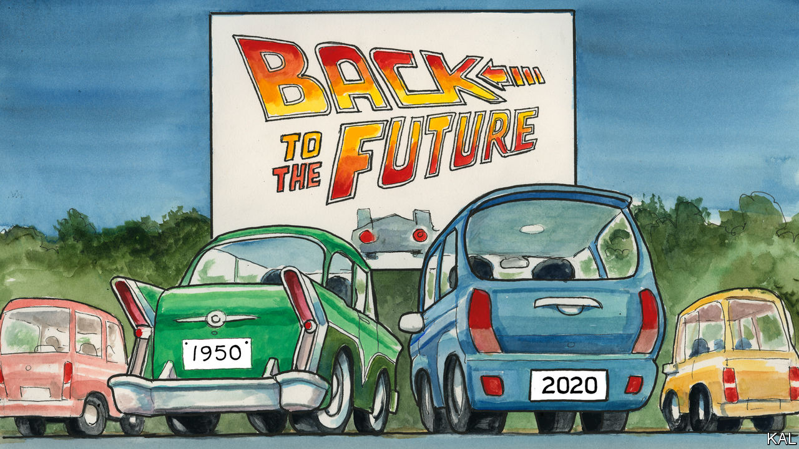

## Lexington

# Mid-century modern

> Americans should stop harking back to the 1950s. Many of the decade’s delights are still available

> Aug 1st 2020

THE GIANT movie screen at Bengies was illuminated by a thrilling golden sunset when the cinema’s owner and compere, D. Edward Vogel, began reciting the house rules one recent Friday evening. It was dark before he had finished.

Bengies, a drive-in outside Baltimore, does not allow alcohol, profanity, car-horns or headlights—which seemed reasonable. It also bans barefoot children (even when carried), photography, vehicles left unoccupied without an explanatory note, and refunds or ticket changes of any kind, which seemed a bit over the top. “This is not an exclusive list of our rules, but it’s a pretty good start,” said Mr Vogel, as the sky darkened over the 120-foot-long movie screen. He still hadn’t got through his covid-19 stipulations.

Mr Vogel, whose uncle started Bengies in 1956, says its rules are necessary because many of his patrons are new to drive-ins (of 4,000 fresh-air theatres in 1958, fewer than 400 remain). But this was not true of the families setting out chairs and speakers around Lexington and his tribe. From Pennsylvania, Virginia and far-flung Maryland, they were Bengies habitués. They came for its giant screen, grandiose playing of the anthem and unreconstructed snack bar selling Bengies cola, foot-long hot dogs and much more. They revelled in its eccentricity. The drive-in is named after a 19th-century president, Benjamin Harrison, and known for the snarky messages on its neon billboard. Best of all they loved the juxtaposition of electronic entertainment and hot night air.

These virtues were also apparent to first-timers. Like time-travelling Michael J. Foxes, your columnist and his family found the drive-in at once novel and deeply familiar. The experience has been depicted in a thousand films. More acutely, the same combination of mid-century technology, bossiness and cheesy family-mindedness is still remarkably common. America is suffused with the culture of the 1950s. The pandemic, which has inspired pop-up drive-ins around the country, has made this even more evident.

The fact that theme parks and bowling alleys have been conspicuous victims of the economic shutdown has underscored how popular they remain. Disney World’s winning struggle to reopen in plague-ridden Florida this month was a major economic event. Fast food, another 1950s signature, is similarly pre-eminent, and the coronavirus has re-emphasised its most iconic form, the hamburger served to the car-window. McDonald’s, America’s favourite restaurant now as then, collected 70% of its revenues from drive-thrus even before the pandemic made them more popular.

Pent up in suburbia, where a third of Americans lived in 1960 and over half live today, families have been rediscovering the 1950s combination of board games before the kids go to bed and cocktails afterwards (and sometimes before; unless that is a British version). Sales of Scrabble—patented in 1948—and liquor are through the roof. With flying not advised, many are also taking vintage holidays. Lexington is currently on a family road-trip in New England, an undertaking synonymous with the 1950s, which also helps explain why the decade’s culture is so enduring.

Millions made for America’s beaches and parks back then, because they suddenly had the means to do so: 1950 was the first year the average household owned a car. The country’s two most famous bears, Smokey, a wildfire-orphaned cub who became a sensation in 1950, and Yogi, who hit televisions in 1958, were also alluring. And whereas citizens of drearier rich countries have been liberated by foreign holidays, Americans’ vast backyard remains too wonderful to be supplanted. Americans are much less likely to travel abroad than rich Asians or Europeans—not only, or mostly, because they are afraid to, but because they don’t need to.

This rationale has helped preserve the recreational culture of the 1950s. It is especially evident in the state parks that have provided an alternative to shuttered pools this summer. Generally smaller, more accessible and more crowded than national parks, many were converted from forestry land around the 1950s. And they retain, with their roped-off swimming lakes and pedalos, a distinctive mid-century feel. After a summer of surveying America from such vintage vantages, your columnist has these reflections.

Unfavourable comparisons between America now and in its golden decade of capitalism are understandable. Yet 1950s nostalgists should find comfort in the decade’s cultural endurance. That goes beyond board games. The warm civic-mindedness Americans exude in their mid-century pursuits recalls that confident time. When your columnist’s neighbours at Bengies discovered it was his children’s first trip to a drive-in, they bought them a celebratory ice-cream. That would not happen in a video arcade.

Nostalgists should also consider two cautionary points. First, as per Bengies’ rules, the 1950s was a hectoring time. For all its thrust and novelty, there was usually someone telling you what to do. The suburbs were an experiment in social engineering. Housewives there were bombarded with home economics, their teenagers with “mental-hygiene films”. Americans would not submit to that today because they are freer. (Though it would be good if they would submit to wearing face-masks, as you must at Bengies.)

Second, many Americans were barred from the 1950s cultural treats because of their skin colour. Cinemas were segregated in the South until the passage of the Civil Rights Act in 1964. So were many state parks. When Sandy Point, a small beach on Chesapeake Bay, opened in 1952, it was the only one in Maryland available to African-Americans. And they could use only a scruffy corner of it.

When your (white) columnist and his family visited the teeming beach this summer, they were in the minority. It is now a magnet for Hispanic families from Prince George’s County and black ones from Baltimore. Hip-hop and salsa fight it out above the multilingual, multiracial throng. All things considered, 1950s America is better now than it was in the original.■

Dig deeper:Sign up and listen to Checks and Balance, our [weekly newsletter](https://www.economist.com//checksandbalance/) and [podcast](https://www.economist.com//podcasts/2020/07/24/checks-and-balance-our-weekly-podcast-on-american-politics) on American politics, and explore our [presidential election forecast](https://www.economist.com/https://projects.economist.com/us-2020-forecast/president)