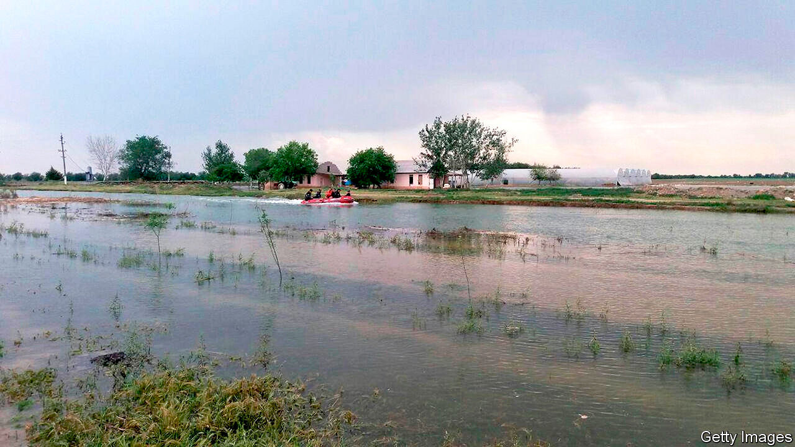

## Weirs and wherefores

# A dam failure raises concerns about corruption in Uzbekistan

> An investigation into the causes is taking a long time to report

> Aug 8th 2020TASHKENT

WHEN A DAM burst in Uzbekistan in May, Shavkat Mirziyoyev, the president, was quick to promise justice for the victims. Those responsible for the disaster, which killed six people and displaced over 100,000, would answer before the law “regardless of who they are”, he pledged. On social media, ordinary Uzbeks aired their suspicions that negligence or corruption must have contributed to the collapse, since the Sardoba dam had only been completed three years before. The structure should surely have been built to withstand the storms that officials initially blamed for the tragedy, they argued. Days after the devastating flood—which washed away crops as well as homes in both Uzbekistan and neighbouring Kazakhstan, causing over $1bn of damage—the president formed a task force to investigate. He gave it a month to report back.

Three months on, the report has still not arrived—and the task force now says it will take another five months to complete. But its preliminary findings do seem to bear out ordinary Uzbeks’ fears: nine people, including government officials and employees of firms that helped build the dam, have been arrested and face charges of embezzlement, fraud, negligence and violation of health-and-safety rules.

Just how far the rot goes is hard to say. The authorities have released the name of just one of the nine suspects, but no senior bureaucrats or businessmen appear to have been arrested. Journalists looking into the dam’s collapse, meanwhile, have been harassed and fired. And the composition of the task force has raised eyebrows: it includes Abdugani Sanginov, a senator who, as head of a government agency, awarded contracts for the construction of the dam. Media reports also claim that his family has ties to some of the firms that won the contracts. Mr Sanginov has brushed aside suggestions of any conflict of interest.

That an investigation is even being conducted is testament to the spirit of reform instituted by Mr Mirziyoyev after he came to power in 2016. His late predecessor, the dictatorial Islam Karimov, would have simply brushed the whole episode under the carpet. But the disaster is especially awkward for Mr Mirziyoyev, since he presided over the dam’s construction as prime minister and became president shortly before it started operating.

Moreover, Mr Sanginov is not the only member of Mr Mirziyoyev’s government to have had to fend off accusations of a conflict of interest. Jakhongir Artikkhodjaev, the mayor of the capital, Tashkent, has acknowledged ties to firms building Tashkent City, a flagship office, housing and leisure complex intended to signal that Uzbekistan is open for business again after decades as a largely closed dictatorship. Municipal officials say the contracts were awarded with appropriate oversight, and Mr Artikkhodjaev insists the firms won them fair and square. Indeed, he implies they are participating in the project largely out of a sense of civic duty.

Under Mr Karimov, Uzbekistan became a byword for crony capitalism. An American diplomat described Gulnara Karimova, the ex-president’s disgraced daughter, as a “robber baron” in a cable that was later leaked. Last year Ms Karimova was indicted in America for allegedly soliciting $865m in bribes from foreign firms hoping to do business in Uzbekistan. She is now in jail in Uzbekistan on corruption charges, although the judicial proceedings against her have been far from transparent.

The current authorities insist that Uzbekistan has changed beyond recognition since Ms Karimova held sway. But many close connections between business and government remain. Most notably, Oybek Tursunov, Mr Mirziyoyev’s son-in-law and a senior member of his staff, owns stakes in several financial firms, including a big bank and a payments network. Mr Mirziyoyev positions himself as a champion of transparency and has pushed through an impressive array of reforms to improve the investment climate and reduce corruption. But ordinary Uzbeks still need to be convinced that it is the public good, not private interests, that dictate how the government spends its money. ■

## URL

https://www.economist.com/asia/2020/08/08/a-dam-failure-raises-concerns-about-corruption-in-uzbekistan
