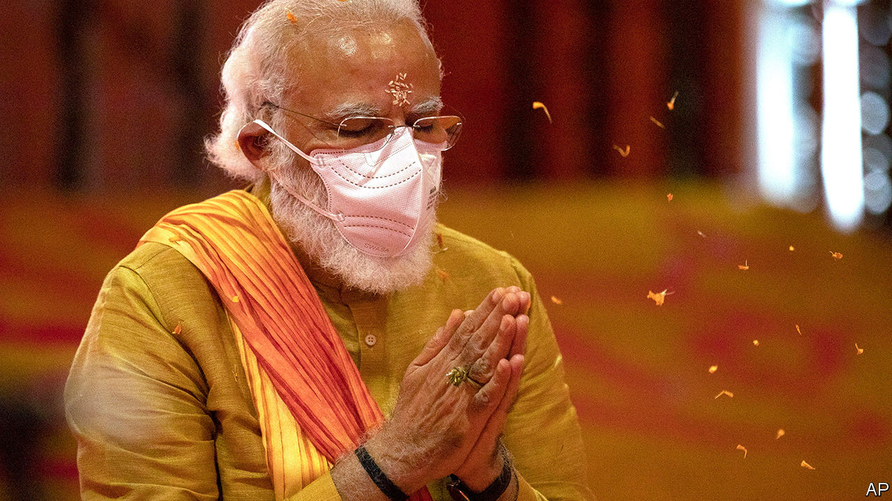

## India shrining

# India’s ruling party replaces a mosque with a Hindu temple

> The construction of the shrine is the culmination of a 30-year campaign

> Aug 4th 2020DELHI

THIRTY YEARS ago a thrusting activist called Narendra Modi helped to organise a month-long political procession across northern India. The Ram Rath Yatra began at the city of Somnath, in his home state of Gujarat, and snaked up and down the country on its way to a mosque in the city of Ayodhya in the state of Uttar Pradesh, at the spot where many Hindus believe the god Ram was born. Mr Modi had recently joined the national campaign team of the Hindu-chauvinist Bharatiya Janata Party (BJP), which was agitating for the demolition of the mosque and the construction of a temple in its stead.

The cavalcade vaulted the BJP into the top ranks of Indian politics. At the next election its share of the vote nearly doubled, making it the biggest opposition party. And even though the mosque was destroyed in 1992 after a BJP rally at its gates descended into a riot, the courts dithered for decades about what should become of the ruins, leaving the party with a perennial campaign issue. The fact that the demolition sparked nationwide violence that claimed over 2,000 lives only helped the BJP, by heightening sectarian tensions.

The episode also accelerated the career of Mr Modi, whose efficiency and drive earned the admiration of the BJP’s top leaders. He received a further boost when a fire aboard a train in his home state of Gujarat killed 59 Hindu pilgrims returning from Ayodhya. Local Muslims were accused of arson, and in the ensuing pogrom at least 1,000 people, the vast majority of them Muslim, died. Although the courts have cleared Mr Modi, Gujarat’s chief minister at the time, of complicity in the violence, he has been lauded by Hindu extremists ever since for putting Muslims in their place.

On August 5th Mr Modi, now prime minister, returned to Ayodhya—for the first time since 1991, according to some reports. He was there to lay the foundation stone of the temple for which he and his party have campaigned for his entire career, and for which the Supreme Court had at last cleared a path in November. Mr Modi (pictured) prayed and chanted in religious garb and a medical facemask alongside Yogi Adityanath, a firebrand Hindu cleric whom he elevated to chief minister of Uttar Pradesh, and Mohan Bhagwat, the head of the Rashtriya Swayamsevak Sangh, a goose-stepping Hindu paramilitary group with perhaps 5m members. Then he helped manoeuvre a 40kg silver brick into place before declaring, “The wait of centuries is ending.” He did not mention, much less lament, the vandalism that had cleared the way for the temple’s construction.

Although India is officially a secular republic, the barrier between faith and state has never been absolute. The state has even abetted the construction of a Hindu temple on a site occupied by a mosque before—in the 1950s, at Somnath, the starting point of the Ram Rath Yatra. But previous governments concentrated on reforming Hinduism, weeding out practices deemed backward, such as discrimination on the basis of caste. In that vein, in 2018, the Supreme Court ruled that women must be allowed to enter the Sabarimala temple in the southern state of Kerala.

The BJP, in contrast, has propagated the notion that Hindus, who make up about 80% of the population, are hard done by in modern India, and that Muslims, who account for just 14%, get too good a deal. Since winning a thumping election victory last year, it has reversed, at least in part, the three supposed injustices on which it has campaigned longest and most insistently: the failure to honour Ram at his birthplace, the special constitutional status granted Jammu & Kashmir, India’s only state with a Muslim majority, and the distinct laws on marriage and inheritance that apply only to Muslims. On August 5th last year the government not only revoked Jammu & Kashmir’s modest autonomy, but downgraded it from a state to a territory and split it in two for good measure. A week before it had rescinded Muslim men’s right to divorce their wives instantly and at whim and had made it a crime to attempt to do so.

These moves in part reflect the BJP’s political dominance. For the first time, it enjoys a majority in both chambers of parliament and no longer has to rely on less sectarian allies to pass legislation. But the sudden rush to advance the Hindu nationalist items on its agenda also reflects the diminished chance of making good on its other main campaign promise: to accelerate economic growth and spread opportunity. The growth rate was already slowing before covid-19 arrived; the IMF now predicts that the economy will contract by 4.5% this year. Millions are being pitched into poverty.

What is more, the BJP has not yet hit on a fresh cause with the appeal of the Ram temple. When it amended the laws on citizenship to favour Hindus at the end of last year, it was met with surprisingly big and persistent protests in favour of secularism. The government itself, meanwhile, seems wary of stoking confrontation with China, despite recent Chinese border encroachments that have aroused public indignation. After Chinese troops beat 20 Indian soldiers to death high in the Himalayas in June, it took Mr Modi’s government two weeks to retaliate, and then only with a decree banning an assortment of Chinese-owned smartphone apps.

In the Ramayana, the epic poem that tells the story of Ram, the god is exiled from Ayodhya by his father, the king, and passed over as heir to the throne. Although it takes him many years and titanic struggles to do so, Ram eventually returns in triumph to Ayodhya, where he takes his rightful place as king and ushers in a golden era. Mr Modi is deliberately echoing the story with his own triumphant return to Ayodhya. He would doubtless like Indians to imagine that a golden era lies ahead. But the BJP’s current political ascendancy is made of baser stuff. ■

Editor’s note (August 5th 2020): This story has been updated since it was first published.

## URL

https://www.economist.com/asia/2020/08/04/indias-ruling-party-replaces-a-mosque-with-a-hindu-temple
