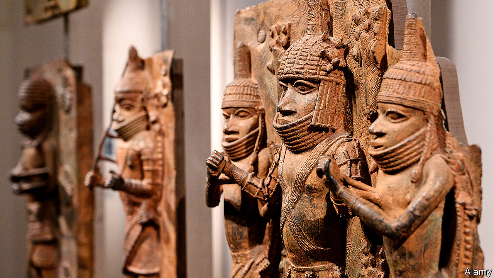

## Legacies of violence

# Activist curators are sharpening the debate on restitution

> The battle lines between retainers and returners are being redrawn from inside museums

> Aug 8th 2020

IN JUNE MWAZULU DIYABANZA marched into the Musée du Quai Branly in Paris with four friends. “I’ve come to recover goods that were stolen from Africa,” he said, seizing a funerary statue from South Sudan. With 70,000 objects, the Quai Branly has France’s biggest stash of African artefacts. Three years ago President Emmanuel Macron promised they would start to be returned. “I cannot accept that a large share of several African countries’ cultural heritage be kept in France,” he said during a speech in Burkina Faso.

Yet progress has been slow; Mr Diyabanza and his associates have lost patience. “We have the right to remove what belongs to us because it’s our patrimony,” the activist announced on YouTube, “and we’re going to take it home.” Instead, the friends were arrested, charged with theft and are awaiting trial.

Away from the spotlight, another group is also trying to sharpen the debate on restitution, this time from the inside. In America and Europe curators are speaking out about the colonial past of Western museums. Many of them became curators in the early 2000s when the idea of institutions as “world museums”, where visitors could compare cultures from all over the globe, was fashionable. But underpinning this viewpoint, one Western museum director says, was a selfish attitude of “what’s mine is mine and what’s yours is mine.”

These curators were emboldened by the report Mr Macron commissioned soon after his return from west Africa, which was published in 2018. In it, Felwine Sarr, a Senegalese economist, and Bénédicte Savoy, a French art historian, argued that the time had come for a “new relational ethics” in the discussion about the return of Africa’s cultural heritage. Since then, the Black Lives Matter and Rhodes Must Fall movements have only made these curators more determined. “Conversations about monuments outside are being applied to monuments inside,” says Dan Hicks, who oversees world archaeology at Oxford’s treasure-laden Pitt Rivers Museum. “Especially where they have a common history in terms of racism.”

Some of the most eloquent activist curators include Nanette Snoep, a Dutch anthropologist who runs the ethnological collections in Cologne; Chip Colwell, until recently a curator of Native American culture at the Denver Museum of Nature and Science; and Wayne Modest, the head of the Research Centre for Material Culture in Leiden, whose research focuses on slavery in the Caribbean. Mr Hicks may be about to become the best-known among them.

After working for nearly a decade as a digger on archaeological sites, Mr Hicks went to Oxford University in 1994 to read archaeology and anthropology. For his postgraduate work, he transferred to Bristol, where he learned about the city’s role in the transatlantic slave trade—a past that was dragged into the present when protesters against racism toppled a statue of Edward Colston, a profiteer from that trade, in June. Fieldwork in the Caribbean for his PhD pitched him deeper into debates about the history and legacy of empire.

In 2007 Mr Hicks joined the Pitt Rivers Museum. His first task was to study its collection, a mishmash of 500,000 objects. By 2015 Mr Hicks had a good idea where most of the items came from, but a social-media post by Rhodes Must Fall made him reconsider a wooden display case containing “Court Art of Benin”. The items had been “brought” to Britain, the label said, after a military skirmish. The tweet was pointed: “The Pitt Rivers Museum is one of the most violent spaces in Oxford #BeninBronzes”.

Knowing that object labels can be economical with the truth, Mr Hicks extended his research. He joined the Benin Dialogue Group, a salon of European museums and authorities in Benin City, but felt their ideas were too timid. In November Mr Hicks will publish his manifesto, “The Brutish Museums: The Benin Bronzes, Colonial Violence and Cultural Restitution” (Pluto Press). Using military and trade records, it shows how closely the Benin Bronzes, brutal expansionism and museums are linked.

By the late 1800s the Oba of Benin oversaw an empire that sold slaves, ivory and ebony in exchange for metal coinage, blades and guns. Britain was determined to seize control of this trade. When it learned that a small party approaching Edo, the capital of the kingdom of Benin, in January 1897 had been attacked, and seven British delegates killed, it quickly retaliated with a punitive expedition. Over 5,000 men from the British Royal Marines and the Niger Coast Protectorate, armed with 38 Maxim machineguns and 2m rounds of ammunition, razed the oba’s palace and the city, but not before they had packed up its vast collection of ivory and brass objects.

The small trading party was bait, Mr Hicks believes, a means to justify the dismemberment of the Benin empire. British soldiers seized and sold over 5,000 bronze objects (no one is quite sure precisely how many). They are now dispersed among more than 160 institutions, including the British Museum which, with around 900 pieces, has the single biggest hoard. There are also many private collectors, some of them descendants of soldiers who took part in the sacking.

“To the people of Benin and to Nigerians generally the Benin Bronzes represent a great artistic and spiritual loss,” says Ben Okri, a Nigerian poet and novelist. They “are a constant reminder of the Western disrespect for their traditions and their history.” Museums that fail to acknowledge this loss, and the destruction associated with it, collude in that violence, Mr Hicks argues. “The arrival of loot into the hands of Western curators, its continued display in our museums and its hiding away in private collections, was not some art-historical incident,” he says, “but an enduring brutality that is refreshed every day that a museum...opens its doors.”

The title of his book, “The Brutish Museums”, is spelled out in the same font that the British Museum uses, and the cover’s hue matches the museum’s stone-clad walls. It is a clear challenge to the 267-year-old institution, which mostly refuses to hand back artworks to the countries that produced them. “I think it’s misleading to call the British Museum the brutish museum,” says Hartwig Fischer, its director, who has not read the book. “The museum is engaged with the partners in Benin City in a long-term, comprehensive collaboration that aims at a sustainable development of cultural heritage.”

The royal court in Benin City plans to build a museum of its own, though work has not begun and it has yet to make a formal request to the Pitt Rivers or the British Museum. “But how many times do they really have to ask?” Mr Hicks says. “We shouldn’t have anything in that’s nicked. It’s as simple as that.” Last month Oxford University, which oversees the Pitt Rivers, published its formal procedures for dealing with restitution claims for objects taken under duress.

Beyond his own museum, Mr Hicks has joined forces with Ms Savoy, the co-author of the French report, on a £700,000 ($915,000) research project into the origins of collections in Britain and Germany. The Open Society Foundations (OSF) has also pledged $15m to help African organisations reclaim artefacts. Using $1m of that grant, Mr Hicks is establishing a museum network called Action for Restitution to Africa, working with curators in Europe as well as in Egypt, Ghana and South Africa. “We understood...that we could with our investment create some real binding connective tissue between academics, activists, artists, civil-society actors and governmental actors,” says Patrick Gaspard, president of the OSF.

There are still hearts and minds to win over within institutions. In 2019 Mr Hicks launched #BeninDisplays, a Twitter campaign which urges museums with Benin collections to provide honest contextual information. He hopes that the efforts of curators, as well as activists, will cause a reckoning over restitution that many believe should have happened long ago. ■

## URL

https://www.economist.com/books-and-arts/2020/08/08/activist-curators-are-sharpening-the-debate-on-restitution
