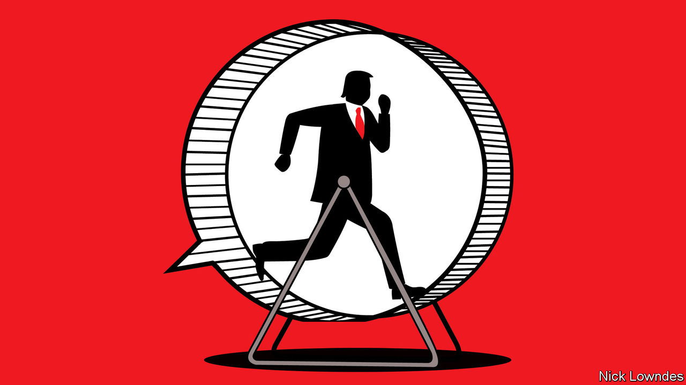

## Johnson

# Donald Trump’s language offers insight into how he won the presidency

> His linguistic quirks reveal the salesmanship that has made his career

> Aug 8th 2020

EVERYONE KNOWS how to do a Donald Trump impersonation. In speech, adopt his raspy timbre, bellowing volume and start-stop rhythm. In writing, throw in “bigly”, capitalise Emotional Noun Phrases and end everything with an exclamation mark. Such quirks of enunciation and spelling make Mr Trump easy to mimic, but they do not easily explain his political success. The way he constructs sentences, however, does offer some insight into how he captured the presidency.

Underpinning Mr Trump’s distinctive language is an extreme confidence in his own knowledge. Like Steve Jobs—who inspired his colleagues at Apple by making the impossible seem possible—Mr Trump creates his own “reality distortion field”. One of his signature tropes is “not a lot of people know…” He has introduced the complicated nature of health care, or the fact that Abraham Lincoln was the first Republican president, as truths that are familiar only to a few. A related sound-bite is “nobody knows more about...than I do”. The fields of expertise Mr Trump has touted this way include campaign finance, technology, politicians, taxes, debt, infrastructure, the environment and the economy.

His critics have often attributed this to narcissism, but a complementary explanation is that it is also one of his strengths—salesmanship. In Mr Trump’s framing, he is in possession of rare information. He is therefore able to cut a customer a special deal “not a lot of people know” about. Should you be tempted to take your business to a competitor, he will remind you that “nobody knows more about” what is on offer than he does.

And how does he convince listeners he really does know what he’s talking about? His language constantly indicates self-belief. Consider Mr Trump’s predecessor. Barack Obama was known for long pauses, often filled with a languid “uh…” He gives the impression of a man thinking hard about what to say next. But Mr Trump rarely hesitates and hardly ever says “um” or “uh”. When he needs to plan his next sentence—as everyone must—he often buys time by repeating himself. This reinforces the impression that he is supremely confident and that what he’s saying is self-evident.

Perhaps the most striking element of Mr Trump’s uncompromising belief in his sales technique can be glimpsed in an unusual place: his mistakes. Mr Trump is often presented as a linguistic klutz, saying things that make so little sense that his detractors present them as proof of major cognitive decline.

All people make some slips and stumbles when they speak: not just those known for them (say, George W. Bush) but those known for eloquence (Mr Obama, for example). Mr Trump regularly makes errors but his signature quality, by contrast, is to lean into them. Take a recent interview with Fox News, in which he talked about governors’ differing attitudes towards masks. Some are keener than others about requiring people to wear them to slow the spread of the coronavirus. Or, as Mr Trump put it, “they’re more mask into”.

What is remarkable is not the mistake. It is easy for anyone to go down a syntactic blind alley. Many people will say something like “they’re more mask” and then realise there is nowhere to go. The sentence, in linguists’ terms, requires “repair”, which usually involves backtracking. Unless, that is, you are Mr Trump, in which case you confidently intone “into” and move on, giving no hint of trouble.

This refusal to concede blunders shows up in more serious ways, of course, such as the president’s unwillingness to take responsibility for his administration’s missteps during the pandemic. It also helps explain two mysteries. The first is the odd disjunct between words that seem nonsensical on the page and a stage presence that enraptures audiences—it is Mr Trump’s assertive persona that convinces more than his words.

The second is how this works on his fans. In a recent survey conducted by Pew, Americans were asked to rank Mr Trump and Joe Biden, the presumptive Democratic nominee, on a number of characteristics. The trait for which Americans give Mr Trump the highest mark is telling. Despite a notably light schedule and a stated disdain for exercise, the president’s incessant speaking style is almost certainly the reason he received a good score on one quality in particular: 56% of voters, and 93% of his supporters, describe him as “energetic”.

Dig deeper:Sign up and listen to Checks and Balance, our [weekly newsletter](https://www.economist.com//checksandbalance/) and [podcast](https://www.economist.com//podcasts/2020/07/31/checks-and-balance-our-weekly-podcast-on-american-politics) on American politics, and explore our [presidential election forecast](https://www.economist.com/https://projects.economist.com/us-2020-forecast/president)

## URL

https://www.economist.com/books-and-arts/2020/08/08/donald-trumps-language-offers-insight-into-how-he-won-the-presidency
