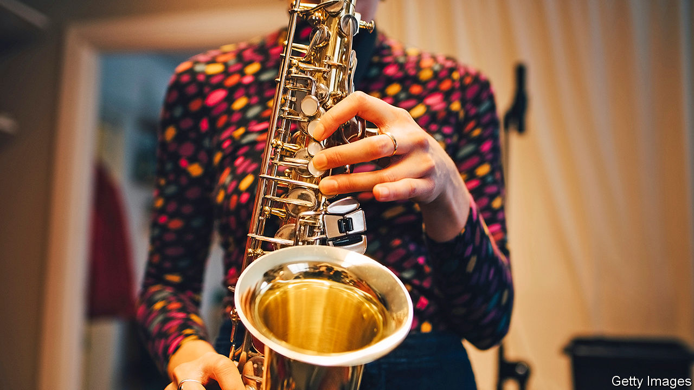

## Home Entertainment

# The benefits of learning an instrument in lockdown

> Today’s music students have access to past and present masters online

> Aug 5th 2020

WHEN THIS correspondent formed a band in his early 20s with four other jazz maniacs, little did its members think it would still be going decades later. But then Night In Tunisia’s business model worked impeccably until the pandemic. Rather than charge money, the band bribed listeners with food and drink. Alas, that approach, now defunct, made this saxophonist lazy. His sound lacks control, squawking involuntarily like a duck being taken to the plucking shed. Fingers refuse the brain’s bidding. Ears cannot tell the phrygian mode from the aeolian.

Recording himself on a smartphone brought a brutal reckoning: intonation and technique were woeful. But then a strange thing happened—instead of dismay came mounting anticipation. Improving your playing can be a more pleasant prospect for an adult than for a young music student hectored by tiger parents. You are not aiming for the sky, yet gratifying progress can be swift. Even a few minutes’ focus on a study brings audible improvement.

As well as time for practice, the pandemic has bestowed another bonanza: teachers of all sorts of instruments. For instance, Chris Caldwell is a British saxophonist of the highest calibre, a member of the world-class Delta Saxophone Quartet and in normal times in demand from London to Pyongyang. As with so many freelance performers, these months have been brutal. But he now has time for lessons beamed anywhere via Zoom.

They are a revelation. Teacher and student are going back to first principles: turning air into breath into sound. A saxophone is a sinuously complex bundle of harmonic compromises—intonation varies not just in different octaves, but from one note to the next. Think not about taming the instrument, Mr Caldwell urges, but rather of living with the wilder acoustics that embody the saxophone sound. Amateurs may aim to reach the high notes of a soprano sax by belting them out. The approach, Mr Caldwell says, should be more like “walking on eggshells”.

Happily, today’s music students are also locked down with history’s masters. Every jazz great learned from those who went before, painstakingly copying solos from records—probably the most critical part of “woodshedding”, that is, practising by yourself. How much easier, technically, is the task today. Spotify provides a boundless library of recordings. Transcription apps let you slow down solos to commit every scoop and grace note to memory.

Other programmes provide a backing band to help you learn the “changes”—ie, the chord progressions in jazz tunes. Charlie Parker said that the secret to improvisation was to learn the changes and then forget them. To judge by this student’s progress, Night In Tunisia should not ditch its business model yet. But his homebound musical journey is its own reward. ■

## URL

https://www.economist.com/books-and-arts/2020/08/05/the-benefits-of-learning-an-instrument-in-lockdown
