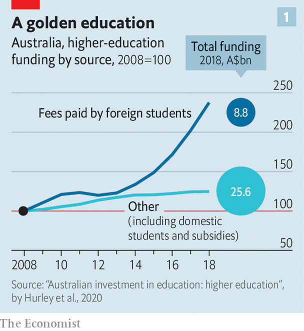
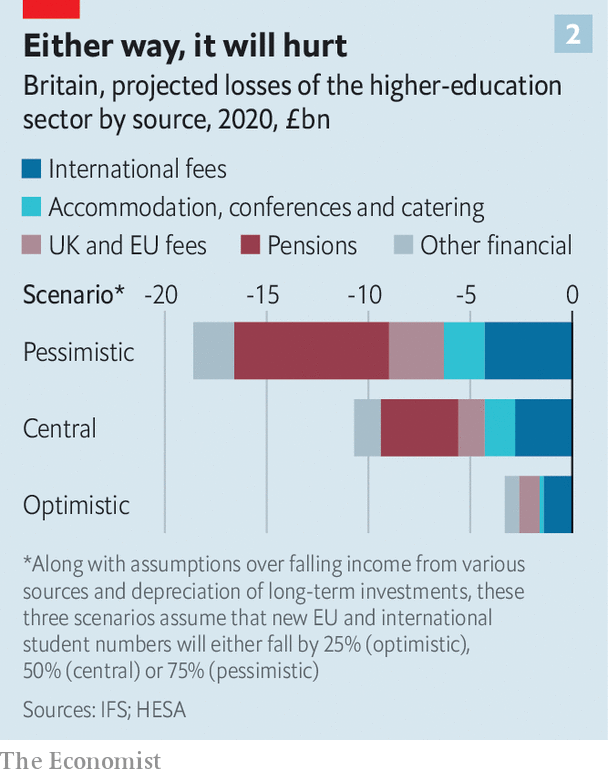
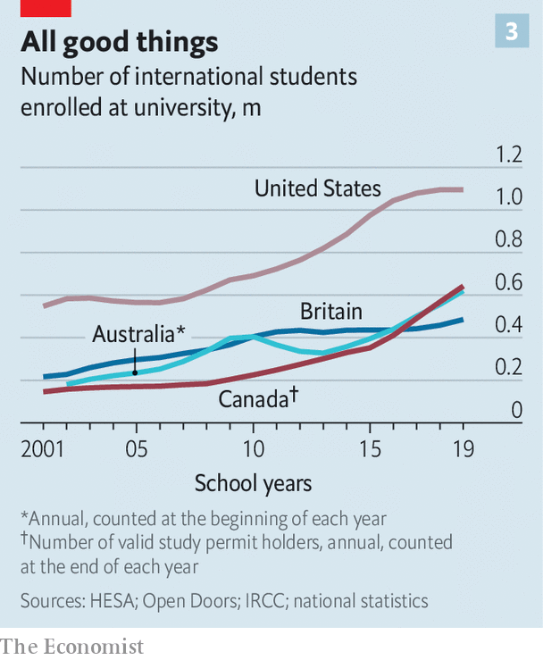

## Uncanny University

# Covid-19 could push some universities over the brink

> Higher education was in trouble even before the pandemic

> Aug 8th 2020

Editor’s note: Some of our covid-19 coverage is free for readers of The Economist Today, our daily [newsletter](https://www.economist.com/https://my.economist.com/user#newsletter). For more stories and our pandemic tracker, see our [hub](https://www.economist.com//news/2020/03/11/the-economists-coverage-of-the-coronavirus)

DUE TO BE completed in 2022, Boston University’s $141m data-sciences centre will tower over the city like an uneven Jenga tower, providing 350,000 square feet of space. The University of Reading in Britain has nearly finished a £50m ($65m) life-sciences building, designed to make more space for subjects that are attracting lots of students. The University of New South Wales (UNSW) in Australia has pumped more than A$500m ($360m) into new facilities, as part of a project intended to push it into the top 50 of global rankings.

If these plans made sense in a world where students were crossing borders in droves, today they seem barmy. All three institutions are now considering cuts. Boston has said that it is likely some staff will have to be laid off or furloughed. Reading has announced that 15% of full-time jobs at the university are on the line. UNSW has already cut 8% of its staff and closed two of its eight faculties. At all three universities plans for new facilities are on hold.

Covid-19 has put immense pressure on all universities. But the problems are about to get particularly severe for those in America, Australia, Canada and Britain that have come to rely on international students to fill their coffers. There are now more than 5m such students, up from 2m in 2000. In Australia foreign students provide a quarter of universities’ income (see chart 1). In Canada the tuition fees for a science degree at McGill, one of the country’s top universities, cost C$45,656 ($34,000) a year for an overseas student, compared with C$2,623 for a local.

Even before the pandemic, many such universities worried about worsening relations with China, the biggest source of international students. And higher education in America, Australia and Britain has also faced increasing scepticism from conservative-leaning governments about the value of a university degree. Academics, used to tricky questions, now face an existential one: how will universities survive with many fewer students in them?

The problem is that campuses make an excellent breeding ground for the virus, and students travelling across the world are a good way to spread it. A study by researchers at Cornell found that, although the average student at the university shares classes with just 4% of their peers, they share a class with someone who shares a class with 87%. The potential for the rapid spread of the disease was shown by the arrival of recruits at Fort Benning, an American army base. When 640 arrived in spring, just four tested positive. A few weeks later, more than a hundred did. According to the New York Times, some 6,600 covid-19 cases can be linked to American colleges.

Many lecturers are understandably reluctant to get close to students. In July a letter from the provost of the University of Colorado Boulder, seen by The Economist, put pressure on staff to teach in person, warning that not doing so “simply deflects the burden of this vital mode of instruction onto fellow faculty members”. Indeed, at the end of the 2019-20 academic year most American colleges planned to open for in-person teaching. Now they are not so sure. According to data collected by the College Crisis Initiative at Davidson College, less than a quarter of universities will teach fully or mostly in person next term (another quarter have yet to decide what to do).

Even if professors turn up in person, many students will not. Harshita Bhatia, a 24-year-old from Mumbai, was supposed to start a masters in economics at the Australian National University in July. She has deferred it until February, not wanting to miss out on the full experience of university life in another country. Polling by QS, a consultancy, suggests that four in ten students may cancel or defer their plans to study overseas. More will do so if tuition goes online. In Australia visa applications from students are down by a third this year.

Strict regimes are emerging at the places which are welcoming students. At Harvard, where 13% of last year’s intake came from overseas, only 40% of undergraduates will return for the first term of the new year, with the rest continuing to learn from afar. Those on campus will be tested for the virus every three days and sign contracts promising not to have guests in their dorms. The University of Bolton, in northern England, is aiming to create a “covid-secure” campus, so that it can open in September. To get to classes students will have to pass through a body-temperature scanner, where they will be provided with masks and hand sanitiser. The university has bought 1,000 bikes to lend to students, so they do not have to take public transport.

The risk is that, beyond the lecture hall, youngsters will ignore many restrictions. In July the University of California, Berkeley reported an outbreak involving 47 covid-19 cases, with most traced to parties in the fraternities and sororities. At the time, administrators urged students to keep gatherings to below 12 people, to hold them outside, to stay at least six feet apart and to cover their faces; they have since announced that all classes will be online and only 3,200 of the university’s 40,000 students will be allowed to live on campus.

Even for students who do move into their dorms, a lot of teaching will be online. A video from Johns Hopkins University touts its new “on-campus studios” for lectures, the idea being that students can take part in lectures from the safety of their rooms. Such Zoom lectures may accelerate a long-running trend. Online-education providers, such as Coursera, have not revolutionised higher-education, as was routinely forecast at the start of the 2010s. But they have carved out a niche in the market, mostly offering business-focused classes to older students. Over the past five years or so a growing number of universities have begun to offer degrees online, sometimes in partnership with “online-programme managers”. In America an estimated one postgraduate in three was studying fully online last year, up from one in five in 2012.

This number now looks set to rise. In May Dan Tehan, the Australian education minister, offered funding for short online courses in topics that are judged to be “national priorities” like teaching and engineering that would run for six months, with fees ranging from A$1,250 to A$2,500. “We want to enable people, rather than bingeing on Netflix, to binge on studying,” he said. UNSW has announced plans to offer more remote courses. Tyler Cowen, an economist at George Mason University who runs his own education website, predicts a big increase in online learning.

Many students, however, prefer in-person teaching. Last year just one in seven American undergraduates pursued a degree online, estimates Richard Garrett of Eduventures, a consultancy. International students also tend to want “the cultural immersion” of another country, he says. Lots gravitate to big cities: in America, New York University is home to the most international students with 19,605; in Britain, University College London is, with 19,635. The experience of either city—with all the possibilities of exploration and romance which urban life brings, even under semi-lockdown—cannot be replicated through video calls in a parental living room.

The prospect now for international students is a far less appealing university experience—either wholly virtual or wholly surreal. Despite this, they will face little prospect of lower fees. The University of Adelaide is one of the few universities to have cut prices, offering students a 20% “Covid-19 Offshore Study Fee Rebate” so long as they confirm their place. Privately, administrators at British universities expect to make more use of discounts (sorry, “scholarships”) to entice foreign students, but they will try not to publicise that. Many universities argue that the education students receive will be just as good as it was before the pandemic. It remains to be seen how many students (and parents) will buy this. As a college counsellor working at a school in Xi’an in China asks: “Without the whole experience, why pay $50-60k for online courses you can get on Coursera?”

For those students not put off by these changes, other problems loom. The collapse of air travel means there may not be enough flights. Bolton is one of a number of British universities which is contemplating bringing students directly over from China and India. “We can charter a plane that will seat 300 people for around £300,000,” explains George Holmes, the vice-chancellor. Representatives would meet students in Delhi; on arrival, they would be whisked off to a hotel or halls to quarantine. The university would heavily subsidise the costs.

Indeed, entry restrictions currently prevent students from getting to lots of countries. Since February all Chinese visitors have been banned from entering Australia. Pilot programmes to fly in groups of a few hundred students were abandoned when the local case count rose. Currently Canada will not let in students who did not get a visa before March. Some Indian students are allowed into America, but Chinese ones are not. Both would be welcome in Britain, so long as they quarantined for a fortnight.

In July the Trump administration gave up on plans to rescind the visas of international students at universities that had moved to solely online teaching, after legal challenges from a number of universities, including Harvard and MIT. But later that month it announced first-year students will not be able to enter the country if they do not have in-person courses. Embassies and consulates have begun opening, but it is unclear whether they will be able to get through the visa backlog.

All this spells trouble. A report by the Institute for Fiscal Studies (IFS), a British think-tank, predicts that universities in that country will lose the equivalent of a quarter of their annual income, with high-ranking institutions suffering the greatest losses (see chart 2). Four leading Australian universities—UNSW, Sydney, Melbourne and Monash—receive more than a third of their income from foreign students. Across the world, it is prestigious universities that recruit the most globetrotters.

Some of these institutions are indeed in a risky situation. And yet, for the most part, elite universities are well placed to make it through the crisis thanks to hefty cash reserves and the ability to borrow on more generous terms. The very top tier are unlikely to struggle for students for long. “If you’re a prestigious institution, people are not going to turn down a hard-won opportunity to earn a diploma that has a lot of brand value, even if earning it turns out to be less fun and more inconvenient than they thought it would be,” thinks Kevin Carey of New America, a think-tank.

Instead it is likely to be mid- and low-ranking universities that are most at risk, particularly those institutions with less prestigious brands that have nevertheless managed to attract lots of international students (or, in America, out-of-state ones, who also pay higher fees). The IFS reckons that the British universities most at risk of insolvency—of which it says there are 13, responsible for teaching 5% of British students—are those that entered the pandemic with weak finances. Of Australia’s top-ranking universities, only Monash is among the seven at “high risk” according to the Centre for the Study of Higher Education at the University of Melbourne.

The unequal effects of covid on university finances can be seen in the behaviour of American colleges. Over the past few months middling state universities and liberal-arts colleges have been far slower to announce reduced access to campuses so as not to put off potential students. Even before the crisis, a demographic dip in the number of 18-year-olds had caused around 50 colleges to close or merge. That is a small portion of America’s 4,000-odd higher-education institutions, but the trend is now likely to accelerate, as colleges lose out on money from accommodation and funding from state capitals.

Lobby groups everywhere have sought bail-outs. Universities Australia estimated that its members’ revenue would drop by A$3bn to A$4.6bn. British universities asked for a package of measures that would have come to £3.2bn; American colleges for around $50bn. Yet in all countries money has been limited. Congress gave American colleges around $14bn in March. In Britain some funding has been brought forward and loans will be on offer to cover 80% of lost income from international students, but only at research-focused universities. In Australia the government will stump up for income lost from domestic students, but not those from abroad.

Part of the reason for such reluctant bail-outs is that governments are waiting to see just how bad things get. But in an era when politics is increasingly divided along educational lines—between the have-degrees and the have-nots—universities appear to have little sway over politicians who see themselves as tribunes of the latter group. American universities are unlikely to receive much support from Donald Trump’s administration. President Trump has complained that colleges are focused on “Radical Left Indoctrination, not Education”, and has asked the Treasury to re-examine their tax-exempt status.

In other parts of the Anglosphere, governments want to make universities more focused on employment. As universities have grown, so too have doubts about the “return on investment”, says Peter Hurley of the Mitchell Institute at Victoria University. In Britain ministers are worried by research from the IFS which finds that a fifth of graduates would be better off had they not gone to university.

In both Australia and Britain governments have funded the expansion of higher education by passing more of the cost to students, via higher fees. But, since they also offer income-contingent loans, the state ends up footing a large part of the bill. In Britain the government has said that universities that get covid loans will need to focus more on subjects that either deliver high wages (such as engineering) or are judged to be particularly important to the country (such as teaching). Boris Johnson, the British prime minister, has also floated the possibility of introducing differential fees—at the moment the cost of all subjects is capped at £9,250—and has promised reforms to boost vocational education.

Mr Johnson has said he may follow Australia, where the government plans to more than double the cost of humanities courses while lowering fees for subjects it reckons are in areas of future employment growth or are otherwise important, including clinical psychology and agriculture. Yet some Australian higher-education experts doubt that the reforms will achieve their aims. Because students don’t pay up front for their degrees, instead receiving generous government loans, many suspect that altering the amount they pay for subjects won’t have much effect. The same would be true in England.

On top of this, all three governments have taken more hawkish stances towards China. Deteriorating relations between America and China over the past four years have contributed to a slowdown in the number of international students crossing the Pacific. Australian and British universities now worry they face the same fate. In June China’s Ministry of Education urged students to “exercise caution” before studying in Australia due to discrimination against those of Asian descent during the pandemic; something widely seen as a response to the Australian government’s decision to call for an inquiry into the origin of covid-19. Britain’s opposition to a new national-security law in Hong Kong has infuriated Beijing.

Universities have a few reasons for hope. One is that prospective students do not have much else to do. “The gap year doesn’t look terribly attractive, the job market doesn’t look terribly enticing,” notes Matt Durnin of the British Council, which promotes the country’s education abroad. The other is that in a recession there is normally an uptick in the number of students.

Even so the next few months are likely to transform the fortunes of many institutions. Some will shut entirely. If the pandemic drags on, if a vaccine is not forthcoming or if the economic climate becomes particularly bad, then things will get bleaker still. Politicians will have bigger things to think about than protecting universities. The first two decades of the 21st century were ones of extraordinary growth for universities in many countries. That golden age is over. ■

## URL

https://www.economist.com/briefing/2020/08/08/covid-19-could-push-some-universities-over-the-brink
