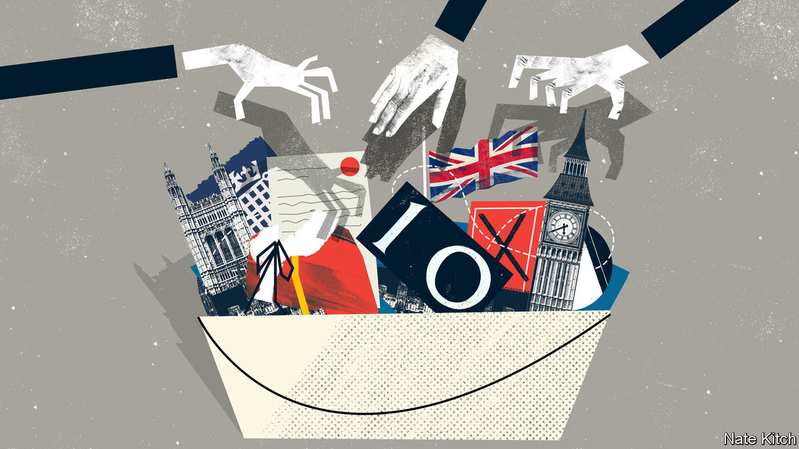

## Bagehot

# Boris Johnson’s horrible House of Lords list

> It reveals a contempt for the institutions of government

> Aug 8th 2020

WALTER BAGEHOT, a Victorian editor of The Economist, celebrated the House of Lords as the more dignified of the two Parliamentary chambers. “Dignified” is hardly the word for the bumper bucket of new peers—36 in all—that Boris Johnson has just created. The list includes the son of a Russian KGB-agent-turned-oligarch who owns a couple of newspapers in Britain and a party castle in Italy; an ageing, irascible cricketer who supported Brexit; a former Revolutionary Communist Party activist and IRA apologist who also supported Brexit (the balm that washes away all sins); the prime minister’s brother; and sundry party donors, bag-carriers and hangers-on. This from a government that acknowledges the Lords is absurdly bloated, now with over 800 peers.

The few people who have defended Mr Johnson’s list have done so on the grounds that it was ever thus. Every prime minister comes into office promising to reform the Lords only to end up treating it as a patronage pissoir. In 2007, in what was dubbed the “cash for honours” scandal, the Parliamentary Standards Authority rejected seven of Tony Blair’s nominees. Harold Wilson’s resignation honours list in 1976, drawn up on lavender-coloured notepaper by Marcia Falkender, his private secretary and special friend, contained the names of several fraudsters.

Leave aside that this argument belongs in a banana republic. Leave aside, too, that the Lords has lighter financial disclosure rules than the Commons because peers are supposed paragons of probity. The argument ignores the context in which the list appears. Mr Johnson’s degradation of the Upper House is happening as the rules of public life are under unprecedented strain.

In the 18th and early 19th centuries the British political system was known as “Old Corruption”. The rich treated the state as their private property, appointing their cronies to “pocket boroughs”, securing jobs in the civil service for the fool of the family and buying great offices of state for themselves. The Victorians dismantled this system in the name of open competition and public duty, conscious that Britain couldn’t succeed as a great industrial power if it was hampered by an inefficient state.

Mr Johnson’s list suggests that the country is reverting to old habits. This is not about money changing hands in brown paper bags—British politics is still cleaner than in France or Italy—but treating government, if not quite with contempt, then as nothing more than a means to personal or ideological ends. The sense of high seriousness that the Victorians attached to government is being eroded before the public’s gaze, as insiders cash in on their knowledge and experience, ideologues bend the rules to push narrow agendas, and the likes of Evgeny (now Lord) Lebedev dole out jobs and party invitations to members of the political class.

The erosion of standards is encouraged by structural changes in political life. The collapse of party membership is forcing parties to take desperate measures to raise money. This is particularly true of the Conservatives who, with only 150,000 members, have resorted to auctioning places next to senior ministers at fund-raising dinners. One such dinner recently resulted in scandal: Richard Desmond, a property developer and former pornographer, took the opportunity to show his dining companion, Robert Jenrick, the housing secretary, a video of his £1bn property development in East London. He eventually persuaded Mr Jenrick to overrule his own department to grant permission for it.

The shortening of political careers means that young stars are always thinking of their next move. George Osborne, only 45 when he ceased to be chancellor, quickly built a new career by persuading Blackrock to pay him more than £650,000 to offer advice one day a week and Mr Lebedev to make him editor of the Evening Standard. At the same time, the internet has blown apart funding rules. A new book by Peter Geoghegan, “Democracy for Sale”, documents the ways in which politics is being transformed by invisible donors who try to influence it through “dark money”, internet wizards who delight in exploiting legal loopholes and spies who use bots and shell organisations to muddy the waters.

Still, Brexit accelerated the decline, eroding the legitimacy of the state and reducing its competence. Brexiteers launched a fusillade against any institution that got in their way, including the Supreme Court and the Lords. Political entrepreneurs could exploit the confusion to insert themselves into the heart of policy-making. Shanker Singham, the “brains of Brexit”, became the country’s most influential adviser on trade despite having no formal qualifications in economics and spending most of his career as a lawyer-lobbyist in America. Finally, Mr Johnson and his coterie of hardliners seized control of the Conservative Party.

Mr Johnson is a specialist in not taking anything too seriously. In her new book, “The Twilight of Democracy”, Anne Applebaum describes the atmosphere at the Spectator magazine in the mid-1990s, when she worked there alongside Mr Johnson (who later edited it): “the tone of every conversation, every editorial meeting, was arch, every professional conversation amusing; there was no moment when the joke ended or the irony ceased.” Mr Johnson is surrounded (some would say captured) by revolutionaries who believe in tearing down the current order. Dominic Cummings, Mr Johnson’s most important adviser, is a libertarian revolutionary who reveres technology and creative destruction. Michael Gove, the cabinet-office minister, has a neuralgic dislike of the “clerisy” that runs the establishment.

The combination of languid indifference to “boring institutions” and revolutionary fervour would be dangerous at any time. It is poisonous when public standards are being eroded by new technology and changing norms. The Victorians knew that Old Corruption would inevitably return unless you waged a relentless war on behalf of clean government and public probity. There is no sign that Britain’s current masters have either the firmness of purpose or philosophical conviction to wage such a war. ■

## URL

https://www.economist.com/britain/2020/08/08/boris-johnsons-horrible-house-of-lords-list
