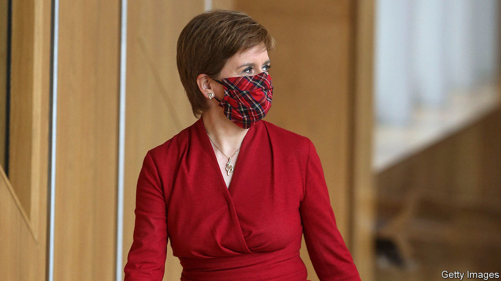
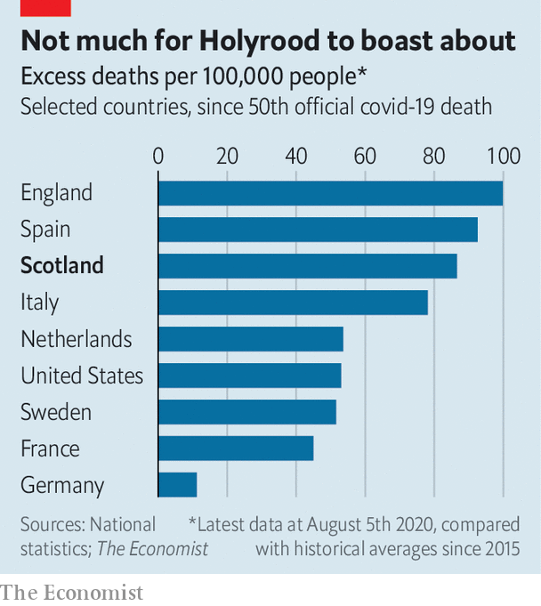

## Covid-19 in Scotland

# How coronavirus strengthened Scottish independence

> The country has a powerful case of independence fever

> Aug 8th 2020

NICOLA STURGEON recoils from the suggestion that coronavirus could be politically advantageous. It has, after all, been linked to more than 4,200 Scottish deaths. Even so, the pandemic has left Scotland’s first minister in rude political health. Some 74% of Scots think her handling of the pandemic has been good or very good, according to Panelbase, a pollster. In contrast, Boris Johnson, who spent three nights in intensive care and scores just 21%, has been stricken by the virus personally and professionally.

In the 2014 referendum, the Nationalists struggled to get Scots to imagine what an independent government might look like. The pandemic was just what the doctor ordered. Health is devolved under Britain’s constitution, so Ms Sturgeon’s administration has the trappings of a state-in-waiting. Unlike the rumpled, details-light Mr Johnson, she has given poised daily televised press conferences packed with useful information.

Pointing to rising support for independence, Sir John Curtice, of the University of Strathclyde, says that “some people may, in the wake of coronavirus, have bought into the argument that, ‘You know what, maybe an independent Scotland could govern itself a wee bit better’.” That perception is detached from reality. Scotland’s outbreak has followed a distinctly British course. In early March Scotland’s chief medical officer said the outbreak would mean “business as usual” for Scots, mirroring English scientific officials’ optimism. As in England, hundreds of elderly Scots were discharged into care homes to free up hospital beds, which may have hastened the spread of the virus. Ms Sturgeon’s administration is accused of covering up an outbreak at a conference in February. She was censured by Scotland’s chief statistician for claiming that the virus was a fifth as prevalent in Scotland as in England. Scotland’s excess mortality rate, a measure that accounts for different reporting methods in different states, is high (see chart).

Westminster has helped Scotland through the crisis. The Treasury has funded the furlough scheme which pays the wages of Scottish workers. The central government also runs a network of mobile-testing centres in Scotland and Scottish scientists sit on British expert committees.

The government has thus fulfilled the unionists’ promise in the 2014 referendum that Britain would be Scotland’s protector in hard times. Yet the appetite for separation has rarely been so high. The threat of a hard border between England and Scotland after divorce has been the unionists’ trump card. But 37% of Scots polled in early July said border controls to stop covid “should already be happening”, while a further 36% said they may be necessary in the future. Fewer than one in five opposed them.

Scottish Conservatives are worried. It was bad enough when nationalists had to build their case on solid foundations. Now they seem to be able to win the argument on soggy territory, too. Says one despairing Tory: “How are we losing ground when the Union is working as it never has before?”

Editor’s note: Some of our covid-19 coverage is free for readers of The Economist Today, our daily [newsletter](https://www.economist.com/https://my.economist.com/user#newsletter). For more stories and our pandemic tracker, see our [hub](https://www.economist.com//news/2020/03/11/the-economists-coverage-of-the-coronavirus)

## URL

https://www.economist.com/britain/2020/08/08/how-coronavirus-strengthened-scottish-independence
