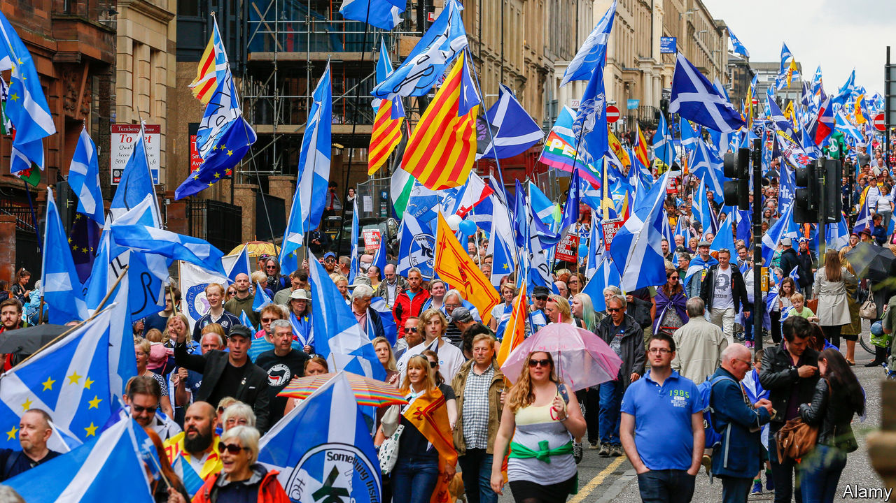
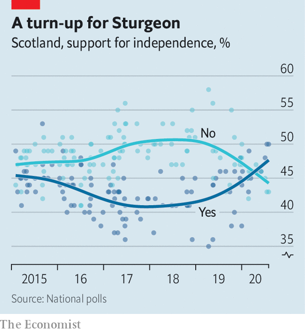

## Scotland

# How the Scottish National Party risks turning Caledonia into Catalonia

> The independence battle looks like turning into an ugly stalemate

> Aug 8th 2020

THE INDEPENDENCE marches which occasionally wind through grey Scottish cities are colourful affairs. The blue and white of the Saltire jostle with the red and yellow of the Estelada, the banner of Catalonia’s separatist movement.

The struggle for Catalan independence from Spain has been an inspiration not just for Scotland’s nationalists: it also influenced David Cameron, the Conservative prime minister who permitted and then won the referendum on independence in 2014. If he had not, he wrote in his memoirs, the question of Scotland’s future would have festered and the case for independence grown stronger. Catalonia held an illegal referendum in 2017, which was followed by arrests and riots. It was, wrote Mr Cameron, a lesson in the perils of mishandling separatists.

Those boasts do not look so clever today. Recent polls show Scots favouring independence—the first time that a sustained lead for independence has been seen, says Sir John Curtice, a political scientist at the University of Strathclyde. One factor, he says, is Brexit, which has pushed Remainers into the hands of Nationalists. While Brexit has degraded the British government’s reputation for competence and sound judgment, managing coronavirus has built up the Scottish government’s (see [article](https://www.economist.com//britain/2020/08/08/how-coronavirus-strengthened-scottish-independence)). Mr Johnson is unpopular. The Scottish National Party is projected to take 55% of the vote in the elections to the Scottish Parliament in May 2021, according to recent polls, which would give Nicola Sturgeon, Scotland’s first minister, an outright majority, and allow her to demand a second referendum on independence.

The Conservative Party is spooked. Boris Johnson made a flying visit to Orkney on July 23rd, where he said the “sheer might of our union” had seen Scotland through coronavirus. On July 30th Jackson Carlaw, leader of the Scottish Conservatives, was ousted after only six months in the job. He admitted that he was not up to the job of defending the union. His replacement, Douglas Ross, is the pugilistic MP for Moray and a part-time football referee.

Mr Cameron thought the best way to contain separatism was an “agenda of respect” towards the Edinburgh administration. Mr Johnson, in contrast, wants to reassert Whitehall’s role in governing Scotland, and splash some Treasury cash. “There will be a little less about pleasing the devolved administration and more about pleasing the people,” says an official.

But even if Ms Sturgeon triumphs, Scotland will not be on a rapid trajectory to independence. Instead, there will be a long stalemate between London and Edinburgh. The Nationalists may have support, but, like the Catalan separatists, they lack a road map to an independence referendum that is recognised by the British government and triggers exit negotiations.

The government is not constitutionally obliged to permit the Scottish Parliament to organise a referendum. In the 2019 general election, Mr Johnson promised to “return to sender” any request for a referendum. He has happily ignored the Scottish Parliament on Brexit. And the Scottish Conservatives have done well out of the division of the country over independence. They displaced Labour as the second party by scooping up the votes of scunnered unionists with the mantra “No to Indyref2”. “Polarisation suits the poles,” says James Mitchell, a professor of public policy at Edinburgh University. “You can appeal to that substratum of the electorate, even if it’s a minority.”

Mr Johnson’s refusal would also threaten the unity of the ultra-disciplined SNP. Ms Sturgeon says the Westminster government’s consent and international recognition are essential if a referendum is to lead to independence. Catalonia’s illegal ballot now serves as a warning, not an inspiration. Spain dismissed the result and public support has slipped. “The Russians might be cool with it but that’s not what we’re aiming for,” says a Sturgeon supporter.

If Mr Johnson won’t give way, there will be pressure on her to produce a Plan B for independence. A group of activists is asking Scotland’s highest court to rule that the Westminster Parliament’s consent for a referendum is unnecessary. Pete Wishart, an SNP lawmaker, says the European Union should be asked to recognise a poll if Mr Johnson doesn’t. Some even say Ms Sturgeon could simply declare independence after an election. Tory strategists like it when hotheads sound off in this way because it frightens the middle classes.

Then there’s Labour. Ms Sturgeon’s best hope of breaking the stalemate is a deal with Labour in 2024, in which she supports a minority Labour administration in exchange for a referendum. But Sir Keir Starmer, the party’s new leader, says he opposes such an agreement. Mr Johnson told voters in 2019’s general election that a vote for Labour is a vote to break up Britain, and Mr Starmer will want to avoid that happening next time round.

Both sides think they can win a war of attrition. Mr Ross says voters are exhausted by constitutional wrangling and want their schools and hospitals fixed. The nationalists hope that obstinacy on Mr Johnson’s part will fuel their cause.

The price of stalemate is deteriorating governance. Scotland is caught in a rolling referendum campaign, which encourages freebies such as the abolition of prescription charges, and discourages unpopular but necessary reforms. “Any difficult issue which would be at least immediately unpopular but might be the right thing to do is pushed aside,” says Professor Mitchell. And the devolution settlement lacks friends. The SNP thinks it no substitute for statehood, whereas growing numbers of Tories think sending ever-more powers to Edinburgh has failed to stop separatism. “They fed the crocodile,” says one.

Devolution accommodates two fundamental ideas about the constitution: one which says that sovereignty lies with the Scottish people, and another which says it lies with the Westminster Parliament that legislated for devolution. They need not clash. But if the SNP triumphs in the Scottish election next May, the question of whether Scotland can vote a second time will force them into conflict. Mr Johnson and Ms Sturgeon will both claim mandates. Mr Cameron will not have saved Scotland from Catalonia’s limbo. ■

## URL

https://www.economist.com/britain/2020/08/08/how-the-scottish-national-party-risks-turning-caledonia-into-catalonia
