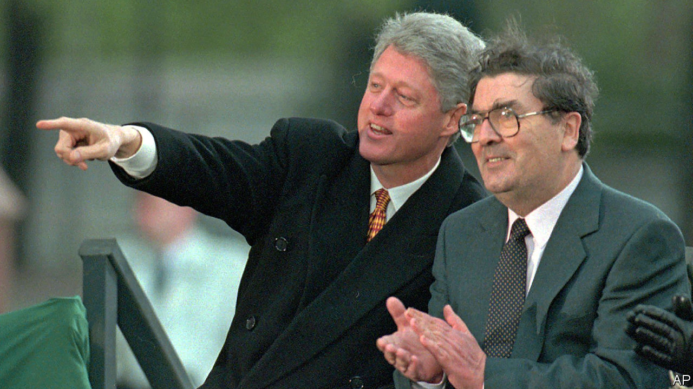

## A dove over Derry

# John Hume’s vision of peace in Northern Ireland is only half-fulfilled

> He did more than anybody else to end the bloodshed, but mutual respect between Catholics and Protestants remains elusive

> Aug 5th 2020

OF ALL NORTHERN IRELAND’S representatives, John Hume was both the most cosmopolitan and also the most parochial. When he died in his native Derry on August 3rd, infirmity had kept him away from the public arena for many years. Even so, memories of his central role in forging the peace agreement of 1998 that earned him a Nobel Prize remained vivid, among both veterans of global politics and his neighbours in a rainy, quirky corner of Ireland whose idiosyncrasies he reflected. Bill Clinton mourned his friend’s “unshakable commitment to non-violence, persistence, kindness and love”. Humbler local folk heeded the family’s request to light “candles for peace” in their homes, as did some heads of government, including Britain’s Boris Johnson. His funeral on August 5th in Derry’s Catholic cathedral was attended by Ireland’s leading politicians but remained a low-key affair because of the pandemic.

Mr Hume was prescient. Much sooner than any other elected figure in Northern Ireland, he realised that the murderous passions of his homeland could be stilled only by bringing them into a larger arena, European or transatlantic. After 1969, as rioting in his native streets escalated into full-blown urban war, his response was to look far and wide for antidotes. As a fluent speaker and former teacher of French, he believed in the peace-making power of the European Union. He was a respected figure in the European Parliament, where Franco-German amity fascinated him as a template for what might happen in Ireland.

As a visitor to Capitol Hill, he had a dogged message for Irish-American politicians: their best gift to the motherland lay not in stoking violence by supporting the Irish Republican Army (IRA) but in working to promote prosperity, reconciliation and peaceful change. His relations with some congressmen prepared the ground for the White House (under Jimmy Carter, then Mr Clinton) to take an interest in Ireland. Mr Hume and Mr Clinton worked in risky lockstep to coax the champions of armed Irish nationalism into respectable politics.

Mr Hume’s non-violent stance was not an easy one to maintain, especially after January 1972 when British troops shot dead 14 peaceful demonstrators in Derry. The killings triggered a surge of volunteers for the bombing and shooting campaign of the IRA. Mr Hume insisted there were other ways for aggrieved Catholics to advance their cause. Seeking fairer terms for co-existence with their Protestant, pro-British neighbours was always better than vengeful killing, Mr Hume insisted, and many in his town took heed.

Thanks in part to his charisma, the Social Democratic and Labour Party, which he had co-founded as a voice of moderate Irish nationalism, regularly drew more Derry voters than Sinn Fein, which was in effect the political wing of the IRA.

Uniquely, Mr Hume combined a commitment to peace with street credibility. Having grown up in hard times, with a father who lost his shipyard job in 1945, he knew the grind of life at the bottom. It was a scene in which poverty and anti-Catholic discrimination were mitigated only by a church-based tradition of self-help. He qualified as a teacher (after half-training for the priesthood), but retained the saltiness of the Derry streets, where Catholic invocations and colourful swear-words flow readily from the same tongue.

Derry’s other hallmark is its smallness: rated a city because of its cathedrals, it is really a modest town of 110,000 where all lives are interconnected, despite the segregation of the streets. When Dervla Murphy, a travel writer, visited during the conflict, she was bemused to find a house where, for lack of space, an off-duty British soldier bedded down with a family member in the IRA. To Mr Hume, who had emerged from that world and also looked beyond it, it was common sense that communities must find a way of living together in respect.

His vision is only half-fulfilled at best. The killing has mostly ended, and since January pro-British Unionists and Irish nationalists have once again been sharing power, and the spoils of patronage, after a three-year political deadlock. But they show little sign of mutual respect. The two camps have opposing visions both of the future and the past. Quarrels over how to commemorate, or legally adjudicate, the conflict still absorb much political energy.

But there is hope in the fact that many young Northern Irish people refuse to place themselves in either the Protestant Unionist or the Catholic nationalist camp. Already, a majority of those under 25 eschew both labels, notes Jon Tonge of Liverpool University, who studies Northern Irish opinion. Mr Hume relished the fact one of his forebears was a Scottish Presbyterian settler who married a local Catholic. A melting away of his homeland’s seemingly insuperable boundaries would honour his memory. ■

## URL

https://www.economist.com/britain/2020/08/05/john-humes-vision-of-peace-in-northern-ireland-is-only-half-fulfilled
