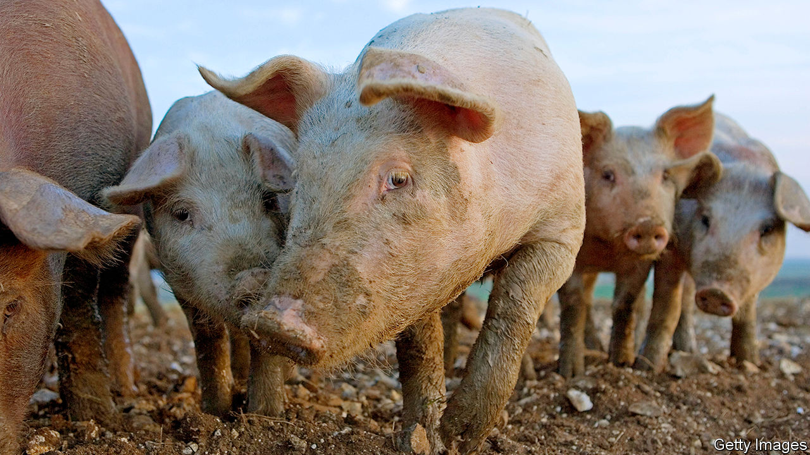

## Trade and farming

# Why food blocks a British-American trade deal

> It’s a pig of a problem

> Aug 8th 2020

WHEN LIZ TRUSS, Britain’s international trade secretary, and her American counterpart, Robert Lighthizer, met in Washington on August 3rd-4th nobody expected a breakthrough. Both parties had previously said that a deal was unlikely to be struck in 2020. That’s partly because food, one of the main issues, is a particularly indigestible matter.

The problem is that farming is not just an industry. What people eat and how they produce their food is central to how societies see themselves.

America regards Brexit as an opportunity to export pork and chicken, among other foods, across the Atlantic. Many Britons do not like that idea. The words “chlorinated chicken” are morphing into an insult on Twitter, as in “this deal is an undercooked chlorinated chicken.”

The problem is not, ultimately, that Americans wash their chicken meat in chlorine. British consumers already drink water and eat lettuce treated with chlorine. The European Union’s own Food Safety Authority says that this process does not pose a health risk. Objections to the chlorination of chicken are a symptom of a deeper division, between regulatory systems embedded in different philosophies and different values.

The American system focuses on the end product, and whether what the consumer puts in her mouth will make her ill. Americans call it “science-based”. If studies have not shown that a practice, such as injecting cattle with hormones in order to beef them up, causes harm to the consumer then it is safe to put those products on supermarket shelves.

On that basis, there is no reason why Britons should not welcome American food, which is just as safe as European stuff. A comparison of annual infection rates by the three most frequently reported food-borne parasites that are transmitted by meat shows they are roughly the same in America and Europe.

Europeans rely instead on the “precautionary principle”, which does not just look at known impacts on health, but also incorporates wider concerns about the food industry’s production methods—even when studies have not established that they pose a threat to human health. It led the EU to impose an early ban on genetically modified organisms. The ban has been relaxed but regulations remain tighter than in America. The EU has also taken a tougher stance on pesticides.

Where Britain lands on this divide is of great interest—and not just to farmers and trade negotiators. Environmentalists are arguing for sticking to the European approach; economic liberals for adopting one that is friendlier to innovation.

Europe’s enthusiasm for a farm-to-fork system, which regulates the steps that produce the food as well as the food itself, is an illustration of the difference between the two regulatory philosophies. In Europe, there is a push for farms and natural systems to coexist, not to be seen as competing with each other for land.

British cultural peculiarities emphasise a third element: animal welfare. That is the source of concerns about chlorinating chicken. Opposition to the chemical’s use comes from the belief that farmers chlorinate food that has been dirtied, morally as well as physically, by bad animal-welfare practices. Europe mandates nicer conditions for chickens than America does.

Sow stalls, similarly, make pigs more profitable by housing them more densely. Used in 75% of American farms, they have been banned in Britain since 1999 and Europe since 2013. And Britain holds its farmers to higher animal-welfare standards than Europe does. Charcuterie is best made with the fatty meat of castrated boars, but Britons do not like the idea of neutering boars to improve their salami, especially as it is commonly done without anaesthetic. So whereas European farmers routinely snip their pigs, British farmers who want to receive the industry’s Red Tractor quality-assurance label must leave their boars’ masculinity intact.

The government has to tread a tricky path between the demands of American trade negotiators, British farmers and lobbyists from animal-welfare and environmental groups. An agriculture bill to replace the EU’s Common Agricultural Policy is currently making its way through Parliament. It is supposed to navigate between these different interests. In May, the government annoyed the animal-welfare and environmental lobbyists by defeating an amendment that would have ensured food imports met the same standards that are required of British farmers.

But the bill has a lot in it for those who worry about nature. It proposes a principle of public money for public goods, whereby farmers will be recompensed for improving air, water and soil quality, and fostering biodiverse ecosystems. And on July 28th, Ms Truss launched a new Trade and Agriculture Commission to gather all interests in the food chain, from farmers to industry and animal-welfare groups. A few days later, the first volume of the National Food Strategy, an independent but government-commissioned review of Britain’s food system, advised that the government should seize the “once-in-a-lifetime opportunity” presented by Brexit to protect Britain’s “high environmental and animal-welfare standards”.

If a trade deal does bring cheap American meat to Britain, farmers will struggle to compete. They could wind up making most of their income as custodians of the land, while producing smaller quantities of pricier meat—as already happens with some beef. The practice could spread. ■

## URL

https://www.economist.com/britain/2020/08/08/why-food-blocks-a-british-american-trade-deal
