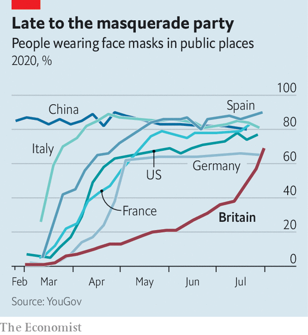

## Made in the USA

# With face-masks, Britain imported an American culture war

> The coverings should be uncontroversial—they are not

> Aug 8th 2020

BRITONS LIKE to think of themselves as a fair-minded bunch who play by the rules. The national character, in theory, involves standing in queues, getting in a round at the pub and “walking” before being given out in cricket. The wearing of face-masks, then, ought to be uncontroversial: it is a public-spirited act that benefits all. From August 8th, the mandatory use of masks will be extended to more indoor spaces in England, and police will be more vigorous in enforcing the rules.

Yet the use of masks in Britain, which rallies around its health service, is lower than it is in America, a country now synonymous with weirdly aggressive anti-mask sentiment. In part that is because the government has put out confusing public-health messages. Usage surged after it became compulsory on public transport and in shops.

But a new study by King’s College London and Ipsos MORI, a pollster, found that 13% of Britons believe that “the government only wants us to wear face masks as a way of controlling us”, and that 18% are “more focused on protecting civil liberties” than controlling the coronavirus. The Daily Telegraph, a conservative broadsheet, has run several pieces decrying their use, arguing that masks destroy public confidence, make their wearers feel “less human” and prove that Britain is “the scaredy-cat of Europe”. A letter-writer to the paper called mandatory mask-use “a massive infringement of my personal liberty”. Toby Young, founder of the Free Speech Union, calls the decision to require people to wear masks “very disappointing”.

The British controversy mirrors a trend in America where, says Bobby Duffy of the Policy Institute at King’s College, “your views on a range of issues can be predicted knowing your party identity through a process called ‘conflict extension’, where you start with things like abortion and slowly more and more issues are rolled into this identity.” More than twice as many Democrats as Republicans say masks should always be worn in public places.

In Britain the gap between Labour voters and Conservatives who say they have recently worn a mask is just 9%. But identities related to Brexit have in some ways supplanted party affiliation. A review by the Royal Society of academic literature on the use of masks noted the difficulty “for co-ordinated action due to political polarisation—which is notable in countries such as the US, UK and Brazil, which in turn results in distrust of the opposing party and beliefs in false information that can undermine public-health messages.”

That suggests the importance of a second finding by King’s College: people who get most of their news from social media are much likelier than the general public to hold anti-mask views. Just 10% of Britons think wearing a mask is bad for health, but among those who get their news from WhatsApp, the proportion rises to 27%. More than a third of those who get their news from WhatsApp, and just under a third of those who get their news from YouTube, believe that mandatory masks are a form of government control. A new study by Pew, an American pollster, finds that “those who rely on social media for news are less likely to get the facts right about the coronavirus and politics and more likely to hear some unproven claims.”

Melinda Mills, an Oxford sociologist who co-wrote the Royal Society report, says she has received vicious abuse on Twitter for her research: for instance, calls for her to be jailed for “criminal deception and accomplice to murder”. (They were eventually deleted after she complained to Twitter.) “People are going into rabbit holes of information,” says Ms Mills.

As Brexit gets done, the issue’s political salience, and thus its power to polarise the population, is fading. But conspiracy theories and political sentiment originating in America and elsewhere easily make their way to Britain through social-media streams. “We do have a polluted information environment and it’s much easier to spread that type of disinformation than it was in the past, and it is much more difficult for people to sort the trustworthy information from the untrustworthy information,” says Mr Duffy. So far, Britain’s political leaders have not taken much advantage of it; Britons must hope it stays that way.■

Editor’s note: Some of our covid-19 coverage is free for readers of The Economist Today, our daily [newsletter](https://www.economist.com/https://my.economist.com/user#newsletter). For more stories and our pandemic tracker, see our [hub](https://www.economist.com//news/2020/03/11/the-economists-coverage-of-the-coronavirus)

## URL

https://www.economist.com/britain/2020/08/08/with-face-masks-britain-imported-an-american-culture-war
