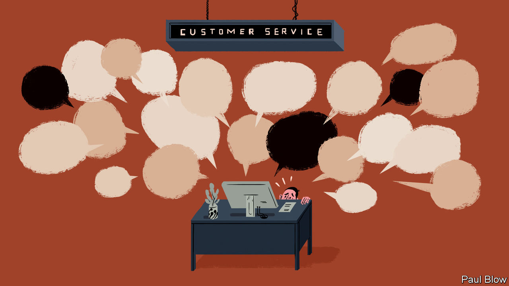

## Bartleby

# Dealing with customer complaints

> Companies called to account

> Aug 8th 2020

NOTHING IS MORE likely to sabotage a brand’s reputation than a customer complaint that goes viral. Social media often blow the problem out of proportion, leading television programmes and newspapers to pick up the story, which is invariably one that pits plucky members of the public against some heartless corporate Goliath. Consumer gripes—and stories about them—have multiplied during the pandemic as many services were cancelled because of lockdowns.

Rupert Younger of Saïd Business School at the University of Oxford says that views of companies are centred on the issues of capability and character. Firms’ capability is expressed in the quality of their products. The way that firms handle customer disputes, meanwhile, speaks to their character. If that quality is undermined, it can take time to rebuild public confidence. Research suggests that people and organisations alike tend to be judged by the worst thing they do.

One of the best-known pieces of brand damage occurred in 2008. Dave Carroll was travelling with United Airlines when he heard another passenger say that baggage handlers were carelessly tossing around guitars. When he arrived at his destination, Mr Carroll found his guitar had been damaged. After months of fruitless complaints, the musician made a video about his experience called “United Breaks Guitars”. Within a few weeks the video had received 5m views on YouTube and United contacted Mr Carroll to apologise and offer restitution.

The airline even pledged to use the video for internal training. But the corporate culture did not change sufficiently. In 2017 United suffered another public-relations disaster when a video emerged of security guards dragging a passenger off a plane to make way for a member of its own staff. The airline’s initial apology was viewed as ham-fisted, sympathising more with its own employees than with the unfortunate passenger, prompting Forbes magazine to dub United “the world’s most hated airline”.

Managers must thus be eternally vigilant when trying to protect their company’s good name. That can be expensive. Compensating customers costs money, as does having call centres that can respond quickly to queries and complaints.

There is a difference, however, between one-off complaints, which can usually be handled by common sense and a willingness to apologise, and a crisis that affects a wide range of customers, where solutions require extra costs on top of the complaint infrastructure. And costly crises can in turn be subdivided into those caused by a company’s own failings and those, like the pandemic, that are not its fault.

Airlines and travel companies have been the focus of a lot of customer complaints in 2020, thanks to all those cancelled holidays. “It took a hell of a lot of pressure to get companies to offer refunds, and even then it may take several months for them to pay out,” says Adam French of Which?, a British consumer magazine. Customers have also faced long delays on the phone, in part because the pandemic has reduced staffing levels at call centres.

Oddly enough, the poor reputation of some airlines may have cushioned the blow. “Ryanair has always marketed itself as cheap,” says Mr French, so customers don’t expect a high standard of service. The biggest reputational hit was to companies that had marketed themselves as treating customers better.

Airlines get away with more than other companies because they often have a monopoly on certain routes. But travel companies that want to behave well still have a problem. Repaying customers quickly puts a tremendous strain on cashflow at a time when they are generating a fraction of usual revenues.

Specialist Leisure, a British travel group, went into administration earlier this year; one of its main brands was Shearings, a coach-holiday operator. Mr French says the problem for Shearings was that, when it received customer deposits, it paid them to hotels where the tourists would stay. That created a cash squeeze when money had to be repaid. In short, it is all very well to have a good reputation as a prompt repayer. But that won’t help if the firm goes bust.

The pandemic has been an exercise in crisis management for thousands of firms. Dealing with angry customers is only one element. The rule of thumb for more normal times, Mr Younger says, is for companies to be clear about what they are offering and then to hold themselves to their promises. That means, at the very least, not breaking guitars.

## URL

https://www.economist.com/business/2020/08/08/dealing-with-customer-complaints
