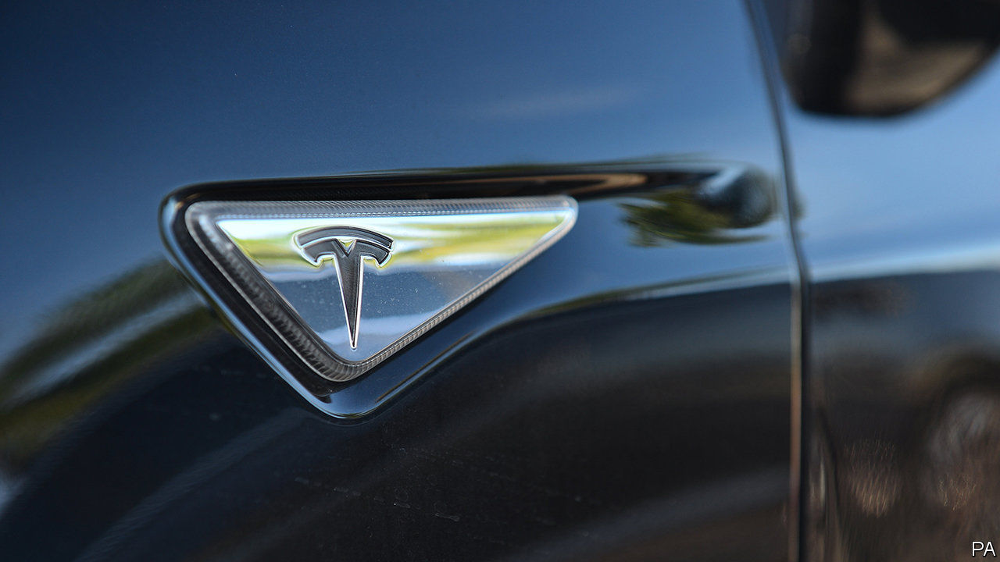
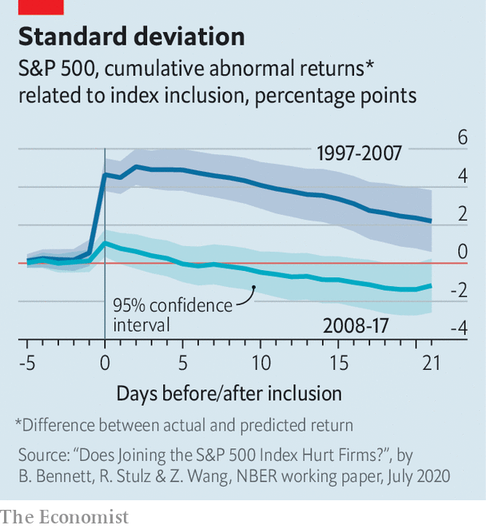

## Inclusive growth

# Joining the S&P 500 may not be as big a boon as often assumed

> New research suggests that the share-price premium for entering Wall Street’s flagship index isn’t what it used to be

> Aug 8th 2020

LAST MONTH Tesla reported second-quarter net income of $104m. This came as a surprise; the pandemic has pushed many carmakers into the red as cash-strapped consumers put off purchases. It also had Tesla’s investors aflutter, for it marked the firm’s fourth consecutive quarter of profits. At last, thanks to that milestone, the maker of snazzy electric vehicles—which in July overtook Toyota was the world’s most valuable car firm—met the formal criteria for inclusion in the S&P 500.

As covid-19 has boosted pandemic-resilient businesses such as technology firms while walloping industries such as travel, more companies than usual may drop out of or enter that coveted club this year. Membership of Wall Street’s flagship share index is seen as a boon, because “passive” investors, who do not actively pick winning stocks but merely track the broader stockmarket, must buy the shares of any new member (and sell those of the firm it displaces). This should drive up the entrant’s share price. Thereafter, one theory goes, increased common ownership of companies by large index funds, which hold stakes in listed rivals, reduces competitive pressure and leads to juicier shareholder returns all around.

However, as passive ownership of assets in mutual and exchange-traded funds has swelled—from around 3% of their portfolios in 1995 to more than 40% at the start of 2020—the fillip from inclusion in the index appears to have weakened. It may even have become a burden.

That, at least, is the conclusion of a new paper by Benjamin Bennett of Tulane University, René Stulz of Ohio State University and Zexi Wang of Lancaster University. They looked at freshly minted S&P 500 firms between 1997 and 2017, five days before their ascension, then up to a year later. In the first decade of the sample, index inclusion increased “abnormal” stockmarket returns—ie, those relative to pre-inclusion expectations—by up to 4.9% in a firm’s first week in the index. This outperformance then gradually disappeared over 12 months. In the second decade, by contrast, the initial pop was negligible. Worse, abnormal returns turned negative within three weeks, and stayed there.

The researchers suggest two possible reasons. First, unlike active stockpickers, passive investors are indifferent to the price of a firm’s shares—if it is in an index, they must hold them. What they pay thus conveys less information about their view of a firm’s strengths and weaknesses than an active stockpicker would. Distorted market signals may make managers overconfident, warp investment decisions and lead to shabbier long-term earnings—which share prices in principle reflect. Second, an increase in passive holdings as a proportion of a firm’s shares dilutes the power of active (and activist) shareholders. Since they hold managers to account, corporate governance can slip after joining an index, also hurting long-term prospects. Tesla, and other S&P 500 wannabes, had better take note.■

## URL

https://www.economist.com/business/2020/08/08/joining-the-s-and-p-500-may-not-be-as-big-a-boon-as-often-assumed
