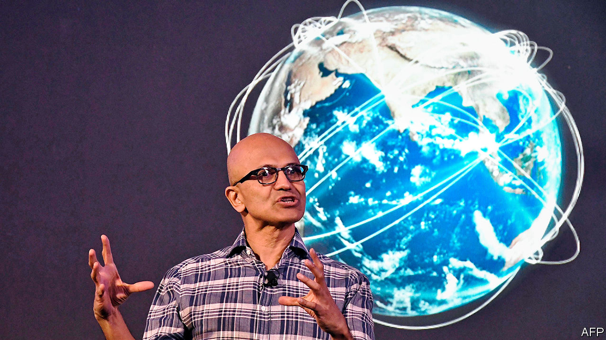

## Unproductivity puzzle

# Microsoft wants a slice of TikTok

> What does a middle-aged tech giant want with a teenage sensation?

> Aug 8th 2020

ON JULY 29TH the bosses of Alphabet, Amazon, Apple and Facebook endured a five-hour videoconference with a congressional subcommittee on antitrust. Satya Nadella, chief executive of Microsoft, America’s other technology titan, spent the day talking to investors, recruiting new hires and reviewing the latest quarterly numbers. His presence was not required—Microsoft no longer attracts the controversies that bring politicians running.

Or does it? On August 2nd the firm said it was in talks to buy the American, Canadian, Australian and New Zealand operations of TikTok, a wildly popular but problematic Chinese-owned video-sharing app. President Donald Trump had mused about banning it over fears that it could hand data on Americans to China’s Communist authorities, despite protestations by its parent company, ByteDance, that it would never do such a thing. After some unusual steps to mollify Mr Trump—including a statement in which it thanked him effusively for his “personal involvement”—Microsoft has until September 15th to hash out a deal.

Other suitors may cut in. ByteDance’s venture-capital backers, most of whom are American, will try to flush out rival bidders. They are disappointed that ByteDance failed to head off TikTok’s political travails. The Chinese group should have spun off the American unit this spring, keeping a big minority stake, says an investor close to the firm. But the ambition of its founder, Zhang Yiming, led ByteDance mistakenly to calculate that it could muscle through geopolitical tensions, the investor says.

TikTok’s price could rise if more bidders emerge, but it will still go for far less than ByteDance’s estimation of its value. ByteDance believes TikTok US would have been worth $200bn within a few years. Now it may have to sell the business for between $15bn and $40bn. That would be one of the year’s biggest deals. But once TikTok US, with its 100m or so users in America alone, turns profitable—which it is widely expected to soon—it may look like a bargain.

TikTok would propel Microsoft into the social-media big league. That may be Mr Nadella’s strategic aim. Google, the main division of Alphabet, is challenging Microsoft in cloud computing and office software. Nabbing TikTok would be a counter-strike against Google’s YouTube, notes Mark Moerdler of Bernstein, a research firm. The app would also give Microsoft a trove of data on young people, putting it on a par with the likes of Snapchat and Facebook’s Instagram.

At the same time, TikTok is a departure from Microsoft’s core competence of business-productivity tools. The app is unproductivity software par excellence. Microsoft’s gaming business, including the Xbox console, brought in only 8% of its $143bn in revenues in the 12 months to June. The firm has a mixed record with consumer technology. In July it shut Mixer, a live-streaming service for gamers that had failed to gain traction. And with TikTok Mr Nadella may expect an invitation to Big Tech’s next roasting on Capitol Hill. Controversies around TikTok’s content moderation and data protection will keep cropping up.

The next 40 days will be busy. Microsoft may try to buy more of TikTok than just the four English-speaking markets. But ByteDance will want to keep as much of its global presence as possible, especially with Mr Zhang under fire in China for selling out to the Yankees. The world may end up with two TikToks, one American-run, one controlled by ByteDance.

How an American TikTok would work is unclear. Microsoft would need to replace the app’s Chinese infrastructure, presumably by copying ByteDance’s code and auditing it. If it wants American teenagers to be able to view videos uploaded by Japanese or even British ones, it would have to license them from ByteDance, which may run afoul of Mr Trump. TikTok’s current appeal rests in part on its global assortment. Both versions of the app will be diminished by a split. Instagram’s Reels, a TikTok lookalike launched on August 5th, will try to woo disenchanted TikTokers. For the 45-year-old Microsoft, navigating the Sino-American tech tussle may be the easy part next to keeping teenagers’ attention. ■

## URL

https://www.economist.com/business/2020/08/08/microsoft-wants-a-slice-of-tiktok
