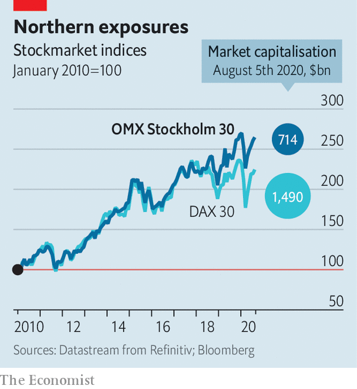

## Sverige AB v Deutschland AG

# Swedish firms have outshone German ones in the pandemic

> How two northern European corporate realms have weathered covid-19

> Aug 8th 2020BERLIN

SINCE THE Middle Ages, when the Hanseatic League of merchant guilds dominated trade in northern Europe, the German and Swedish business worlds have been close. This remains the case. Both economies depend on exports, manufacturing and retail. Germany is the biggest market for many Swedish firms. Nearly a fifth of Sweden’s imports come from across the Baltic. The two countries’ stockmarkets also tend to move in lockstep (see chart).

You would, then, expect covid-19 to have affected Sverige AB and Deutschland AG in similar ways. Not quite. The 18 members of the DAX 30 index of Germany’s biggest firms that have already reported swung from a healthy profit in the second quarter of 2019 to a loss almost as big this year. For many companies, including Volkswagen, a giant carmaker, and BASF, the world’s biggest chemicals concern, results were even worse than analysts had expected. The income of the 27 Swedish firms in Stockholm’s OMX 30 that have reported so far fell by 49%, bad but much better than the DAX. If you include adjusted earnings of two opaque investment vehicles in the OMX, income actually rose.

From makers of kitchen appliances (Electrolux) and telecoms equipment (Ericsson) to finance (Svenska Handelsbanken) and pharmaceuticals (AstraZeneca, which is listed in Stockholm, London and New York), big Swedish firms trounced expectations. “I have never seen so many companies come in with better than expected results,” marvels Esbjörn Lundevall of SEB, a Swedish bank.

Mr Lundevall points to three main reasons for the surprise. Sweden’s pandemic-relief effort, from cheap loans to furlough schemes, was more generous than predicted. Firms cut costs more radically than was thought possible. And, critically, demand recovered faster than forecast in June. As a result, Sweden’s GDP contracted by 8.2% in the second quarter, year on year, compared with a drop of 11.7% in Germany. Capital Economics, a consultancy, now expects Sweden’s economy to shrink by a relatively modest 2.5% in 2020. The country, it says, is the “best of a bad bunch in Europe”.

Many Swedish bosses put this down to their government’s controversial decision, which they vocally backed, to avoid the total lockdowns imposed across much of Europe. This allowed consumers to go about their lives and workers to send their children to schools, which remained open.

In public, CEOs of big German companies generally praised their government’s tougher policies. Privately, though, some shared the fears expressed openly by the BVMW, the association of Mittelstand firms that represents 3.5m businesses with up to 250 employees. In an open letter in May the BVMW called on the government to lift the lockdown “before it is too late” and criticised it for lacking an exit strategy.

Such calls may intensify if recent spikes in covid-19 cases turn into a new wave of infections. “A second lockdown would have cruel consequences,” says Hans-Jürgen Völz of the BVMW. Investors seem ambivalent about which country’s strategy is preferable for the long-term health of the economy. After falling more steeply than the OMX in March, the DAX has rebounded at a faster pace, too. In the past two months the fortunes of the Hanseatic peers have once again mirrored one another—trans-Baltic earnings disparities notwithstanding. ■

Editor’s note: Some of our covid-19 coverage is free for readers of The Economist Today, our daily [newsletter](https://www.economist.com/https://my.economist.com/user#newsletter). For more stories and our pandemic tracker, see our [hub](https://www.economist.com//news/2020/03/11/the-economists-coverage-of-the-coronavirus)

## URL

https://www.economist.com/business/2020/08/08/swedish-firms-have-outshone-german-ones-in-the-pandemic
