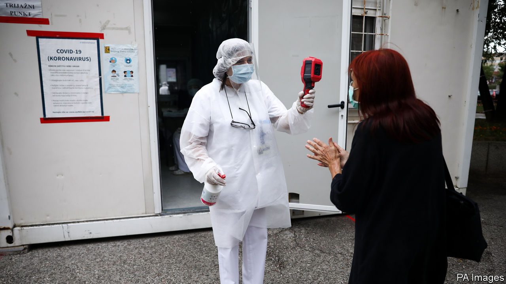
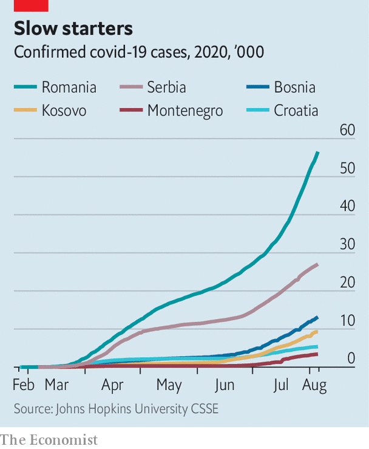

## Not as stated

# Balkan governments said the coronavirus was under control

> They spoke too soon

> Aug 8th 2020

FOR A FEW months it seemed that the Balkans were having a good pandemic. Infection and death rates were low. In March, as covid-19 began to spread fast across Europe, most Balkan countries locked down quickly and strictly. In May the Montenegrin prime minister crowed that his was the first covid-free country on the continent. But by the end of July Montenegro had the second-highest infection rate in Europe. Now, eight of the ten European countries with the fastest-rising infection rates are in the Balkans. If it were ever true that early firm action had worked, that advantage was lost with rapid reopenings. Or perhaps the early numbers were wrong, thanks to poor measurement or a cover-up; maybe the picture was never as good as it had seemed to be.

Until the beginning of June, according to Serbian statistics, only 244 people had died from the disease. Then an investigative report claimed the true figure was 632. The president and government, at the time engaged in an election campaign, denied that it was trying to suppress the real numbers. But Gorica Djokic, a leader of Serbia’s doctors’ union, said the higher figures matched those the union received from colleagues across the country.

Today, says Dr Djokic, and under pressure from 2,870 angry doctors who have signed a letter of protest, the authorities seem to be publishing more accurate figures. She reckons that one reason for the low infection numbers in the early months was that there was hardly any testing. Today there is more. But even Serbian doctors who, like her, work in covid hospitals are still rarely being tested. She thinks the authorities fear the health system would be crippled if all the doctors carrying the virus took weeks off work.

As in much of the rest of Europe, official messages have been confusing. In the Balkans this confusion has been compounded by low levels of trust in government. Many people believe the government is lying about there even being a virus, says Brikena Hoxha of the Kosovar Stability Initiative, a think-tank; and that it is paying families to claim relations died from covid-19 as part of a scam to procure foreign aid.

In March Kosovo’s president, then embroiled in a political dispute with the prime minister and his government, told citizens they could ignore its instructions to stay at home. On August 2nd the prime minister announced that he had tested positive for the virus. Unchecked, families wander in and out of hospital to buy food and medicine for their infected relatives. Thousands are now flocking to Albania, where they are packing the beaches in scenes similar to those on the Romanian Black Sea coast; the number of infections in Romania is also rising fast.

As for Bosnia, Adi Cerimagic, an analyst, says that although hospitals have been coping well, scandals in covid-related procurement have led many to believe that “while they locked us down, they were making money with it.” In May Silver Raspberry, a well-connected fruit-and-vegetable firm, bagged a $5.8m contract to supply ventilators. In June Novak Djokovic, Serbia’s tennis star, ignored advice and went ahead with a regional tournament he had organised. He hugged and partied with his Croatian and Bulgarian tennis buddies, several of whom were infected.

Large minorities believe covid conspiracy theories, which are often promoted by prominent people, including a former Serbian minister of health. Clerics have also played a role. In Montenegro infections have shot up as holidays begin, and also after huge anti-government demonstrations led by the Orthodox church. Across the region the pandemic has coincided with Orthodox, Catholic and Muslim festivals which have brought families and flocks together. Worse, says Mr Cerimagic, in this poor part of Europe the pressure to return to work is immense, and that pushes up infection rates further. ■

Editor’s note: Some of our covid-19 coverage is free for readers of The Economist Today, our daily [newsletter](https://www.economist.com/https://my.economist.com/user#newsletter). For more stories and our pandemic tracker, see our [hub](https://www.economist.com//news/2020/03/11/the-economists-coverage-of-the-coronavirus)

## URL

https://www.economist.com/europe/2020/08/08/balkan-governments-said-the-coronavirus-was-under-control
